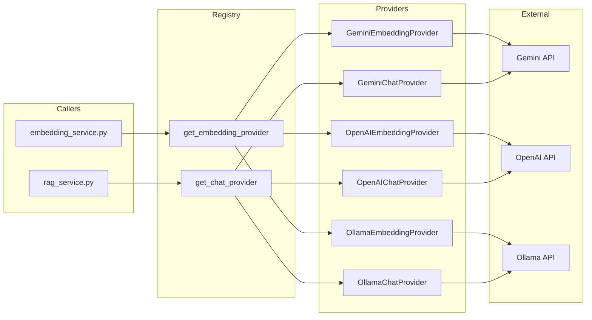

# Provider Abstraction Refactor Plan

## Objective

Create a clean **Strategy/Provider pattern** so that embedding and chat (LLM) providers can be swapped at runtime via a single configuration setting — without modifying business logic. Currently, the codebase has:

- [`src/backend/documents/services/embedding_service.py`](../src/backend/documents/services/embedding_service.py) — hardcoded to Google Gemini API
- [`src/backend/conversations/rag_service.py`](../src/backend/conversations/rag_service.py) — hardcoded to OpenAI SDK for chat, imports Gemini-based `embed_query`

We want to abstract both so that switching from e.g. Gemini → OpenAI → Ollama is a config change.

---

## Architecture Overview

```
┌─────────────────────────────────────────────────────────┐
│                    Provider Registry                      │
│  (providers.py) — dict[str, type[BaseProvider]]          │
│  get_embedding_provider() / get_chat_provider()          │
└──────────┬──────────────────────────────────┬────────────┘
           │                                  │
           ▼                                  ▼
┌──────────────────────┐       ┌──────────────────────────┐
│  BaseEmbeddingProvider │       │   BaseChatProvider       │
│  (abstract)           │       │   (abstract)             │
│  + embed(text)        │       │   + chat(messages)       │
│  + embed_batch(texts) │       │                          │
│  + embed_query(text)  │       │                          │
└──────────┬───────────┘       └───────────┬──────────────┘
           │                                │
     ┌─────┼─────┐                    ┌─────┼─────┐
     │     │     │                    │     │     │
     ▼     ▼     ▼                    ▼     ▼     ▼
  Gemini  OpenAI Ollama            OpenAI  Gemini Ollama
```

### Key Design Decisions

1. **Two separate abstract base classes** — `BaseEmbeddingProvider` and `BaseChatProvider` — because a provider may support only one (e.g., Ollama might have embedding but not chat, or vice versa).
2. **Provider Registry** — a simple dict mapping provider names (e.g., `"google"`, `"openai"`, `"ollama"`) to provider classes. A factory function reads `settings.EMBEDDING_PROVIDER` / `settings.CHAT_PROVIDER` and instantiates the correct class.
3. **Configuration via Django settings** — new settings:
   - `EMBEDDING_PROVIDER` (already exists)
   - `CHAT_PROVIDER` (new)
   - Provider-specific settings stay as they are (`OPENAI_API_KEY`, `GOOGLE_API_KEY`, `OLLAMA_BASE_URL`, etc.)
4. **Backward compatibility** — the existing functions in `embedding_service.py` and `rag_service.py` will delegate to the provider under the hood, so all existing imports and callers work without changes.

---

## Step 1: Create Abstract Base Classes & Provider Registry

### Files to create

#### [`src/backend/providers/__init__.py`](../src/backend/providers/__init__.py)
Package init, exports all public symbols.

#### [`src/backend/providers/base.py`](../src/backend/providers/base.py)
Define two abstract base classes:

```python
from abc import ABC, abstractmethod
from typing import Any

class BaseEmbeddingProvider(ABC):
    """Abstract interface for embedding providers."""

    @abstractmethod
    def embed(self, text: str) -> list[float] | None:
        """Embed a single text. Return None on failure."""
        ...

    @abstractmethod
    def embed_batch(self, texts: list[str]) -> list[list[float] | None]:
        """Embed a list of texts. Return list aligned with input."""
        ...

    @abstractmethod
    def embed_query(self, text: str) -> list[float]:
        """Embed a query. Raise on failure."""
        ...

    @property
    @abstractmethod
    def dimensions(self) -> int:
        """Return the embedding dimension for this provider."""
        ...

class BaseChatProvider(ABC):
    """Abstract interface for chat/LLM providers."""

    @abstractmethod
    def chat(
        self,
        messages: list[dict[str, str]],
        max_tokens: int | None = None,
        model: str | None = None,
    ) -> dict[str, Any]:
        """Send a chat completion request.

        Returns dict with keys:
        - content: str
        - token_usage: dict with prompt_tokens, completion_tokens, total_tokens
        """
        ...
```

#### [`src/backend/providers/registry.py`](../src/backend/providers/registry.py)
Provider registry and factory functions:

```python
from typing import TypeVar

from providers.base import BaseEmbeddingProvider, BaseChatProvider

T = TypeVar("T")

class ProviderNotRegisteredError(Exception):
    pass

_embedding_providers: dict[str, type[BaseEmbeddingProvider]] = {}
_chat_providers: dict[str, type[BaseChatProvider]] = {}

def register_embedding_provider(name: str, cls: type[BaseEmbeddingProvider]) -> None:
    _embedding_providers[name] = cls

def register_chat_provider(name: str, cls: type[BaseChatProvider]) -> None:
    _chat_providers[name] = cls

def get_embedding_provider() -> BaseEmbeddingProvider:
    from django.conf import settings
    name = settings.EMBEDDING_PROVIDER
    cls = _embedding_providers.get(name)
    if cls is None:
        raise ProviderNotRegisteredError(
            f"Embedding provider '{name}' not registered. "
            f"Available: {list(_embedding_providers.keys())}"
        )
    return cls()

def get_chat_provider() -> BaseChatProvider:
    from django.conf import settings
    name = settings.CHAT_PROVIDER
    cls = _chat_providers.get(name)
    if cls is None:
        raise ProviderNotRegisteredError(
            f"Chat provider '{name}' not registered. "
            f"Available: {list(_chat_providers.keys())}"
        )
    return cls()
```

### Files to modify

#### [`src/backend/config/settings.py`](../src/backend/config/settings.py)
Add new setting:
```python
CHAT_PROVIDER = env('CHAT_PROVIDER', default='openai')
```

---

## Step 2: Implement Concrete Providers

### Files to create

#### [`src/backend/providers/gemini_embedding.py`](../src/backend/providers/gemini_embedding.py)
Migrate the logic from [`embedding_service.py`](../src/backend/documents/services/embedding_service.py) into a class:

```python
class GeminiEmbeddingProvider(BaseEmbeddingProvider):
    def __init__(self):
        self.api_key: str = ...
        self.base_url: str = ...
        self.model: str = ...
        self._dimensions: int = 768

    def embed(self, text: str) -> list[float] | None: ...
    def embed_batch(self, texts: list[str]) -> list[list[float] | None]: ...
    def embed_query(self, text: str) -> list[float]: ...

    @property
    def dimensions(self) -> int:
        return self._dimensions
```

#### [`src/backend/providers/openai_embedding.py`](../src/backend/providers/openai_embedding.py)
```python
class OpenAIEmbeddingProvider(BaseEmbeddingProvider):
    """Uses OpenAI's Embeddings API (text-embedding-3-small, etc.)."""
    def __init__(self):
        import openai
        self.client = openai.OpenAI(api_key=settings.OPENAI_API_KEY)
        self.model: str = settings.OPENAI_EMBEDDING_MODEL
        self._dimensions: int = settings.EMBEDDING_DIMENSION

    def embed(self, text: str) -> list[float] | None: ...
    def embed_batch(self, texts: list[str]) -> list[list[float] | None]: ...
    def embed_query(self, text: str) -> list[float]: ...

    @property
    def dimensions(self) -> int:
        return self._dimensions
```

#### [`src/backend/providers/ollama_embedding.py`](../src/backend/providers/ollama_embedding.py)
```python
class OllamaEmbeddingProvider(BaseEmbeddingProvider):
    """Uses Ollama's /api/embed endpoint."""
    def __init__(self):
        self.base_url: str = settings.OLLAMA_BASE_URL
        self.model: str = settings.OLLAMA_EMBEDDING_MODEL
        self._dimensions: int = settings.EMBEDDING_DIMENSION

    def embed(self, text: str) -> list[float] | None: ...
    def embed_batch(self, texts: list[str]) -> list[list[float] | None]: ...
    def embed_query(self, text: str) -> list[float]: ...

    @property
    def dimensions(self) -> int:
        return self._dimensions
```

#### [`src/backend/providers/openai_chat.py`](../src/backend/providers/openai_chat.py)
Migrate the chat logic from [`rag_service.py`](../src/backend/conversations/rag_service.py):

```python
class OpenAIChatProvider(BaseChatProvider):
    def __init__(self):
        import openai
        self.client = openai.OpenAI(api_key=settings.OPENAI_API_KEY)
        self.model: str = settings.OPENAI_CHAT_MODEL
        self.max_tokens: int = settings.OPENAI_CHAT_MAX_TOKENS

    def chat(self, messages, max_tokens=None, model=None):
        response = self.client.chat.completions.create(
            model=model or self.model,
            messages=messages,
            max_tokens=max_tokens or self.max_tokens,
        )
        choice = response.choices[0]
        return {
            "content": choice.message.content or "",
            "token_usage": {
                "prompt_tokens": response.usage.prompt_tokens if response.usage else 0,
                "completion_tokens": response.usage.completion_tokens if response.usage else 0,
                "total_tokens": response.usage.total_tokens if response.usage else 0,
            },
        }
```

#### [`src/backend/providers/gemini_chat.py`](../src/backend/providers/gemini_chat.py)
```python
class GeminiChatProvider(BaseChatProvider):
    """Uses Google Gemini API for chat completions."""
    def __init__(self):
        self.api_key: str = settings.GOOGLE_API_KEY
        self.model: str = settings.GEMINI_CHAT_MODEL  # new setting
        self.base_url: str = "https://generativelanguage.googleapis.com/v1beta"

    def chat(self, messages, max_tokens=None, model=None):
        # Convert OpenAI-style messages to Gemini format
        # Call Gemini generateContent API
        # Return standardized dict
        ...
```

#### [`src/backend/providers/ollama_chat.py`](../src/backend/providers/ollama_chat.py)
```python
class OllamaChatProvider(BaseChatProvider):
    """Uses Ollama's /api/chat endpoint."""
    def __init__(self):
        self.base_url: str = settings.OLLAMA_BASE_URL
        self.model: str = settings.OLLAMA_CHAT_MODEL  # new setting

    def chat(self, messages, max_tokens=None, model=None):
        # Call Ollama /api/chat
        # Return standardized dict
        ...
```

#### [`src/backend/providers/registration.py`](../src/backend/providers/registration.py)
Auto-register all built-in providers (imported so their registration runs):

```python
from providers.registry import register_embedding_provider, register_chat_provider
from providers.gemini_embedding import GeminiEmbeddingProvider
from providers.openai_embedding import OpenAIEmbeddingProvider
from providers.ollama_embedding import OllamaEmbeddingProvider
from providers.openai_chat import OpenAIChatProvider
from providers.gemini_chat import GeminiChatProvider
from providers.ollama_chat import OllamaChatProvider

# Register embedding providers
register_embedding_provider("google", GeminiEmbeddingProvider)
register_embedding_provider("openai", OpenAIEmbeddingProvider)
register_embedding_provider("ollama", OllamaEmbeddingProvider)

# Register chat providers
register_chat_provider("openai", OpenAIChatProvider)
register_chat_provider("google", GeminiChatProvider)
register_chat_provider("ollama", OllamaChatProvider)
```

### Files to modify

#### [`src/backend/config/settings.py`](../src/backend/config/settings.py)
Add new settings:
```python
CHAT_PROVIDER = env('CHAT_PROVIDER', default='openai')
GEMINI_CHAT_MODEL = env('GEMINI_CHAT_MODEL', default='gemini-2.0-flash')
OLLAMA_CHAT_MODEL = env('OLLAMA_CHAT_MODEL', default='llama3')
OPENAI_EMBEDDING_MODEL = env('OPENAI_EMBEDDING_MODEL', default='text-embedding-3-small')
OLLAMA_EMBEDDING_MODEL = env('OLLAMA_EMBEDDING_MODEL', default='nomic-embed-text')
```

#### [`.env.example`](../.env.example)
Add new env vars documentation.

---

## Step 3: Refactor Existing Code to Use the Abstraction

### Files to modify

#### [`src/backend/documents/services/embedding_service.py`](../src/backend/documents/services/embedding_service.py)
Replace the hardcoded Gemini logic with delegation to the provider:

```python
from providers.registry import get_embedding_provider

def generate_embedding(text: str) -> list[float] | None:
    provider = get_embedding_provider()
    return provider.embed(text)

def embed_query(text: str) -> list[float]:
    provider = get_embedding_provider()
    return provider.embed_query(text)

def batch_generate_embeddings(texts: list[str]) -> list[list[float] | None]:
    provider = get_embedding_provider()
    return provider.embed_batch(texts)
```

The higher-level functions (`generate_embeddings_for_document`, `batch_embed_chunks`, `reembed_chunk`) remain unchanged since they call the above functions.

#### [`src/backend/conversations/rag_service.py`](../src/backend/conversations/rag_service.py)
Replace `OpenAI(...)` direct usage with the chat provider:

```python
from providers.registry import get_chat_provider

def run_rag_query(...):
    # ... steps 1-4 unchanged ...
    
    # Step 5: Call chat provider instead of OpenAI directly
    provider = get_chat_provider()
    result = provider.chat(
        messages=messages,
        max_tokens=settings.OPENAI_CHAT_MAX_TOKENS,
    )
    response_content = result["content"]
    token_usage = result["token_usage"]
    
    # ... steps 6-7 unchanged ...
```

### Test Updates

#### [`src/backend/conversations/tests/test_rag_service.py`](../src/backend/conversations/tests/test_rag_service.py)
- Change `@patch("conversations.rag_service.OpenAI")` to `@patch("conversations.rag_service.get_chat_provider")`
- Update mock setup to match the new provider interface

#### [`src/backend/documents/tests/test_embedding.py`](../src/backend/documents/tests/test_embedding.py)
- The existing tests mock `requests.post` at the module level, which still works since the provider internally uses `requests.post`
- Add new tests for each provider class

#### New test files
- [`src/backend/providers/tests/`](../src/backend/providers/tests/) — unit tests for each provider implementation

---

## Migration / Rollout Plan

| Step | Description | Risk |
|------|-------------|------|
| 1 | Create `providers/` package with abstract base classes and registry | Low — new code, no existing code changed |
| 2 | Implement `GeminiEmbeddingProvider` (migrate existing logic) | Low — pure refactor of existing code |
| 3 | Implement `OpenAIChatProvider` (migrate existing logic) | Low — pure refactor of existing code |
| 4 | Refactor `embedding_service.py` to delegate to provider | Medium — changes existing tested code |
| 5 | Refactor `rag_service.py` to delegate to chat provider | Medium — changes existing tested code |
| 6 | Implement additional providers (OpenAI Embedding, Ollama, Gemini Chat) | Low — new code, independently testable |
| 7 | Update tests | Medium — test mocks need updating |
| 8 | Update `.env.example` and settings documentation | Low |

---

## Mermaid Diagram: Data Flow After Refactor



---

## Settings Configuration Example

To switch providers, a user would update their `.env`:

```bash
# Use Google Gemini for embeddings
EMBEDDING_PROVIDER=google
GOOGLE_API_KEY=AIza...

# Use Ollama for chat (local)
CHAT_PROVIDER=ollama
OLLAMA_BASE_URL=http://localhost:11434
OLLAMA_CHAT_MODEL=llama3
```

Or:

```bash
# Use OpenAI for both
EMBEDDING_PROVIDER=openai
CHAT_PROVIDER=openai
OPENAI_API_KEY=sk-...
OPENAI_EMBEDDING_MODEL=text-embedding-3-small
OPENAI_CHAT_MODEL=gpt-4o-mini
```
