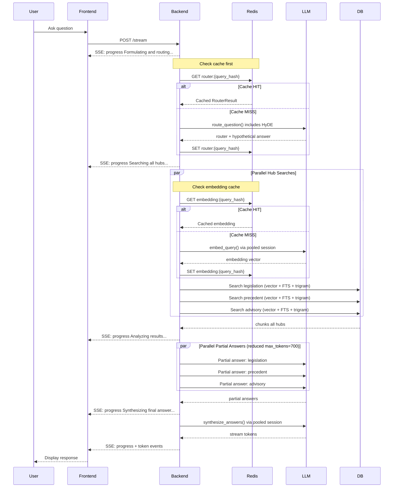

# Global RAG Performance Optimization Plan

## Problem Statement

The Global RAG pipeline takes **~140 seconds on average** per query. For 10 requests, this means ~20 minutes of waiting. The goal is to **reduce this latency without harming answer quality**.

---

## Current State Assessment

After thorough code review, here's what's **already been optimized** vs. what's **still pending**:

### ✅ Already Implemented (from previous plan)

| Optimization | Status | Details |
|---|---|---|
| **Parallel Hub Searches** | ✅ Done | `ThreadPoolExecutor(max_workers=3)` in `multi_hub_search()` |
| **Parallel Partial Answers** | ✅ Done | `ThreadPoolExecutor(max_workers=3)` in both `run_global_rag_query()` and `run_global_rag_query_stream()` |
| **Merge formulate + route** | ✅ Done | `route_question()` returns `RouterResult` with `hypothetical_answer` field; separate `formulate_query()` call removed from global RAG |
| **RRF Depth Optimization** | ✅ Done | `_get_rrf_depth(top_k)` = `max(top_k * 6, 30)` instead of hardcoded 60 |
| **SSE Progress Events** | ✅ Done | Streaming pipeline yields `("progress", ...)` events at each stage |
| **Frontend Loading Indicator** | ✅ Done | `useProcessingStatus` hook exists |

### ❌ Still Pending

| Optimization | Status | Impact Estimate |
|---|---|---|
| **Redis Caching Layer** | ❌ Not done | **High** — avoids redundant API calls |
| **Reduce System Prompts** | ❌ Not done | **Medium** — fewer tokens = faster LLM calls |
| **Reduce LLM Calls** | ❌ Not done | **High** — each LLM call is 10-30s |

---

## Root Cause Analysis: Why 140 Seconds?

### Pipeline Breakdown (Estimated)

```
Step 1: Route Question (LLM call)         → ~20s  (sequential)
Step 2: Multi-Hub Search (parallel)
   ├── Embedding API × 3 (parallel)       → ~10s  (max of 3 parallel calls)
   └── DB Queries × 9 (3 methods × 3 hubs)→ ~5s   (parallel)
Step 3: Partial Answers × 3 (parallel)    → ~30s  (max of 3 parallel LLM calls)
Step 4: Synthesis (LLM call, streaming)   → ~25s  (sequential, streaming)
Step 5: Citation Extraction                → ~2s   (sequential)
─────────────────────────────────────────────────────
Total:                                     → ~92s  (baseline estimate)
Overhead (network, serialization, etc.):   → ~48s  (gap to 140s)
```

**Key insight**: The gap between the ~92s baseline estimate and the ~140s reported suggests significant overhead from:
- **Network latency** to OpenAI/Gemini APIs (especially from Iran)
- **Serialization/deserialization** of large payloads
- **Connection establishment** (no connection pooling)
- **Retry delays** from failed API calls

---

## Proposed Optimizations (Ordered by Impact)

### Phase A: Caching Layer (HIGH IMPACT, ZERO RISK)

**Estimated savings**: 20-40s per query (avoids redundant API calls)

#### A1: Redis Cache for Embeddings

**Problem**: Every query generates 3 embedding API calls (one per hub). If the same or similar query is asked again, the embeddings are regenerated from scratch.

**Solution**: Add a Redis cache keyed by `(query_text, model_name)` for embedding results.

**Files to modify**:
- [`src/backend/documents/services/embedding_service.py`](../src/backend/documents/services/embedding_service.py:105) — Add `embed_query_cached()` with Redis backend
- [`src/backend/config/settings.py`](../src/backend/config/settings.py:233) — Redis URL already configured for Celery, reuse it

**Implementation**:
```python
# In embedding_service.py
from django.core.cache import cache

def embed_query_cached(text: str, timeout: int = 3600) -> list[float]:
    """Embed query text with Redis caching."""
    cache_key = f"embedding:{hashlib.md5(text.encode()).hexdigest()}"
    cached = cache.get(cache_key)
    if cached is not None:
        return cached
    result = embed_query(text)
    if result:
        cache.set(cache_key, result, timeout)
    return result
```

**Risk**: None. Caching is transparent and never changes behavior.

#### A2: Redis Cache for Router Decisions

**Problem**: The same question routed through the LLM produces the same routing decision. This is a waste of an LLM call.

**Solution**: Cache `RouterResult` keyed by normalized query text.

**Files to modify**:
- [`src/backend/conversations/question_router.py`](../src/backend/conversations/question_router.py:219) — Add `route_question_cached()` wrapper

**Implementation**:
```python
# In question_router.py
def route_question_cached(user_query: str, timeout: int = 3600) -> RouterResult:
    """Route question with Redis caching."""
    normalized = user_query.strip().lower()
    cache_key = f"router:{hashlib.md5(normalized.encode()).hexdigest()}"
    cached = cache.get(cache_key)
    if cached is not None:
        return RouterResult(**cached)
    result = route_question(user_query)
    cache.set(cache_key, asdict(result), timeout)
    return result
```

**Risk**: None for identical queries. For similar queries, the cache miss is the same as current behavior.

---

### Phase B: Reduce System Prompt Sizes (MEDIUM IMPACT, LOW RISK)

**Estimated savings**: 5-10s per query (fewer tokens = faster LLM calls)

#### B1: Trim Router System Prompt

**Problem**: The router system prompt in [`question_router.py`](../src/backend/conversations/question_router.py:65) is ~100 lines with verbose examples and redundant instructions.

**Solution**: Reduce to ~50 lines by:
- Removing redundant example JSON structures (keep 1-2 instead of 3-4)
- Condensing hub descriptions
- Removing verbose formatting instructions

**Files to modify**:
- [`src/backend/conversations/question_router.py`](../src/backend/conversations/question_router.py:65) — Reduce `SYSTEM_PROMPT`

#### B2: Trim Synthesis System Prompt

**Problem**: The synthesis prompt in [`global_rag_service.py`](../src/backend/conversations/global_rag_service.py:447) is verbose.

**Solution**: Condense instructions while preserving the legal hierarchy and conflict detection logic.

**Files to modify**:
- [`src/backend/conversations/global_rag_service.py`](../src/backend/conversations/global_rag_service.py:447) — Reduce `build_synthesis_system_prompt()`

#### B3: Trim Hub System Prompts

**Problem**: Each hub's system prompt in [`global_rag_service.py`](../src/backend/conversations/global_rag_service.py:376) has redundant instructions.

**Solution**: Condense while preserving role-specific instructions.

**Files to modify**:
- [`src/backend/conversations/global_rag_service.py`](../src/backend/conversations/global_rag_service.py:376) — Reduce `build_hub_system_prompt()`

---

### Phase C: Reduce LLM Calls (HIGH IMPACT, MEDIUM RISK)

**Estimated savings**: 15-30s per query

#### C1: Use Faster Model for Partial Answers

**Problem**: Partial answers use the same model (`gpt-4o-mini`) as routing and synthesis. The partial answer task is simpler — just summarize chunks for a single hub.

**Solution**: Allow a separate, faster/cheaper model for partial answers. This could be:
- A smaller model variant (if available)
- The same model with reduced `max_tokens` (from 1000 to 500)

**Files to modify**:
- [`src/backend/config/settings.py`](../src/backend/config/settings.py:273) — Add `PARTIAL_ANSWER_MAX_TOKENS` setting
- [`src/backend/conversations/global_rag_service.py`](../src/backend/conversations/global_rag_service.py:768) — Use reduced `max_tokens` for partial answers

**Risk**: Medium. If `max_tokens` is too low, partial answers may be truncated, reducing synthesis quality. Start with 700 tokens and monitor.

#### C2: Reduce Partial Answer Max Tokens

**Problem**: [`CHAT_MAX_TOKENS=1000`](../src/backend/config/settings.py:274) is used for partial answers. For a single hub with 5 chunks, 1000 tokens is generous.

**Solution**: Reduce to 500-700 tokens for partial answers. The synthesis step (4000 tokens) handles the comprehensive answer.

**Files to modify**:
- [`src/backend/config/settings.py`](../src/backend/config/settings.py:274) — Add `PARTIAL_ANSWER_MAX_TOKENS=700`
- [`src/backend/conversations/global_rag_service.py`](../src/backend/conversations/global_rag_service.py:768) — Use the new setting

---

### Phase D: Connection Pooling & HTTP Optimization (MEDIUM IMPACT, LOW RISK)

**Estimated savings**: 5-15s per query

#### D1: Reuse HTTP Sessions

**Problem**: Both [`openai_chat.py`](../src/backend/providers/openai_chat.py:22) and [`gemini_embedding.py`](../src/backend/providers/gemini_embedding.py:30) create new HTTP connections for every API call. No connection reuse means TCP handshake + TLS negotiation every time.

**Solution**: Use `requests.Session()` for connection pooling.

**Files to modify**:
- [`src/backend/providers/openai_chat.py`](../src/backend/providers/openai_chat.py:22) — Use `requests.Session()` with connection pool
- [`src/backend/providers/gemini_embedding.py`](../src/backend/providers/gemini_embedding.py:30) — Use `requests.Session()` with connection pool

**Implementation**:
```python
# In provider __init__:
self._session: requests.Session | None = None

@property
def session(self) -> requests.Session:
    if self._session is None:
        self._session = requests.Session()
        adapter = requests.adapters.HTTPAdapter(
            pool_connections=10,
            pool_maxsize=20,
        )
        self._session.mount("https://", adapter)
    return self._session
```

#### D2: Reduce Embedding Timeout

**Problem**: [`gemini_embedding.py`](../src/backend/providers/gemini_embedding.py:23) has a 60-second timeout with 3 retries. If the API is slow, this can add 180s of waiting.

**Solution**: Reduce timeout to 30s with 2 retries (max 60s total instead of 180s).

**Files to modify**:
- [`src/backend/providers/gemini_embedding.py`](../src/backend/providers/gemini_embedding.py:20) — Change `_TIMEOUT_SECONDS` from 60 to 30, `_MAX_RETRIES` from 3 to 2

---

### Phase E: Fine-Tune Search Parameters (LOW IMPACT, LOW RISK)

**Estimated savings**: 2-5s per query

#### E1: Reduce RRF Depth Further

**Problem**: Current RRF depth is `max(top_k * 6, 30)` = 30 for `top_k=5`. This fetches 30 candidates per search method × 3 methods × 3 hubs = 270 chunks for 15 returned.

**Solution**: Reduce to `max(top_k * 4, 20)` = 20. This fetches 20 × 3 × 3 = 180 chunks.

**Files to modify**:
- [`src/backend/documents/services/search_service.py`](../src/backend/documents/services/search_service.py:72) — Change multiplier from 6 to 4

**Risk**: Minimal. RRF is robust to candidate pool size; the top-5 results are unlikely to change significantly with 20 vs 30 candidates.

#### E2: Reduce Hub Timeout

**Problem**: [`_TIMEOUT_PER_HUB=45`](../src/backend/conversations/global_rag_service.py:78) seconds. If one hub is slow, the entire pipeline waits 45s.

**Solution**: Reduce to 30s. If a hub times out, the pipeline continues with the remaining hubs.

**Files to modify**:
- [`src/backend/conversations/global_rag_service.py`](../src/backend/conversations/global_rag_service.py:78) — Change `_TIMEOUT_PER_HUB` from 45 to 30

---

## Architecture Diagram — Optimized Pipeline



---

## Implementation Order

| Order | Phase | Description | Files Changed | Risk | Est. Savings |
|-------|-------|-------------|---------------|------|-------------|
| **1** | **A1** | Redis Cache for Embeddings | 2 | None | 10-20s |
| **2** | **A2** | Redis Cache for Router Decisions | 2 | None | 15-25s |
| **3** | **D1** | Connection Pooling (HTTP Sessions) | 2 | Low | 5-10s |
| **4** | **D2** | Reduce Embedding Timeout | 1 | Low | 5-10s |
| **5** | **B1-B3** | Reduce System Prompts | 2 | Low | 5-10s |
| **6** | **C1-C2** | Reduce Partial Answer Max Tokens | 2 | Medium | 10-20s |
| **7** | **E1** | Reduce RRF Depth | 1 | Low | 2-5s |
| **8** | **E2** | Reduce Hub Timeout | 1 | Low | 2-5s |

---

## Estimated Improvement

| Metric | Before | After (estimated) |
|--------|--------|-------------------|
| **Total response time** | ~140s | **~40-70s** |
| **LLM calls per query** | 5 | **2-5** (depends on cache hits) |
| **Embedding API calls** | 3 | **0-3** (depends on cache hits) |
| **DB chunks fetched** | 270 | **180** (RRF depth 30→20) |
| **HTTP connections** | New per call | **Reused** (connection pooling) |

---

## Files to Modify

### Backend (8 files)

1. [`src/backend/conversations/global_rag_service.py`](../src/backend/conversations/global_rag_service.py) — Phases B2, B3, C1, C2, E2
2. [`src/backend/conversations/question_router.py`](../src/backend/conversations/question_router.py) — Phases A2, B1
3. [`src/backend/documents/services/embedding_service.py`](../src/backend/documents/services/embedding_service.py) — Phase A1
4. [`src/backend/documents/services/search_service.py`](../src/backend/documents/services/search_service.py) — Phase E1
5. [`src/backend/providers/openai_chat.py`](../src/backend/providers/openai_chat.py) — Phase D1
6. [`src/backend/providers/gemini_embedding.py`](../src/backend/providers/gemini_embedding.py) — Phases D1, D2
7. [`src/backend/config/settings.py`](../src/backend/config/settings.py) — Phase C2 (new setting)
8. [`src/backend/conversations/views.py`](../src/backend/conversations/views.py) — No changes needed (already passes through progress events)

### No Frontend Changes Required

The frontend already has `useProcessingStatus` hook and SSE progress event handling. No frontend changes are needed.

---

## Risk Mitigation

| Risk | Mitigation |
|------|-----------|
| **Cache invalidation** | Use 1-hour TTL for embeddings and router decisions. Stale data is acceptable for legal research (laws don't change hourly). |
| **Reduced max_tokens truncates answers** | Start conservative (700 tokens), monitor partial answer length in logs, adjust if needed. |
| **Connection pooling thread safety** | Use `threading.Lock` or `local()` for session management in threaded context. |
| **Reduced timeout causes failures** | Pipeline already handles per-hub timeouts gracefully (returns error message, continues with other hubs). |
| **Quality regression** | All changes are either transparent (caching, connection pooling) or configurable (max_tokens, RRF depth). Easy to roll back individual changes. |
