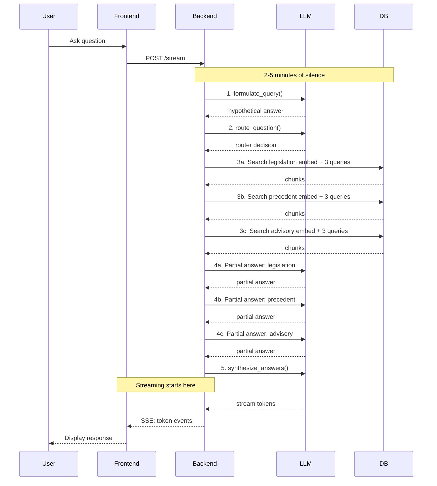
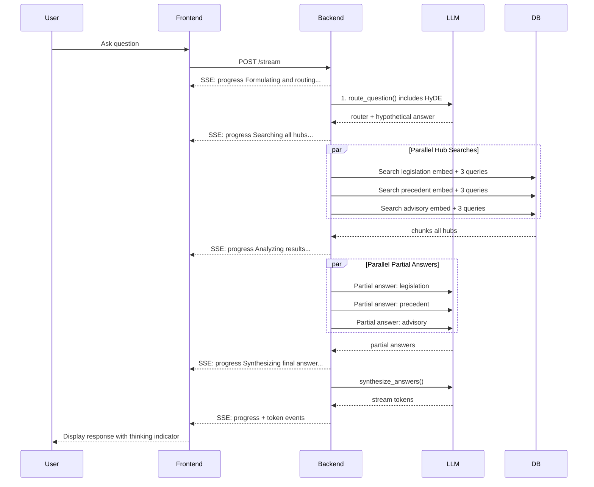

# RAG Performance Refactoring Plan

## Problem Statement

The Global RAG pipeline at `http://localhost/legal-research/` takes **2–5 minutes** to respond to any question, regardless of complexity. During this time, the UI shows **no visual feedback** — the user sees only their sent message and a disabled input field.

The user suspects (correctly) that the bottleneck is primarily in the backend.

---

## Root Cause Analysis

After reading the full pipeline code, I identified **7 distinct bottlenecks**, ordered by impact:

### 🔴 Bottleneck #1: 5–6 Sequential LLM Calls (Primary Cause)

The Global RAG pipeline makes **5–6 LLM API calls in strict sequence**:

| Step | Function | File | LLM Calls |
|------|----------|------|-----------|
| 1 | `formulate_query()` | [`query_formulation.py`](../src/backend/conversations/query_formulation.py:149) | 1 |
| 2 | `route_question()` | [`question_router.py`](../src/backend/conversations/question_router.py:205) | 1 |
| 3 | `generate_hub_partial_answer()` × 3 | [`global_rag_service.py`](../src/backend/conversations/global_rag_service.py:415) | 3 (sequential) |
| 4 | `synthesize_answers()` | [`global_rag_service.py`](../src/backend/conversations/global_rag_service.py:518) | 1 |
| **Total** | | | **5–6** |

Each LLM call takes **5–30+ seconds** depending on API latency and model. With 5–6 calls, this alone accounts for **25–180+ seconds** of the total time.

### 🟠 Bottleneck #2: 3 Sequential Embedding API Calls

In [`multi_hub_search()`](../src/backend/conversations/global_rag_service.py:88), each hub's vector search requires an embedding API call via [`embed_query()`](../src/backend/documents/services/embedding_service.py:105). These are **sequential** — each waits for the previous to complete. The Gemini embedding provider has a **60-second timeout** with **3 retries** ([`gemini_embedding.py`](../src/backend/providers/gemini_embedding.py:256)).

### 🟠 Bottleneck #3: No Streaming Feedback During Pipeline

The streaming (SSE) only starts at the **synthesis step** (step 4 of 4). The [`run_global_rag_query_stream()`](../src/backend/conversations/global_rag_service.py:871) function yields tokens only during `synthesize_answers()`. The user sees **nothing** for the first ~80% of the pipeline time.

### 🟡 Bottleneck #4: Excessive RRF Minimum Depth

In [`search_service.py`](../src/backend/documents/services/search_service.py:67), `_RRF_MIN_DEPTH = 60` means even with `top_k=5` (global RAG), each search method fetches **60 candidates**.

```
Global RAG: 3 hubs × 3 search methods × 60 candidates = 540 chunks fetched
Returned: 3 hubs × 5 = 15 chunks
Waste ratio: 36:1
```

### 🟡 Bottleneck #5: No Parallelism in Per-Hub Operations

The 3 per-hub searches and 3 per-hub partial answers are executed **sequentially**. There is no use of `concurrent.futures`, `asyncio`, or any threading mechanism.

### 🟢 Bottleneck #6: No Caching

There is no caching of:
- Embedding results (same query → same embedding)
- Router decisions (same query → same routing)
- Partial answers (same query + hub → same answer)

### 🟢 Bottleneck #7: Large System Prompts

The system prompts in [`question_router.py`](../src/backend/conversations/question_router.py:65) (~100 lines with examples) and [`query_formulation.py`](../src/backend/conversations/query_formulation.py:60) (~60 lines with examples) increase token count and latency for every LLM call.

---

## Refactoring Plan — 7 Phases

### Phase 1: SSE Progress Events (Immediate UX Fix)
**Risk**: Low | **Impact**: High (perceived performance)

Add progress events to the SSE stream so the frontend can show a "thinking" indicator with status messages.

#### Backend Changes

**File: [`global_rag_service.py`](../src/backend/conversations/global_rag_service.py)**

Modify `run_global_rag_query_stream()` to yield SSE progress events at each pipeline stage:

```python
# Before each pipeline step, yield:
yield {"event": "progress", "data": {"status": "Formulating search query..."}}
yield {"event": "progress", "data": {"status": "Routing question to legal knowledge hubs..."}}
yield {"event": "progress", "data": {"status": "Searching legislation database..."}}
yield {"event": "progress", "data": {"status": "Analyzing legislation results..."}}
# ... etc
```

**File: [`views.py`](../src/backend/conversations/views.py)**

Update the SSE event stream in `ConversationMessageStreamView` to pass through progress events alongside token events.

#### Frontend Changes

**File: [`conversationStore.ts`](../src/frontend/src/stores/conversationStore.ts)**

1. Add `thinkingStatus: string | null` to the store state
2. Handle `"progress"` event type in the SSE parser to update `thinkingStatus`
3. Clear `thinkingStatus` when streaming starts or completes

**File: [`ChatWindow.tsx`](../src/frontend/src/components/chat/ChatWindow.tsx)**

1. Add a `ThinkingIndicator` component showing animated dots + status text
2. Show it when `isSendingMessage && !streamingContent`
3. Update status text from `thinkingStatus`

---

### Phase 2: Parallelize Per-Hub Operations
**Risk**: Medium | **Impact**: High (reduces 3 sequential LLM calls to ~1)

Use `concurrent.futures.ThreadPoolExecutor` to run per-hub operations in parallel.

**Important context**: The view is a **sync** `APIView` ([`views.py:480`](../src/backend/conversations/views.py:480)), so `ThreadPoolExecutor` is the correct approach. No `asyncio` needed.

#### Thread Safety

Each thread needs its own Django DB connection. The pattern:

```python
from concurrent.futures import ThreadPoolExecutor, as_completed
from django.db import close_old_connections

def _search_single_hub(hub_type, sub_query, top_k):
    close_old_connections()  # Close stale connections inherited from parent
    # ... do work ...
    return results

with ThreadPoolExecutor(max_workers=3) as executor:
    future_map = {
        executor.submit(_search_single_hub, hub_type, sq, top_k): hub_type
        for hub_type, sq in sub_queries.items()
    }
    for future in as_completed(future_map):
        hub_type = future_map[future]
        hub_results[hub_type] = future.result()
```

`close_old_connections()` is sufficient here because:
- Each thread creates its own connection on first DB access
- `close_old_connections()` ensures stale connections from the parent thread are not reused
- Django's ORM is thread-safe for read operations (which all hub searches are)

#### Timeout Protection

**Critical**: Add per-future timeout so one slow hub doesn't block the entire pipeline:

```python
TIMEOUT_PER_HUB = 45  # seconds

for future in as_completed(future_map, timeout=60):
    hub_type = future_map[future]
    try:
        hub_results[hub_type] = future.result(timeout=TIMEOUT_PER_HUB)
    except TimeoutError:
        logger.warning(f"Hub {hub_type} timed out after {TIMEOUT_PER_HUB}s")
        hub_results[hub_type] = {"chunks": [], "error": "timeout"}
```

#### Backend Changes

**File: [`global_rag_service.py`](../src/backend/conversations/global_rag_service.py)**

1. **Parallelize `multi_hub_search()`**: Use `ThreadPoolExecutor(max_workers=3)` to run the 3 hub searches concurrently. Each hub search involves an embedding API call + 3 database queries.

2. **Parallelize partial answer generation**: Use `ThreadPoolExecutor(max_workers=3)` to run the 3 `generate_hub_partial_answer()` calls concurrently. Each is an LLM call.

---

### Phase 3: Merge `formulate_query()` + `route_question()`
**Risk**: Medium | **Impact**: Medium (saves 1 LLM call)

**⚠️ Per user feedback: This phase must be implemented AFTER Phase 2 and tested for quality regressions before merging.**

Combine the HyDE query formulation and question routing into a **single LLM call**.

**Risk**: If the LLM performs poorly on any one of the sub-tasks (HyDE generation, routing decision, sub-query generation), all three degrade simultaneously. Must A/B test.

#### Backend Changes

**File: [`question_router.py`](../src/backend/conversations/question_router.py)**

1. Extend the `RouterResult` dataclass to include `hypothetical_answer: str`
2. Modify the system prompt to ask the LLM to also generate a hypothetical answer (HyDE)
3. Update `_parse_router_response()` to extract the hypothetical answer

**File: [`global_rag_service.py`](../src/backend/conversations/global_rag_service.py)**

1. Remove the `formulate_query()` call from the pipeline
2. Use `router_result.hypothetical_answer` as the vector query for each hub's search
3. Use `router_result.fts_query` as the FTS query (already exists)

**File: [`query_formulation.py`](../src/backend/conversations/query_formulation.py)**

1. This file can be deprecated or kept for single-document RAG if needed

---

### Phase 4: Optimize RRF Depth
**Risk**: Low | **Impact**: Medium (3x reduction in database load)

Make the RRF minimum depth proportional to `top_k` instead of a hardcoded 60.

#### Backend Changes

**File: [`search_service.py`](../src/backend/documents/services/search_service.py:67)**

Change `_RRF_MIN_DEPTH` from a module-level constant to a computed value:

```python
# Old (line 68):
_RRF_MIN_DEPTH: int = 60

# New — computed per call:
def _get_rrf_depth(top_k: int) -> int:
    return max(top_k * _RRF_DEPTH_MULTIPLIER, 20)
```

Update the two call sites (lines 850 and 1331) to use the function instead of the constant.

For global RAG with `top_k=5`: reduces from 60 → 20 candidates per search method (3x reduction).

---

### Phase 5: Add Caching Layer
**Risk**: Low | **Impact**: Medium

Add caching for embedding results and router decisions.

**Note**: The embedding service uses **standalone functions** (not a class), so `@lru_cache` works directly.

#### Backend Changes

**File: [`embedding_service.py`](../src/backend/documents/services/embedding_service.py)**

Add an in-memory LRU cache for `embed_query()`:

```python
from functools import lru_cache

@lru_cache(maxsize=128)
def embed_query_cached(text: str) -> list[float]:
    return embed_query(text)
```

Then update callers to use `embed_query_cached` instead of `embed_query`.

**File: [`question_router.py`](../src/backend/conversations/question_router.py)**

Add a simple cache for router decisions keyed by normalized query text.

**Note**: For production, consider using Django's cache framework or Redis directly. For the immediate fix, `lru_cache` is sufficient.

---

### Phase 6: Reduce System Prompt Sizes
**Risk**: Low | **Impact**: Low

Trim verbose examples and redundant instructions from system prompts.

#### Backend Changes

**File: [`question_router.py`](../src/backend/conversations/question_router.py:65)**

Reduce the system prompt from ~100 lines to ~40 lines by:
- Removing redundant examples
- Condensing instructions
- Using shorter hub descriptions

**File: [`query_formulation.py`](../src/backend/conversations/query_formulation.py:60)**

Similarly trim the formulation prompt.

---

### Phase 7: Frontend Loading Indicator
**Risk**: Low | **Impact**: High (UX)

Add a proper thinking/loading animation to the chat UI.

#### Frontend Changes

**File: [`ChatWindow.tsx`](../src/frontend/src/components/chat/ChatWindow.tsx)**

Add a `ThinkingIndicator` component:

```tsx
function ThinkingIndicator({ status }: { status: string }) {
  return (
    <div className="flex items-center gap-2 px-4 py-2 text-muted-foreground">
      <div className="flex gap-1">
        <span className="animate-bounce">●</span>
        <span className="animate-bounce delay-100">●</span>
        <span className="animate-bounce delay-200">●</span>
      </div>
      <span className="text-sm">{status}</span>
    </div>
  );
}
```

Show it between the user's message bubble and the assistant's response area when the assistant is "thinking".

---

## Architecture Diagram — Current vs. Proposed Pipeline

### Current Pipeline (Sequential, No Feedback)



### Proposed Pipeline (Parallel + Progress Events)



---

## Implementation Order (Revised per User Feedback)

| Order | Phase | Description | Est. Files Changed | Risk | User-Visible Impact |
|-------|-------|-------------|-------------------|------|-------------------|
| **1** | **Phase 1** | SSE Progress Events | 4 (2 backend, 2 frontend) | Low | High — users see thinking status in seconds |
| **2** | **Phase 7** | Frontend Loading Indicator | 2 | Low | High — visual feedback during wait |
| **3** | **Phase 4** | Optimize RRF Depth | 1 | Low | Medium — 3x fewer DB queries |
| **4** | **Phase 2** | Parallelize Per-Hub Ops | 1 | Medium | High — 3x faster pipeline |
| **5** | **Quality Gate** | Test that quality hasn't regressed | — | — | — |
| **6** | **Phase 3** | Merge formulate + route | 2 | Medium | Medium — saves 1 LLM call |
| **7** | **Phase 5** | Add Caching | 2 | Low | Medium — avoids redundant API calls |
| **8** | **Phase 6** | Reduce System Prompts | 2 | Low | Low — slightly faster LLM calls |

---

## Files to Modify

### Backend
1. [`src/backend/conversations/global_rag_service.py`](../src/backend/conversations/global_rag_service.py) — Phases 1, 2, 3
2. [`src/backend/conversations/views.py`](../src/backend/conversations/views.py) — Phase 1
3. [`src/backend/conversations/question_router.py`](../src/backend/conversations/question_router.py) — Phases 3, 6
4. [`src/backend/conversations/query_formulation.py`](../src/backend/conversations/query_formulation.py) — Phase 3 (deprecate), Phase 6
5. [`src/backend/documents/services/search_service.py`](../src/backend/documents/services/search_service.py) — Phase 4
6. [`src/backend/documents/services/embedding_service.py`](../src/backend/documents/services/embedding_service.py) — Phase 5

### Frontend
7. [`src/frontend/src/stores/conversationStore.ts`](../src/frontend/src/stores/conversationStore.ts) — Phase 1
8. [`src/frontend/src/components/chat/ChatWindow.tsx`](../src/frontend/src/components/chat/ChatWindow.tsx) — Phases 1, 7
9. [`src/frontend/src/api/conversations.ts`](../src/frontend/src/api/conversations.ts) — Phase 1 (if SSE parser needs updating)

---

## Estimated Improvement

| Metric | Before | After (estimated) |
|--------|--------|-------------------|
| Time to first feedback | 2–5 min | **3–5 seconds** (progress events) |
| Total response time | 2–5 min | **30–90 seconds** (parallel + merged calls) |
| Database queries per request | 540 chunks fetched | **180 chunks fetched** (RRF depth 60→20) |
| LLM calls per request | 5–6 sequential | **2–3 sequential + 3 parallel** |
| Embedding API calls | 3 sequential | **3 parallel** |
