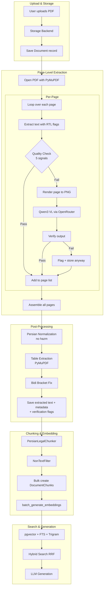

# Phase 1 Extraction Pipeline Refactoring Plan (v2)

> **Goal:** Replace the heavy, multi-branch Persian PDF extraction pipeline with a lightweight, page-level approach using OpenRouter's Qwen3 VL for vision-based OCR when PyMuPDF fails on garbled CMap fonts.

---

## 🔴 Critical Fixes from Architect Review (v1 → v2)

Three issues were identified and fixed in this revision:

| # | Issue | Fix |
|---|-------|-----|
| **1** | Garbled detection + fallback was whole-document, not per-page. Mixed documents (e.g. 75 good pages + 5 garbled) would either miss bad pages or waste cost on good ones. | **Page-level pipeline**: each page is extracted, checked, and potentially re-extracted independently. Only garbled pages are routed to VLM. |
| **2** | Proposed weakening of garbled detector (removing bigram + entropy) could cause false negatives for exactly the edge-case CMap corruption patterns we need to catch. | **Keep and strengthen**: keep all 4 current signals, AND add a **lexicon-based word validity check** (what % of extracted tokens exist in a Persian legal dictionary). The detector is strengthened, not weakened. |
| **3** | VLM hallucination risk for legal content: a fluent wrong article number is worse than garbled text because it's undetectable by the user. | **Fidelity safeguards**: ① strict prompt with explicit number/article preservation, ② post-extraction verification (ascending article number check, digit consistency), ③ confidence flagging for human review. |

---

## Problem Summary

1. **Broken /ToUnicode CMap in Persian PDFs**: PyMuPDF extracts garbled glyph indices instead of Unicode characters for Persian PDFs created by older tools, custom print drivers, or Iranian government/legal software.

2. **Complex multi-stage fallback chain**: PyMuPDF → pdfplumber → Tesseract → EasyOCR, each with their own quirks, produces spaghetti code with no reliable solution for the CMap problem.

3. **Bloated Docker image**: Heavy dependencies (easyocr ~1.5GB RAM, opencv, pdf2image + poppler-utils, pytesseract, pdfplumber, arabic_reshaper, python-bidi, hazm) make the image large and slow to build.

---

## Solution Architecture

### Core Insight

PyMuPDF renders pages to **correct visual images** even when the /ToUnicode CMap is broken. The glyph shapes are drawn correctly on the page — only the text extraction (glyph→Unicode mapping) fails. By rendering the page to an image via [`get_pixmap()`](https://pymupdf.readthedocs.io/en/latest/page.html#Page.get_pixmap) and sending that image to a vision-language model (Qwen3 VL), we get correct Unicode text without any font engineering.

### Page-Level Pipeline (Critical Fix #1)

```mermaid
flowchart TD
    A[PDF Upload] --> B[Open with PyMuPDF]
    B --> C[For each page:]
    C --> D[Extract text with RTL flags]
    D --> E{Page-level Quality Check}
    E -->|Pass| F[Add to page_texts list]
    E -->|Fail - garbled| G[Render page to PNG via get_pixmap]
    G --> H[Base64 encode]
    H --> I[Qwen3 VL via OpenRouter]
    I --> J[Verify extracted text]
    J -->|Verified| F
    J -->|Suspicious| K[Flag for review + add anyway]
    K --> F
    F --> L[Assemble all pages with [PAGE N] markers]
    L --> M[Persian Normalization + Table Extraction]
    M --> N[Chunking & Embedding]

    style G fill:#FFE0B2,stroke:#333
    style I fill:#81C784,stroke:#333
    style K fill:#FFCDD2,stroke:#333
```

**Key difference from v1**: The `for each page` loop means that in an 80-page document with 5 garbled pages, only those 5 pages are sent to the VLM. The rest use fast PyMuPDF extraction.

### Quality Check Signals (Strengthened — Critical Fix #2)

The garbled detector now has **5 signals** (up from 4 in v1), and none are removed:

| Signal | Weight | What it detects |
|--------|--------|-----------------|
| **Stopword ratio** | 0.30 | RTL reversal — stopwords like از, به, در disappear |
| **Bigram plausibility** | 0.15 | Random character substitution (CMap corruption) |
| **RTL consistency** | 0.20 | Shattered text (spaces between characters) |
| **Character entropy** | 0.10 | Unnatural character distribution |
| **Lexicon validity (NEW)** | 0.25 | What % of extracted tokens are valid Persian/legal words |

**Lexicon validity** uses a curated set of ~2000 high-frequency Persian words + ~500 legal terms (ماده, تبصره, قانون, رأی, حکم, دادگاه, etc.). This is the strongest signal for CMap corruption because garbled glyph indices produce tokens that don't exist in any Persian dictionary.

```python
_LEGAL_LEXICON: set = {
    # Persian function words
    "از", "به", "در", "با", "برای", "و", "که", "این", "آن", "را",
    "تا", "یا", "اما", "اگر", "باید", "شاید", "ممکن", "نیز", "هم",
    # Legal domain
    "ماده", "تبصره", "بند", "فصل", "قانون", "رأی", "رای", "حکم",
    "دادگاه", "شعبه", "خواهان", "خوانده", "پرونده", "کلاسه",
    "دادنامه", "الزام", "محکوم", "مستند", "دلایل", "ادعا",
    "دعوی", "درخواست", "اعتراض", "تجدیدنظر", "فرجام", "وکالت",
    "وکیل", "مدعی", "منع", "قبول", "رد", "ابطال", "تنفیذ",
    "استرداد", "تامین", "خسارت", "هزینه", "دادرسی", "کارشناسی",
    "کارشناس", "شرح", "گردش", "کار", "مندرج", "ذیل",
    # Common Persian words (~2000 total, abbreviated here)
    ...
}
```

The **per-page threshold** can be stricter than the document-level one because we don't need to average across pages. Default: `0.25` (quality < 0.25 → garbled).

---

## VLM Fidelity Safeguards (Critical Fix #3)

### 3a. Strict Extraction Prompt

The prompt sent to Qwen3 VL is designed to minimize hallucination:

```
شما یک استخراج‌کننده‌ی دقیق متن از تصویر هستید.

قوانین سختگیرانه:
۱. متن را دقیقاً و کلمه‌به‌کلمه استخراج کنید — هیچ کلمه‌ای را اضافه، حذف یا تغییر ندهید.
۲. اعداد، شماره‌ی مواد، تبصره‌ها، بندها و ارجاعات را دقیقاً حفظ کنید.
۳. سرصفحه‌ها، پاصفحه‌ها، مهرها و متن تکراری را حتی اگر «اضافی» به نظر می‌رسند حذف نکنید.
۴. ساختار پاراگراف‌بندی و خطوط را حفظ کنید.
۵. اگر به بخشی از متن اطمینان ندارید، علامت [?] کنار آن بگذارید.
۶. فقط متن استخراج‌شده را برگردانید — هیچ توضیح اضافه‌ای ندهید.
```

### 3b. Post-Extraction Verification

After the VLM returns text, run automated checks:

```python
def verify_extraction(extracted_text: str, page_num: int) -> VerificationResult:
    """
    Run automated quality checks on VLM output.
    
    Checks performed:
    1. Article number coherence — extract all "ماده \d+" patterns and
       verify they form a logically ascending sequence (no unexpected gaps)
    2. Digit consistency — verify that Arabic/Persian digits weren't
       silently converted to Latin or vice versa
    3. Length sanity — VLM output should be roughly proportional to
       image size (within 20-80% of expected character count)
    4. Repeated content — flag if VLM duplicated paragraphs
    """
```

**Output**: `VerificationResult(verified: bool, confidence: float, flags: list[str])`

- `confidence < 0.7` → text is stored but flagged with `extraction_verified: false` in document metadata
- This flag is exposed in the monitoring UI so users know which documents need human review

### 3c. Cross-Page Article Number Coherence

```python
def check_article_number_sequence(pages_text: list[tuple[int, str]]) -> list[str]:
    """
    Check that article numbers across pages form a logical sequence.
    
    Example: if page 5 mentions "ماده ۲۲" and page 6 starts with "ماده ۲۴",
    that's a possible gap. If page 7 mentions "ماده ۱۲" after "ماده ۲۴",
    that's likely a VLM hallucination and should be flagged.
    """
```

### 3d. Fallback Within Fallback

If the VLM output has `confidence < 0.4` (severe quality issues), the system falls back to returning the original PyMuPDF garbled text (which is at least honest about being low-quality) rather than silently passing hallucinated content into the embedding pipeline. The extraction method field registers `"qwen3_vl_low_conf"` for monitoring.

---

## Comparison: Before vs After

| Aspect | Before (Current) | After (Refactored) |
|--------|-----------------|-------------------|
| **Extraction granularity** | Whole-document | **Per-page** |
| **Primary extractor** | PyMuPDF | PyMuPDF |
| **Fallback 1** | pdfplumber + arabic_reshaper + python-bidi | ❌ Removed |
| **Fallback 2** | Tesseract OCR + poppler-utils | ❌ Removed |
| **Scanned PDF OCR** | EasyOCR + OpenCV + pdf2image (~1.5GB RAM) | Qwen3 VL (page-level, selective) |
| **Table extraction** | pdfplumber | **PyMuPDF `page.find_tables()`** |
| **Persian normalization** | hazm (10MB library) | Custom Python code (~150 lines) |
| **Quality check signals** | 4 signals | **5 signals** (added lexicon validity) |
| **Fidelity verification** | None | **Post-VLM checks** + article sequence validation |
| **Image rendering** | pdf2image → PIL → OpenCV | PyMuPDF `get_pixmap()` → PNG bytes |
| **Docker image** | ~1.5GB+ with all OCR deps | ~300MB |

---

## Dependencies to Remove

### From `requirements.txt`
| Package | Reason for Removal | Replacement |
|---------|-------------------|-------------|
| `easyocr>=1.7.0` | Heavy OCR model (~1.5GB RAM) | Qwen3 VL via OpenRouter API |
| `opencv-python-headless>=4.8.0` | Only used by OcrService for preprocessing | No longer needed |
| `pdf2image>=1.16.0` | PDF→image conversion | PyMuPDF `get_pixmap()` |
| `pytesseract>=0.3.10` | Tesseract OCR fallback | Qwen3 VL |
| `pdfplumber>=0.11.0` | Text fallback + table extraction | PyMuPDF `find_tables()` for tables |
| `arabic_reshaper>=3.0.0` | Only used by pdfplumber fallback | Removed |
| `python-bidi>=0.4.2` | Only used by pdfplumber fallback | Removed |
| `hazm>=0.10.0` | Persian normalization | Custom Python code |

### From `Dockerfile`
| System Package | Reason for Removal |
|----------------|-------------------|
| `libgl1-mesa-glx` | OpenCV dependency |
| `libglib2.0-0` | OpenCV dependency |
| `libsm6`, `libxext6`, `libxrender-dev` | OpenCV GUI dependencies |
| `libgomp1` | OpenMP for OpenCV |
| `poppler-utils` | pdf2image dependency |

### Keep
| Package | Reason |
|---------|--------|
| `PyMuPDF>=1.23.0` | Primary PDF extraction + page rendering + table detection |
| `tiktoken>=0.5.0` | Token counting (used in chunking) |
| `openai>=1.0.0` | OpenRouter API client (already used for embeddings + chat) |

---

## Files to Create

### 1. [`src/backend/documents/services/vision_extraction_service.py`](src/backend/documents/services/vision_extraction_service.py)

**New service** for VLM-based page extraction.

```python
@dataclass
class PageExtractionResult:
    page_num: int
    text: str
    source: str  # "pymupdf" | "qwen3_vl"
    quality_score: float
    verified: bool
    verification_flags: list[str]

class VisionExtractionService:
    """
    Page-level VLM OCR for problematic PDF pages.
    
    - Converts a single PDF page to PNG via PyMuPDF get_pixmap()
    - Sends to OpenRouter Qwen3 VL for transcription
    - Verifies output for legal fidelity
    """
    
    def extract_page(
        self, pdf_document: fitz.Document, page_num: int
    ) -> PageExtractionResult:
        # 1. Render page at 200 DPI
        pix = pdf_document[page_num].get_pixmap(dpi=200)
        # 2. PNG bytes → base64
        img_b64 = base64.b64encode(pix.tobytes("png")).decode()
        # 3. Call OpenRouter with image + strict prompt
        text = self._call_vlm(img_b64)
        # 4. Verify output
        result = self._verify(text, page_num)
        return result
```

### 2. Strengthened garbled detector (in [`document_processing.py`](src/backend/documents/tasks/document_processing.py))

Add `_compute_lexicon_validity()` function with a curated Persian + legal word list:

```python
_PERSIAN_LEGAL_LEXICON: set = {
    # 500+ high-frequency Persian words + legal terms
    ...
}

def _compute_lexicon_validity(text: str) -> float:
    """What fraction of extracted tokens are valid Persian/legal words?"""
    tokens = text.split()
    if not tokens:
        return 0.0
    persian_tokens = [t for t in tokens if any(ord(c) > 0x600 for c in t)]
    if not persian_tokens:
        return 0.0
    valid = sum(1 for t in persian_tokens if t in _PERSIAN_LEGAL_LEXICON)
    return valid / len(persian_tokens)
```

Updated quality score weights: `[0.30, 0.15, 0.20, 0.10, 0.25]`

### 3. Simplified [`persian_normalizer.py`](src/backend/documents/services/persian_normalizer.py)

Replace hazm with custom Python code (character mapping, regex-based ZWNJ fixes, NFKC normalization). All existing method signatures remain unchanged.

---

## Files to Modify

### 4. [`src/backend/documents/tasks/document_processing.py`](src/backend/documents/tasks/document_processing.py)

**Major refactoring of `extract_text_from_pdf`:**

**New page-level flow:**
```python
def extract_text_from_pdf(self, document_id: str) -> str:
    pdf_document = fitz.open(stream=pdf_bytes, filetype="pdf")
    vision_service = VisionExtractionService()
    
    page_results: list[str] = []
    
    for page_num in range(pdf_document.page_count):
        page = pdf_document.load_page(page_num)
        
        # 1. Extract with PyMuPDF
        text = page.get_text("text", flags=(
            fitz.TEXT_PRESERVE_LIGATURES |
            fitz.TEXT_PRESERVE_WHITESPACE |
            fitz.TEXT_PRESERVE_IMAGES |
            fitz.TEXT_DEHYPHENATE
        ))
        
        # 2. Page-level quality check (5 signals)
        if _is_page_garbled(text):
            # 3. VLM extraction for this page only
            result = vision_service.extract_page(pdf_document, page_num)
            text = result.text
            
            if not result.verified:
                # Store verification metadata
                unverified_pages.append({
                    "page": page_num + 1,
                    "flags": result.verification_flags
                })
        
        # 4. Persian normalization (per page)
        normalizer = PersianNormalizer()
        text = normalizer.normalize(text)
        
        page_results.append(f"[PAGE {page_num + 1}]\n{text}")
    
    # 5. Assemble, table extraction, bidi fixes
    ...
    
    # 6. Store verification metadata
    document.vision_verification = {
        "vl_pages": len(pages_sent_to_vlm),
        "unverified_pages": unverified_pages,
        "total_pages": total_pages,
    }
```

**Remove:**
- [`_extract_with_pdfplumber()`](src/backend/documents/tasks/document_processing.py:648)
- [`_extract_with_tesseract()`](src/backend/documents/tasks/document_processing.py:690)
- EasyOCR import and scan detection block (lines 866-955)
- pdfplumber import

**Keep and strengthen:**
- `_compute_stopword_ratio()` (keep, weight 0.30)
- `_compute_bigram_plausibility()` (KEEP — not removed, weight 0.15)
- `_compute_rtl_consistency()` (keep, weight 0.20)
- `_compute_character_entropy()` (KEEP — not removed, weight 0.10)
- `_compute_persian_quality_score()` (updated weights + new signal)
- `_has_shattered_persian_words()` (keep)
- `_fix_bidi_brackets()` (keep)
- `_extract_with_pymupdf_rtl()` (replace with **per-page** version)

### 5. [`src/backend/documents/utils/table_extractor.py`](src/backend/documents/utils/table_extractor.py)

Replace pdfplumber with PyMuPDF:
```python
# Old: pdfplumber
with pdfplumber.open(io.BytesIO(pdf_bytes)) as pdf:
    for page in pdf.pages:
        tables = page.find_tables()

# New: PyMuPDF
doc = fitz.open(stream=pdf_bytes, filetype="pdf")
for page_num in range(doc.page_count):
    page = doc.load_page(page_num)
    tables = page.find_tables()
    for table in tables:
        # table.extract() returns list of rows
        # table.bbox gives bounding box
```

### 6. [`src/backend/config/settings.py`](src/backend/config/settings.py)

**Remove:**
- `EXTRACTION_BACKEND` — no longer multiple backends
- `EXTRACTION_AUTO_FALLBACK` — replaced by per-page quality check
- `EXTRACTION_GARBLED_THRESHOLD_PERSIAN_LEGAL` — single threshold now
- `OCR_EASYOCR_ENABLED`, `OCR_EASYOCR_USE_GPU` — EasyOCR removed
- `OCR_CONFIDENCE_THRESHOLD`, `OCR_CONTRAST_ENABLED`, `OCR_DESKEW_ENABLED` — OpenCV removed

**Add:**
- `VISION_EXTRACTION_MODEL` — default: `qwen/qwen3-vl-235b-a22b-instruct`
- `VISION_EXTRACTION_DPI` — default: 200
- `VISION_EXTRACTION_ENABLED` — default: True
- `VISION_EXTRACTION_MAX_RETRIES` — default: 3

**Keep:**
- `EXTRACTION_GARBLED_THRESHOLD` (default 0.3) — still used for per-page check

### 7. [`docker/backend/Dockerfile`](docker/backend/Dockerfile)

Remove system dependencies (lines 24-35). Keep only Python base image.

### 8. [`src/backend/requirements.txt`](src/backend/requirements.txt)

Remove 8 packages: `easyocr`, `opencv-python-headless`, `pdf2image`, `pytesseract`, `pdfplumber`, `arabic_reshaper`, `python-bidi`, `hazm`.

---

## Files to Delete

### 9. [`src/backend/documents/services/ocr_service.py`](src/backend/documents/services/ocr_service.py)

Entire file — EasyOCR + Tesseract replaced by VisionExtractionService.

### 10. [`src/backend/documents/utils/scanned_pdf_detector.py`](src/backend/documents/utils/scanned_pdf_detector.py)

Can be deleted — scanned page detection is now inline (per-page `get_text().strip()` check).

---

## Files to Keep Unchanged (Phase 2 & 3 Integrity)

| File | Reason |
|------|--------|
| `src/backend/conversations/global_rag_service.py` | Phase 2 Global RAG |
| `src/backend/conversations/strategist_service.py` | Phase 3 Strategist |
| `src/backend/conversations/question_router.py` | Phase 2 question routing |
| `src/backend/conversations/rag_service.py` | RAG service (unchanged interface) |
| `src/backend/conversations/two_stage_rag_service.py` | Phase 2b |
| `src/backend/conversations/supervisor.py` | Phase 3+ agent supervisor |
| `src/backend/conversations/action_engine_service.py` | Phase 4 |
| All providers in `src/backend/providers/` | Chat/embedding providers unchanged |
| All frontend code | No UI changes needed |
| All conversation models/views/serializers | Backend API unchanged |
| All document models | Schema unchanged |

---

## Updated Data Flow Diagram



---

## Model Changes

Add a `vision_verification` JSONB field to the [`Document`](src/backend/documents/models.py) model:

```python
# New field (no migration needed for JSONB — already schema-less)
vision_verification = models.JSONField(
    default=dict, blank=True,
    help_text="VLM extraction verification metadata: "
              "{vl_pages, unverified_pages: [{page, flags}], total_pages}"
)
```

This stores which pages needed VLM extraction and which failed verification. Exposed via the monitoring API.

---

## Implementation Order

| Step | File/Action | Risk | Test Impact |
|------|-------------|------|-------------|
| 1 | Create `VisionExtractionService` | Low — new file | New tests needed |
| 2 | Strengthen garbled detector (add lexicon validity) | Low — additive change | Update quality test assertions |
| 3 | Simplify `PersianNormalizer` (remove hazm) | Medium — affects all normalization | Update normalization tests |
| 4 | Replace pdfplumber tables with PyMuPDF in `TableExtractor` | Medium — table format may differ | Update table extraction tests |
| 5 | Refactor `extract_text_from_pdf` to page-level loop | High — core extraction logic | Major test updates |
| 6 | Clean up `settings.py` | Low — remove unused settings | No test impact |
| 7 | Delete obsolete files | Low — no code references after step 5 | Remove associated tests |
| 8 | Update `Dockerfile` | Low — clean build | No test impact |
| 9 | Update `requirements.txt` | Low — clean install | No test impact |
| 10 | Update `docs/references/database-schema.md` | Low — documentation | No test impact |

---

## Edge Cases & Considerations

### 1. API Reliability
- **Problem**: OpenRouter API could be down or slow
- **Solution**: Retry with exponential backoff (3 retries). If VL fails entirely, fall back to returning garbled PyMuPDF text — it's honest about being low-quality.

### 2. Cost Management
- **Problem**: Each page costs ~$0.001-0.002 for VL OCR
- **Solution**: Page-level routing means only garbled pages are sent (typically 5-10% of pages). 50-page document → ~$0.005-0.01.

### 3. Image Size
- **Problem**: Large pages = large base64 = more tokens
- **Solution**: 200 DPI default. JPEG compression for grayscale. Configurable DPI.

### 4. Mixed Arabic/Persian
- **Problem**: Some documents mix Arabic (عربی) with Persian
- **Solution**: Lexicon includes both Arabic and Persian terms. Qwen3 VL handles both scripts natively.

### 5. Table Extraction Compatibility
- **Problem**: PyMuPDF `find_tables()` may produce different bbox coordinates than pdfplumber
- **Solution**: Verify on known PDFs. The `ExtractedTable` dataclass (page, bbox, markdown, semantic_text) remains unchanged.

### 6. Phase 2 & 3 Non-Regression
- Run existing test suite after each step
- All conversation services, providers, search logic are untouched
- Only extraction pipeline is modified

---

## Configuration

```ini
# NEW — Vision extraction (replaces EasyOCR/Tesseract/pdfplumber)
VISION_EXTRACTION_MODEL=qwen/qwen3-vl-235b-a22b-instruct
VISION_EXTRACTION_DPI=200
VISION_EXTRACTION_ENABLED=True
VISION_EXTRACTION_MAX_RETRIES=3

# REMOVED — OCR settings
# EXTRACTION_BACKEND=pymupdf
# EXTRACTION_AUTO_FALLBACK=True
# OCR_EASYOCR_ENABLED=True
# OCR_EASYOCR_USE_GPU=False
# OCR_CONFIDENCE_THRESHOLD=0.5
# OCR_CONTRAST_ENABLED=True
# OCR_DESKEW_ENABLED=True
# EXTRACTION_GARBLED_THRESHOLD_PERSIAN_LEGAL=0.15
```

---

## Migration Path

1. Deploy new code alongside existing data
2. Existing documents with old extraction methods remain as-is
3. New documents use the page-level pipeline
4. Users can re-process old garbled documents (retry uses new pipeline)
5. The `vision_verification` metadata field is available in the monitoring API for transparency
