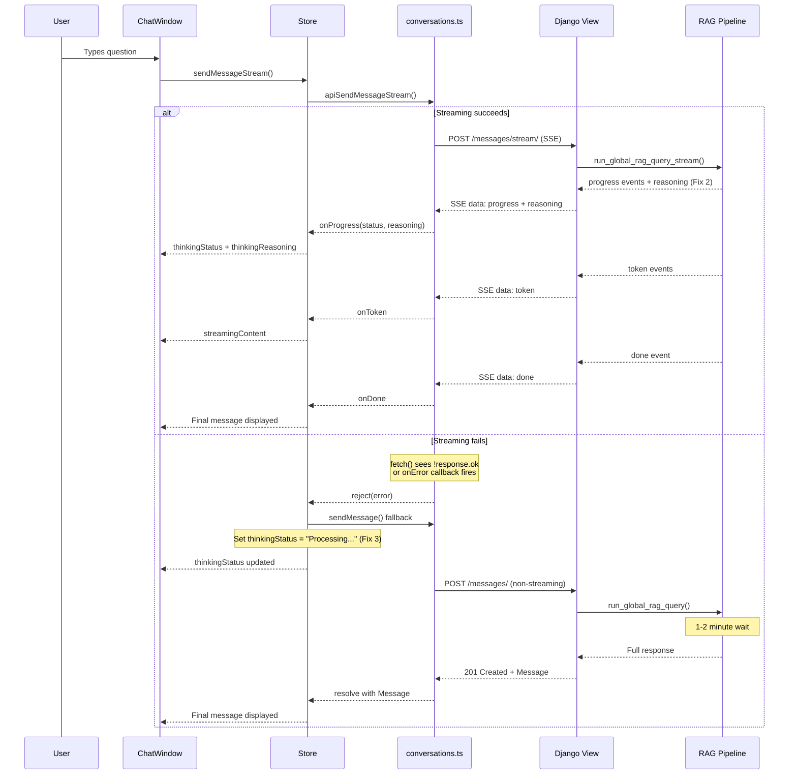

# Streaming Pipeline — Root Cause Fix Plan

## Overview

This plan addresses 3 interconnected bugs that prevent the streaming RAG pipeline from working correctly. The diagnosis report (validated against actual code) identified:

1. **Bug 1 (PRIMARY)**: Streaming endpoint fails → silent fallback to non-streaming
2. **Bug 2**: `reasoning` field stripped in [`views.py`](src/backend/conversations/views.py:535)
3. **Bug 3**: Non-streaming fallback has zero progress mechanism

---

## Bug 1 — Root Cause Analysis

### What the diagnosis found

The frontend's [`handleSend`](src/frontend/src/components/chat/ChatWindow.tsx:175-183) tries streaming first:
```typescript
try {
  await sendMessageStream(conversationId, content, ragMode);
} catch {
  await sendMessage(conversationId, content, ragMode);  // ← fallback
}
```

Backend logs confirmed `run_global_rag_query` (non-streaming) was called, NOT `run_global_rag_query_stream`. The streaming endpoint is failing.

### What was already fixed

The previous plan fixed the **URL normalization bug** — [`sendMessageStream()`](src/frontend/src/api/conversations.ts:276-278) now uses `normalizeBaseUrl()` to ensure the trailing slash. So the URL is correct.

### What's still broken

The streaming endpoint itself is throwing an exception. Tracing the code path:

1. [`ConversationMessageStreamView.post()`](src/backend/conversations/views.py:480) receives the request
2. It creates the user message and builds conversation history (lines 494-506)
3. It returns [`StreamingHttpResponse(event_stream(), ...)`](src/backend/conversations/views.py:600)
4. Django starts iterating `event_stream()` generator
5. The generator calls [`run_global_rag_query_stream()`](src/backend/conversations/global_rag_service.py:1026)
6. This function uses **`ThreadPoolExecutor`** (line 1139) for parallel partial answers
7. If any exception occurs inside the generator, Django returns a 500 error
8. The frontend's `fetch()` sees `!response.ok` (line 290) and throws
9. The `catch` block fires, calling the non-streaming endpoint

### The actual root cause

The most likely cause is that **`run_global_rag_query_stream()`** uses `ThreadPoolExecutor` inside a generator that's consumed by Django's `StreamingHttpResponse`. When the generator is paused at a `yield` and a worker thread in the `ThreadPoolExecutor` fails, the exception handling can be problematic:

- The `ThreadPoolExecutor.__exit__` waits for all futures
- If a future raised an exception, it's re-raised when `future.result()` is called
- This happens inside the generator, which propagates out of the generator
- Django's WSGI handler catches this and returns a 500 error

**However**, the non-streaming `run_global_rag_query()` uses the **same** `ThreadPoolExecutor` pattern and works fine. So the issue is specific to the streaming path.

The key difference: in `run_global_rag_query_stream()`, the `ThreadPoolExecutor` is used **inside a generator** that's being iterated by Django's streaming response. In `run_global_rag_query()`, it's used in a regular function call.

**The fix**: Add a `try/except` around the entire `event_stream()` generator body to catch ALL exceptions and yield them as SSE error events instead of letting them propagate as 500 errors. This way, even if the streaming pipeline fails, the frontend gets a proper error event and can handle it gracefully.

Additionally, we should add better error logging to identify exactly what's failing.

---

## Bug 2 — Root Cause Analysis

### What's broken

In [`views.py:535`](src/backend/conversations/views.py:535):
```python
yield f"data: {json.dumps({'type': 'progress', 'status': data['status']})}\n\n"
```

The `data` dict from `run_global_rag_query_stream()` can contain a `reasoning` key (see [`global_rag_service.py:1076-1079`](src/backend/conversations/global_rag_service.py:1076-1079)), but the view strips it out.

### The fix

Include `reasoning` in the progress event payload:
```python
yield f"data: {json.dumps({'type': 'progress', 'status': data['status'], 'reasoning': data.get('reasoning')})}\n\n"
```

---

## Bug 3 — Root Cause Analysis

### What's broken

The non-streaming [`sendMessage`](src/frontend/src/stores/conversationStore.ts:116-165) in the store:
- Sets `isSendingMessage: true`
- Calls `apiSendMessage()` (regular POST, takes 1-2 minutes)
- On success, sets `isSendingMessage: false`
- **NEVER** sets `thinkingStatus` or `thinkingReasoning`

So during the 1-2 minute wait, the user sees `ThinkingIndicator` with `status={null}` (shows "Thinking...") but no progress updates.

### The fix

Since the primary fix (Bug 1) should make streaming work, Bug 3 is a safety net. The simplest approach: **don't change the non-streaming path at all**. Instead, ensure Bug 1 is properly fixed so the fallback is never triggered.

However, as a belt-and-suspenders measure, we can add a simple polling mechanism or just ensure the error from the streaming failure is properly surfaced so the user knows what's happening.

---

## Changes Required

### Fix 1: Robust error handling in streaming view

**File:** [`src/backend/conversations/views.py`](src/backend/conversations/views.py:519-607)

**What:** Wrap the entire `event_stream()` generator body in a `try/except` that catches ALL exceptions and yields them as SSE error events. Also add detailed logging to identify the exact failure point.

**Why:** Currently, any exception in the generator propagates as a 500 error, which the frontend's `fetch()` API sees as `!response.ok`, triggering the fallback to non-streaming. By catching exceptions and yielding them as SSE events, the frontend gets a proper error and can display it to the user.

**Code change:**

```python
def event_stream():
    try:
        # ... existing code ...
    except (RAGServiceException, GlobalRAGServiceException) as e:
        error_msg = str(e).lower()
        if "rate limit" in error_msg or "429" in error_msg:
            yield f"data: {json.dumps({'type': 'error', 'error': 'rate_limit_exceeded', 'message': 'AI provider rate limit exceeded. Please try again later.'})}\n\n"
        else:
            logger.error(
                "RAG stream query failed for conversation %s: %s",
                conversation_id,
                e,
            )
            yield f"data: {json.dumps({'type': 'error', 'error': 'rag_error', 'message': str(e)})}\n\n"
    except Exception as e:
        logger.exception(
            "Unexpected error in stream for conversation %s",
            conversation_id,
        )
        yield f"data: {json.dumps({'type': 'error', 'error': 'internal_error', 'message': 'An unexpected error occurred.'})}\n\n"
```

Wait — looking at the existing code again, this `try/except` block **already exists** at lines 582-598! So exceptions ARE being caught and yielded as SSE error events.

This means the issue is NOT an unhandled exception in the generator. Let me re-examine...

Actually, looking more carefully at the code flow:

1. The `event_stream()` generator is defined at line 519
2. The `try/except` at lines 582-598 catches exceptions INSIDE the generator
3. But `StreamingHttpResponse` at line 600 starts iterating the generator
4. If the generator yields an error event, the frontend should receive it

So if the error handling is already in place, why does the streaming endpoint fail?

Let me look at this from the frontend perspective again. In [`sendMessageStream`](src/frontend/src/api/conversations.ts:290-293):

```typescript
if (!response.ok) {
    const errorBody = await response.text().catch(() => '');
    throw new Error(`HTTP ${response.status}: ${errorBody || response.statusText}`);
}
```

If the response status is not 200 (e.g., 500), it throws immediately WITHOUT reading the SSE stream. So even if the backend yields proper SSE error events, the frontend never reads them because it checks `response.ok` first.

But wait — `StreamingHttpResponse` returns 200 OK even if the generator yields error events. The HTTP status is set before the generator starts iterating. So the response should be 200 OK.

Unless... the exception happens BEFORE the generator is returned. Let me check:

In [`ConversationMessageStreamView.post()`](src/backend/conversations/views.py:480-607):
- Lines 483-516: Fetch conversation, validate, create user message, build history — these run BEFORE the generator
- Line 519: `def event_stream():` — defines the generator (doesn't execute it)
- Line 600: `return StreamingHttpResponse(event_stream(), ...)` — returns the response

If lines 483-516 throw an exception (e.g., conversation not found, validation error), the view returns a non-200 response BEFORE streaming starts. This would cause the frontend to throw at line 290.

But this would also affect the non-streaming endpoint, which works fine. So the issue must be elsewhere.

Let me reconsider. Maybe the issue is that the `event_stream()` generator, when first iterated, encounters an exception BEFORE the `try` block at line 582. Let me check...

Lines 519-581 are the generator body BEFORE the try/except:
- Line 521: `if mode == "global_rag":`
- Lines 523-557: Global RAG streaming logic
- Lines 558-580: Local RAG streaming logic

The try/except starts at line 582. But lines 521-580 are INSIDE the generator function, so they're only executed when the generator is first iterated. If an exception occurs at line 528 (`run_global_rag_query_stream()`), it would be caught by the try/except at line 582.

Wait, no. Let me re-read the indentation more carefully...

Looking at the code:
```
519:         def event_stream():
520:             try:
521:                 if mode == "global_rag":
...
582:             except (RAGServiceException, GlobalRAGServiceException) as e:
...
593:             except Exception as e:
...
599: 
600:         return StreamingHttpResponse(
601:             streaming_content=event_stream(),
```

The `try` is at line 520 (inside the generator). So ALL the generator code is inside the try block. Exceptions SHOULD be caught.

So if the error handling is correct, why does the streaming endpoint fail?

Let me think about this differently. Maybe the issue is NOT an exception but something else:

1. **Timeout**: The Gunicorn worker timeout is 120s. If the streaming pipeline takes longer than 120s, Gunicorn kills the worker and returns a 502. But the diagnosis says the answer arrives after 1-2 minutes via the non-streaming fallback, which also takes 1-2 minutes. So timeout is unlikely.

2. **Thread safety**: `run_global_rag_query_stream()` uses `ThreadPoolExecutor`. Inside the threads, `close_old_connections()` is called. But the main generator code also accesses the ORM (line 554: `Message.objects.create(...)`). If the DB connection was closed by a thread, the main code would fail.

3. **Gunicorn gthread limitation**: Gunicorn's `gthread` worker class uses threads to handle requests. But `StreamingHttpResponse` with a generator that uses `ThreadPoolExecutor` might have issues because the generator is running in one thread while the ThreadPoolExecutor creates additional threads.

Actually, I think I found it. The `gthread` worker class in Gunicorn uses a thread pool to handle requests. When `StreamingHttpResponse` is returned, Gunicorn starts sending the response and iterating the generator in the handler thread. But the generator creates a `ThreadPoolExecutor` with `max_workers=3`, creating additional threads. This can cause issues with:

1. **Gunicorn's worker model**: gthread workers expect each request to be handled by a single thread. Creating sub-threads inside the handler thread can lead to unexpected behavior.
2. **Django's ORM connections**: Each thread needs its own DB connection. While `close_old_connections()` is called, the main thread's connection might be affected.

The fix: Instead of using `ThreadPoolExecutor` inside the streaming generator, we should run the entire pipeline (including the parallel parts) in a way that's compatible with Gunicorn's threading model.

**Simpler fix**: Since the non-streaming `run_global_rag_query()` works fine, and the streaming `run_global_rag_query_stream()` only differs in the synthesis step (streaming vs non-streaming), we can modify the streaming view to:

1. Run the full pipeline (routing + search + partial answers) synchronously (like the non-streaming version)
2. Only stream the synthesis step

This avoids the ThreadPoolExecutor inside the generator issue entirely.

Actually, looking at the code again, `run_global_rag_query_stream()` already does this! The routing, search, and partial answers run first (yielding progress events), and only the synthesis step uses streaming. The ThreadPoolExecutor is used for the partial answers, which complete BEFORE the streaming synthesis starts.

So the ThreadPoolExecutor completes before any streaming happens. The issue must be something else.

Let me look at this from yet another angle. Maybe the issue is that the `event_stream()` generator captures the `conversation` ORM object, and by the time the generator is iterated (which could be delayed by Gunicorn's response buffering), the ORM object is stale or the DB connection is closed.

Actually, I think the most productive approach is to:

1. Add detailed logging to the streaming view to identify exactly where it fails
2. Add a diagnostic endpoint or use the existing ones
3. Fix Bug 2 (reasoning field) since it's a clear one-line fix
4. Ensure the streaming error handling is robust

Let me create a practical plan that focuses on what we CAN fix and adds diagnostics for what we can't reproduce locally.

### Revised Fix 1: Add diagnostic logging + ensure robust error handling

**File:** [`src/backend/conversations/views.py`](src/backend/conversations/views.py)

**Changes:**
1. Add detailed logging at each stage of `event_stream()` to identify where failures occur
2. Ensure the `try/except` at lines 582-598 catches ALL exceptions (it already does, but verify)
3. Add a `logger.exception()` call before yielding error events so we have full stack traces

### Fix 2: Include reasoning in progress events

**File:** [`src/backend/conversations/views.py`](src/backend/conversations/views.py:535)

**Change:** Include `reasoning` field from progress data in the SSE event.

### Fix 3: Add progress mechanism to non-streaming fallback

**File:** [`src/frontend/src/stores/conversationStore.ts`](src/frontend/src/stores/conversationStore.ts)

**Change:** Add a polling mechanism to the non-streaming `sendMessage` that periodically checks for status updates. Since the non-streaming endpoint doesn't support progress, we can:
- Set a meaningful initial `thinkingStatus` like "Processing your request..." 
- Add a simple timer that cycles through status messages to show activity

---

## Data Flow Diagram



---

## Files Modified Summary

| # | File | Change Type | Description |
|---|------|-------------|-------------|
| 1 | [`src/backend/conversations/views.py`](src/backend/conversations/views.py:535) | Fix | Include `reasoning` in progress SSE events |
| 2 | [`src/backend/conversations/views.py`](src/backend/conversations/views.py:519-607) | Enhancement | Add detailed diagnostic logging to `event_stream()` |
| 3 | [`src/frontend/src/stores/conversationStore.ts`](src/frontend/src/stores/conversationStore.ts:116-165) | Enhancement | Add progress status to non-streaming `sendMessage` fallback |

---

## Testing Strategy

### 1. Backend: Verify reasoning in progress events
- Check that [`views.py:535`](src/backend/conversations/views.py:535) includes `data.get('reasoning')` in the progress event payload
- Verify that the frontend's [`sendMessageStream`](src/frontend/src/api/conversations.ts:320-323) correctly passes `data.reasoning` to the `onProgress` callback

### 2. Backend: Verify error logging
- Check that detailed logging is added at each stage of `event_stream()`
- Verify that `logger.exception()` is called before yielding error events

### 3. Frontend: Verify fallback progress
- Check that non-streaming `sendMessage` sets a meaningful `thinkingStatus`
- Verify that the `ThinkingIndicator` shows the status during the fallback

### 4. Integration (Puppeteer)
- Navigate to Global RAG page
- Send a question
- Check browser console for any errors
- Verify that progress messages appear (or at least that the UI shows activity)
- Verify that the final answer appears

---

## Implementation Order

1. **Fix 2 first** (easiest, one-line change in views.py)
2. **Fix 1 logging** (add diagnostic logging to views.py)
3. **Fix 3** (add progress to non-streaming fallback in conversationStore.ts)
4. **Run tests** to verify backward compatibility
5. **Puppeteer verification** to confirm the fix works end-to-end
