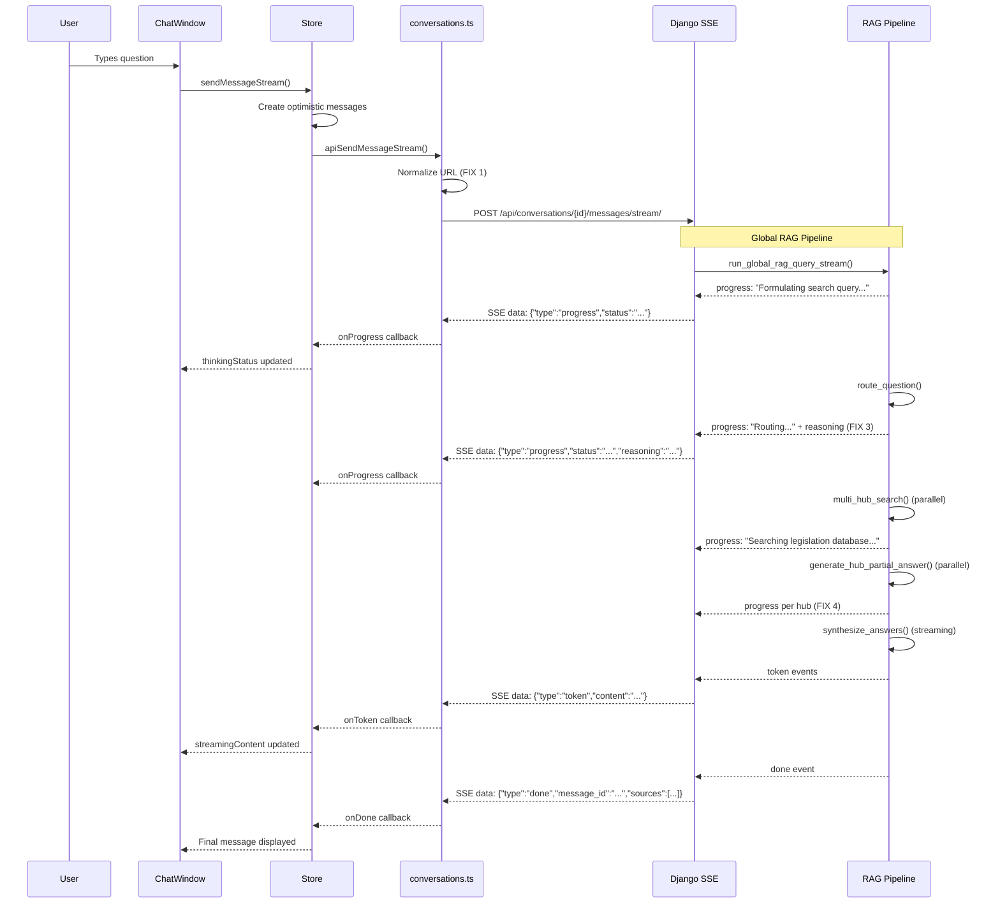

# Streaming & Progress Display — Fix & Enhancement Plan

## Overview

This plan addresses two interconnected issues:

1. **Streaming is broken** due to a URL bug in [`sendMessageStream()`](src/frontend/src/api/conversations.ts:276-277) — the missing trailing slash causes a 404, forcing a fallback to non-streaming `sendMessage()`.
2. **Progress display is minimal** — even after fixing streaming, Local RAG has no progress events, and Global RAG's progress messages are generic and don't expose the LLM's reasoning.

---

## Root Cause Analysis

### The URL Bug

In [`sendMessageStream()`](src/frontend/src/api/conversations.ts:276-277):

```typescript
const response = await fetch(
  `${import.meta.env.VITE_API_URL || 'http://localhost:8000/api/'}conversations/${conversationId}/messages/stream/`,
```

[`VITE_API_URL`](src/frontend/.env.development:2) = `http://localhost:8000/api` (no trailing slash)

Resulting URL: `http://localhost:8000/apiconversations/{id}/messages/stream/` ❌

Expected URL: `http://localhost:8000/api/conversations/{id}/messages/stream/` ✅

### The Fallback Chain

```
sendMessageStream() → fetch() → 404 → catch → sendMessage() (axios, works fine, non-streaming)
```

In [`ChatWindow.tsx:171-175`](src/frontend/src/components/chat/ChatWindow.tsx:171-175):
```typescript
try {
  await sendMessageStream(conversationId, content, ragMode);
} catch {
  await sendMessage(conversationId, content, ragMode);  // ← non-streaming fallback
}
```

### Why axios works but fetch doesn't

[`normalizeBaseUrl`](src/frontend/src/api/axios.ts:5-7) ensures a trailing slash for axios:
```typescript
const normalizeBaseUrl = (url: string): string => {
  return url.endsWith('/') ? url : `${url}/`;
};
```

But [`sendMessageStream()`](src/frontend/src/api/conversations.ts:276-277) uses raw `fetch()` without this normalization.

---

## Changes Required

### Fix 1: Normalize base URL in `sendMessageStream()` (Frontend)

**File:** [`src/frontend/src/api/conversations.ts`](src/frontend/src/api/conversations.ts)

**What:** Import `normalizeBaseUrl` from `./axios` and use it to normalize the base URL before constructing the fetch URL.

**Why:** This is the root cause fix. Using the same normalization function that axios uses ensures consistency.

**Code change:**

```typescript
// At the top of the file, add import:
import { apiClient, normalizeBaseUrl } from './axios';

// In sendMessageStream(), change line 276-277 from:
const response = await fetch(
  `${import.meta.env.VITE_API_URL || 'http://localhost:8000/api/'}conversations/${conversationId}/messages/stream/`,
// To:
const baseUrl = normalizeBaseUrl(import.meta.env.VITE_API_URL || 'http://localhost:8000/api/');
const response = await fetch(
  `${baseUrl}conversations/${conversationId}/messages/stream/`,
```

**Note:** `normalizeBaseUrl` is currently a private function in [`axios.ts`](src/frontend/src/api/axios.ts:5-7). It needs to be exported.

---

### Fix 2: Add progress events to Local RAG streaming (Backend)

**File:** [`src/backend/conversations/rag_service.py`](src/backend/conversations/rag_service.py)

**What:** Add `"progress"` yield events to [`run_rag_query_stream()`](src/backend/conversations/rag_service.py:360-480) so Local RAG users see thinking status updates.

**Current state:** Only yields `"token"` and `"done"` events.

**Code change — add progress yields at each pipeline stage:**

```python
# Before formulate_query (line ~380):
yield ("progress", {"status": "Formulating search query..."})

# Before hybrid_search (line ~405):
yield ("progress", {"status": "Searching document..."})

# Before chat provider call (line ~444):
yield ("progress", {"status": "Generating answer..."})
```

**Why:** This gives users visibility into what the system is doing during the ~10-30 second Local RAG pipeline.

---

### Fix 3: Enhance Global RAG progress with router reasoning (Backend)

**File:** [`src/backend/conversations/global_rag_service.py`](src/backend/conversations/global_rag_service.py)

**What:** After [`route_question()`](src/backend/conversations/question_router.py:219) succeeds in [`run_global_rag_query_stream()`](src/backend/conversations/global_rag_service.py:1026), yield a progress event that includes the actual `reasoning` from the [`RouterResult`](src/backend/conversations/question_router.py:194).

**Current state (line 1059-1078):**
```python
yield ("progress", {"status": "Formulating search query..."})
# ... route_question() ...
yield ("progress", {"status": "Routing question to legal knowledge hubs..."})
```

**Code change — add reasoning progress after routing:**

```python
yield ("progress", {"status": "Formulating search query..."})
router_result = route_question(question)

# NEW: Yield reasoning from the router
if router_result.reasoning:
    yield ("progress", {"status": f"Routing question to legal knowledge hubs...", "reasoning": router_result.reasoning})
else:
    yield ("progress", {"status": "Routing question to legal knowledge hubs..."})
```

**Why:** The router's reasoning (e.g., "The question asks about a specific penalty under the law, which is primarily a legislation matter...") provides valuable insight into how the system is thinking.

**Frontend consideration:** The [`ThinkingIndicator`](src/frontend/src/components/chat/ChatWindow.tsx:126-135) currently only displays `thinkingStatus` as a simple string. To show reasoning, we need to either:
- Append reasoning to the status string (simple)
- Or add a separate `reasoning` field to the store and display it (more complex)

**Recommendation:** Keep it simple — append reasoning to the status string, e.g.:
```
"Routing question to legal knowledge hubs... (Reasoning: The question asks about...)"
```

But this might be too verbose. Better approach: update the `ThinkingIndicator` to show reasoning in a subtle way below the status.

**Updated approach for ThinkingIndicator:**

```tsx
function ThinkingIndicator({ status, reasoning }: { status: string | null; reasoning: string | null }) {
  return (
    <div className="flex items-start gap-2 px-4 py-2 text-muted-foreground">
      <Loader2 className="h-4 w-4 animate-spin mt-0.5" />
      <div className="flex flex-col gap-1">
        <span className="text-sm">{status || 'Thinking...'}</span>
        {reasoning && (
          <span className="text-xs text-muted-foreground/70 italic line-clamp-2">
            {reasoning}
          </span>
        )}
      </div>
    </div>
  );
}
```

---

### Fix 4: Add per-hub partial answer progress events (Backend)

**File:** [`src/backend/conversations/global_rag_service.py`](src/backend/conversations/global_rag_service.py)

**What:** Instead of one generic "Searching legislation database..." for all 3 hubs, yield progress as each hub's partial answer completes.

**Current state (line 1115):**
```python
yield ("progress", {"status": "Searching legislation database..."})
```

**Code change — yield progress per hub as futures complete:**

After the `ThreadPoolExecutor` for partial answers (line 1131-1162), yield progress as each hub completes:

```python
# Track completed hubs
completed_hubs = []
for future in as_completed(future_map, timeout=60):
    hub_type = future_map[future]
    try:
        _, pa = future.result(timeout=_TIMEOUT_PER_HUB)
        partial_answers[hub_type] = pa
        completed_hubs.append(hub_type)
        hub_label = HUB_LABELS.get(hub_type, hub_type)
        yield ("progress", {"status": f"Retrieved answer from {hub_label}..."})
    except TimeoutError:
        ...
```

**Why:** This gives users real-time visibility into which hubs have been processed, making the 2.5-minute wait feel more responsive.

---

## Data Flow Diagram



---

## Testing Strategy

### 1. Unit Test: URL normalization
- Verify that `sendMessageStream()` constructs the correct URL with and without trailing slash in `VITE_API_URL`.

### 2. Backend Test: Progress events in Local RAG
- Verify that `run_rag_query_stream()` yields `("progress", ...)` events at each stage.

### 3. Backend Test: Router reasoning in progress
- Verify that `run_global_rag_query_stream()` yields a progress event with `reasoning` from the router result.

### 4. Backend Test: Per-hub progress
- Verify that progress events are yielded as each hub's partial answer completes.

### 5. Integration Test (Puppeteer)
- Navigate to Global RAG chat page
- Send a question
- Verify that progress messages appear in the UI
- Verify that streaming tokens appear
- Verify that the final answer is displayed with sources and partial answers

---

## Files Modified Summary

| # | File | Change Type | Description |
|---|------|-------------|-------------|
| 1 | [`src/frontend/src/api/axios.ts`](src/frontend/src/api/axios.ts:5-7) | Export | Export `normalizeBaseUrl` function |
| 2 | [`src/frontend/src/api/conversations.ts`](src/frontend/src/api/conversations.ts:276-277) | Fix | Normalize base URL in `sendMessageStream()` |
| 3 | [`src/backend/conversations/rag_service.py`](src/backend/conversations/rag_service.py:360-480) | Enhancement | Add progress events to `run_rag_query_stream()` |
| 4 | [`src/backend/conversations/global_rag_service.py`](src/backend/conversations/global_rag_service.py:1026-1301) | Enhancement | Add router reasoning + per-hub progress events |
| 5 | [`src/frontend/src/components/chat/ChatWindow.tsx`](src/frontend/src/components/chat/ChatWindow.tsx:126-135) | Enhancement | Update `ThinkingIndicator` to show reasoning |
| 6 | [`src/frontend/src/stores/conversationStore.ts`](src/frontend/src/stores/conversationStore.ts:29-40) | Enhancement | Add `thinkingReasoning` field to store |
