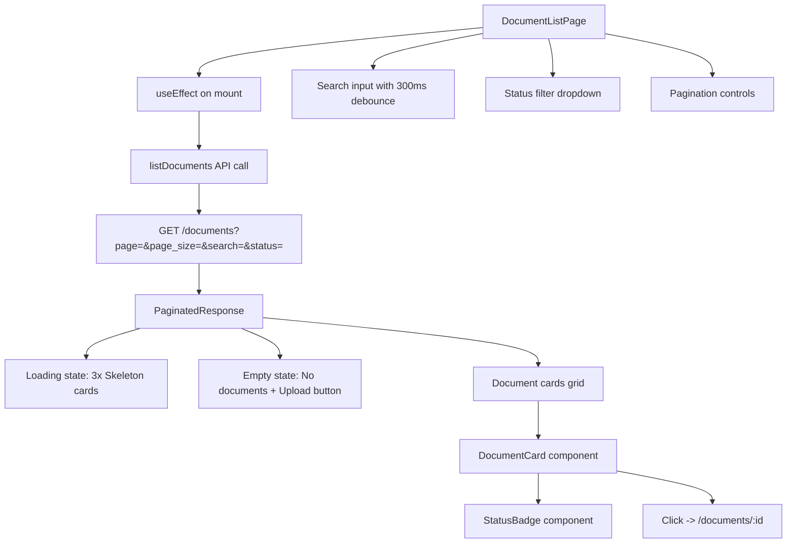
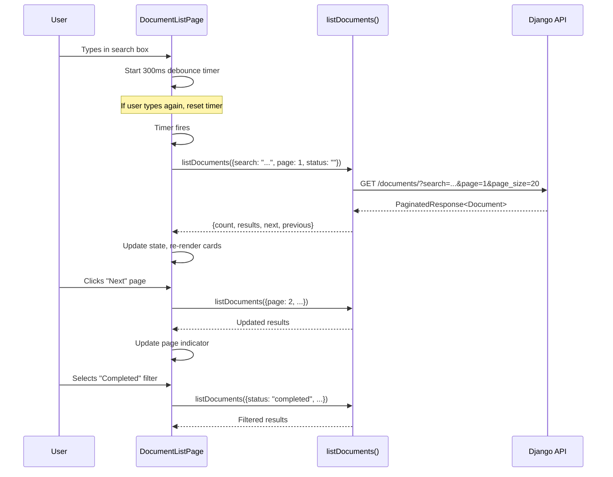

# T02 — Document List Page Implementation Plan

## Overview

Implement a paginated, searchable, filterable document list page with status badges. This task is purely frontend — the backend already has the repository method `get_user_documents()` and the API registry documents the `GET /documents` endpoint, but the backend view/URL for listing documents needs to be created first.

---

## Architecture



---

## Files to Create / Modify

### 1. NEW: [`src/frontend/src/components/documents/StatusBadge.tsx`](src/frontend/src/components/documents/StatusBadge.tsx)

**Purpose:** Colored badge mapping `processing_status` → color/label.

**Mapping:**
| Status | Color | Extra |
|--------|-------|-------|
| `pending` | `bg-gray-100 text-gray-800` | — |
| `processing` | `bg-blue-100 text-blue-800` | `animate-pulse` |
| `completed` | `bg-green-100 text-green-800` | — |
| `failed` | `bg-red-100 text-red-800` | — |

**Props:**
- `status: string` — the `processing_status` value from the Document model

**Implementation:**
- Use a simple `<span>` with Tailwind classes (no shadcn Badge component since it doesn't exist yet)
- Map status → `{ label, className }` using a lookup object
- Handle unknown statuses gracefully (fallback to gray)

### 2. NEW: [`src/frontend/src/components/documents/DocumentCard.tsx`](src/frontend/src/components/documents/DocumentCard.tsx)

**Purpose:** Card showing document metadata, clickable → detail page.

**Props:**
- `document: Document` — the document object

**Displayed fields:**
- `title` (bold, primary text)
- `original_filename` (muted, smaller)
- `file_size` — formatted as KB/MB/GB using a helper
- `total_pages` — display number or `"—"` if null
- `created_at` — formatted as a readable date (e.g., `Apr 18, 2026`)
- `StatusBadge` with `document.status` (the `status` field from the API response)

**Behavior:**
- Wrapped in a `<Card>` from shadcn/ui
- Entire card is clickable → navigates to `/documents/${document.id}`
- Use `useNavigate` from react-router-dom
- `cursor-pointer` and `hover:shadow-md` transition

### 3. NEW: [`src/frontend/src/lib/api/documents.ts`](src/frontend/src/lib/api/documents.ts) — Add `listDocuments()`

**Purpose:** API function to fetch paginated, searchable, filterable document list.

**Signature:**
```typescript
interface ListDocumentsParams {
  page?: number;
  page_size?: number;
  search?: string;
  status?: string;
}

async function listDocuments(params?: ListDocumentsParams): Promise<PaginatedResponse<Document>>
```

**Implementation:**
- Use the existing `apiClient` from `@/api/axios`
- Build query params from the params object (skip undefined values)
- Endpoint: `documents/` (relative to baseURL which already has `/api/` trailing slash)
- Return `data` from the axios response

### 4. NEW: [`src/frontend/src/pages/documents/DocumentListPage.tsx`](src/frontend/src/pages/documents/DocumentListPage.tsx)

**Purpose:** The main list page with search, filter, pagination, loading, and empty states.

**State management (useState):**
- `documents: Document[]` — current page results
- `totalCount: number` — total count from API
- `currentPage: number` — current page number
- `totalPages: number` — computed from count / page_size
- `searchQuery: string` — search input value
- `statusFilter: string` — selected filter value (`''` = All)
- `isLoading: boolean` — loading indicator
- `error: string | null` — error message

**Data fetching:**
- `fetchDocuments()` function that calls `listDocuments()` with current params
- Called on:
  - Mount (`useEffect` with empty deps)
  - Page change
  - Status filter change
  - Search query change (debounced 300ms)

**Debounced search:**
- Use a `useEffect` with a 300ms `setTimeout` that triggers `fetchDocuments()` when `searchQuery` changes
- Clear timeout on cleanup

**Layout:**
```
┌─────────────────────────────────────────────┐
│  Documents                                  │
│  Browse and manage your uploaded documents. │
├─────────────────────────────────────────────┤
│  [Search input]    [Status filter dropdown] │
├─────────────────────────────────────────────┤
│  ┌──────────┐ ┌──────────┐ ┌──────────┐    │
│  │ Card 1   │ │ Card 2   │ │ Card 3   │    │
│  └──────────┘ └──────────┘ └──────────┘    │
│  ┌──────────┐ ┌──────────┐                  │
│  │ Card 4   │ │ Card 5   │                  │
│  └──────────┘ └──────────┘                  │
├─────────────────────────────────────────────┤
│  [Previous]  Page 2  [Next]                 │
└─────────────────────────────────────────────┘
```

**States:**
1. **Loading:** Show 3× `<Skeleton>` cards (need to create a simple skeleton component or use inline divs with `animate-pulse`)
2. **Error:** Show an `Alert` with `variant="destructive"` and error message + retry button
3. **Empty:** Show "No documents yet" message + "Upload your first document" button → `/documents/upload`
4. **Data:** Show document cards in a responsive grid (`grid grid-cols-1 md:grid-cols-2 lg:grid-cols-3`)

**Filter dropdown:**
- Use a native `<select>` element styled with Tailwind (since `@radix-ui/react-select` is not installed)
- Options: All, Ready (completed), Processing, Failed

**Pagination:**
- Previous button (disabled on page 1)
- "Page X of Y" display
- Next button (disabled on last page)

### 5. NEW: [`src/frontend/src/pages/documents/DocumentListPage.test.tsx`](src/frontend/src/pages/documents/DocumentListPage.test.tsx)

**Purpose:** Smoke + interaction tests.

**Test plan:**
1. **Smoke test:** Renders list with mocked API response — mock `listDocuments` to return 2 documents, verify cards render
2. **Empty state:** Mock `listDocuments` to return empty results, verify "Upload your first document" button renders
3. **Loading state:** Mock `listDocuments` to return a promise that never resolves, verify skeleton cards render
4. **Error state:** Mock `listDocuments` to reject, verify error alert renders

**Mocking strategy:**
- Use `vi.mock('@/lib/api/documents', ...)` to mock the `listDocuments` function
- Wrap in `MemoryRouter` for routing context
- Use `@testing-library/react` for rendering and queries

### 6. MODIFY: [`src/frontend/src/App.tsx`](src/frontend/src/App.tsx)

**Change:** Update the import path for `DocumentListPage` from `@/pages/DocumentListPage` to `@/pages/documents/DocumentListPage`.

The old `src/frontend/src/pages/DocumentListPage.tsx` is a stub. The new one will be at `src/frontend/src/pages/documents/DocumentListPage.tsx`. We need to:
1. Update the import in `App.tsx`
2. Delete the old stub file `src/frontend/src/pages/DocumentListPage.tsx`

---

## Backend Work Required

The backend currently has:
- `GET /documents/upload/` (upload endpoint)
- `GET /documents/<uuid:document_id>/...` (detail endpoints)
- Repository method `get_user_documents()` in [`src/backend/documents/repositories/document_repository.py`](src/backend/documents/repositories/document_repository.py)

**Missing:** A `GET /documents/` list endpoint.

### NEW: Backend View — `DocumentListView`

**File:** [`src/backend/documents/views.py`](src/backend/documents/views.py)

Add a new view class:

```python
class DocumentListView(APIView):
    permission_classes = [IsAuthenticated]

    def get(self, request: Request) -> Response:
        page = int(request.query_params.get("page", 1))
        page_size = int(request.query_params.get("page_size", 20))
        search = request.query_params.get("search", "")
        status_filter = request.query_params.get("status", "")

        # Clamp values
        page = max(1, page)
        page_size = max(1, min(100, page_size))

        # Build queryset
        queryset = Document.objects.filter(user=request.user)
        
        if search:
            queryset = queryset.filter(title__icontains=search)
        
        if status_filter:
            queryset = queryset.filter(status=status_filter)
        
        queryset = queryset.order_by("-created_at")

        # Paginate
        paginator = Paginator(queryset, page_size)
        try:
            page_obj = paginator.page(page)
        except EmptyPage:
            page_obj = paginator.page(paginator.num_pages) if paginator.num_pages > 0 else []
            page = paginator.num_pages if paginator.num_pages > 0 else 1

        # Serialize
        results = []
        for doc in page_obj.object_list:
            results.append({
                "id": str(doc.id),
                "title": doc.title,
                "original_filename": doc.original_filename,
                "file_size": doc.file_size,
                "total_pages": doc.total_pages,
                "status": doc.status,
                "created_at": doc.created_at.isoformat(),
                "updated_at": doc.updated_at.isoformat() if doc.updated_at else None,
            })

        # Build next/previous URLs
        base_url = request.build_absolute_uri(request.path)
        next_url = f"{base_url}?page={page + 1}&page_size={page_size}" if page_obj.has_next() else None
        prev_url = f"{base_url}?page={page - 1}&page_size={page_size}" if page_obj.has_previous() else None

        return Response({
            "count": paginator.count,
            "next": next_url,
            "previous": prev_url,
            "results": results,
        })
```

### MODIFY: [`src/backend/documents/urls.py`](src/backend/documents/urls.py)

Add the list route at the top of `urlpatterns`:

```python
path("", DocumentListView.as_view(), name="document-list"),
```

**Important:** This must be placed **before** the `upload/` path to avoid Django catching `upload` as a UUID.

### MODIFY: [`docs/references/api-registry.md`](docs/references/api-registry.md)

Update the `GET /documents` entry from "Planned" to "✅ Implemented" with the correct implementation date.

---

## Detailed Implementation Steps

### Step 1: Backend — Add DocumentListView

1. Open [`src/backend/documents/views.py`](src/backend/documents/views.py)
2. Add import: `from django.core.paginator import EmptyPage, Paginator`
3. Add `DocumentListView` class (see above)
4. Open [`src/backend/documents/urls.py`](src/backend/documents/urls.py)
5. Add import for `DocumentListView`
6. Add `path("", DocumentListView.as_view(), name="document-list")` at the top of `urlpatterns`

### Step 2: Frontend — Add `listDocuments()` API function

1. Open [`src/frontend/src/lib/api/documents.ts`](src/frontend/src/lib/api/documents.ts)
2. Add imports: `import { apiClient } from '@/api/axios';` and `import type { Document, PaginatedResponse } from '@/types/document';`
3. Add `ListDocumentsParams` interface
4. Add `listDocuments()` function

### Step 3: Frontend — Create `StatusBadge` component

1. Create [`src/frontend/src/components/documents/StatusBadge.tsx`](src/frontend/src/components/documents/StatusBadge.tsx)
2. Implement status → color/label mapping
3. Export as default

### Step 4: Frontend — Create `DocumentCard` component

1. Create [`src/frontend/src/components/documents/DocumentCard.tsx`](src/frontend/src/components/documents/DocumentCard.tsx)
2. Use shadcn `Card`, `CardHeader`, `CardContent` components
3. Display all metadata fields
4. Add click handler → navigate to detail page
5. Add file size formatting helper

### Step 5: Frontend — Create `DocumentListPage`

1. Create [`src/frontend/src/pages/documents/DocumentListPage.tsx`](src/frontend/src/pages/documents/DocumentListPage.tsx)
2. Implement all states: loading, error, empty, data
3. Implement search with debounce
4. Implement status filter dropdown
5. Implement pagination controls
6. Use responsive grid layout for cards

### Step 6: Frontend — Update routing

1. Open [`src/frontend/src/App.tsx`](src/frontend/src/App.tsx)
2. Update import path for `DocumentListPage`
3. Delete old stub file [`src/frontend/src/pages/DocumentListPage.tsx`](src/frontend/src/pages/DocumentListPage.tsx)

### Step 7: Frontend — Create tests

1. Create [`src/frontend/src/pages/documents/DocumentListPage.test.tsx`](src/frontend/src/pages/documents/DocumentListPage.test.tsx)
2. Write smoke test with mocked API response
3. Write empty state test
4. Write loading state test
5. Write error state test

### Step 8: Update reference docs

1. Update [`docs/references/api-registry.md`](docs/references/api-registry.md) — mark `GET /documents` as implemented
2. Update [`docs/active-task/wip-context.md`](docs/active-task/wip-context.md) with completion status

---

## Key Design Decisions

1. **Use `status` field (not `processing_status`):** The backend `Document` model has both `status` (upload lifecycle: uploaded/processing/completed/failed) and `processing_status` (pipeline granular). The API registry shows the list endpoint returns `status`. The `StatusBadge` should map the `status` field values.

2. **Native `<select>` for filter:** Since `@radix-ui/react-select` is not in the project dependencies, use a native `<select>` styled with Tailwind. This avoids adding a new dependency.

3. **Inline skeleton:** Since `@/components/ui/skeleton.tsx` doesn't exist, create a simple inline skeleton using `div` with `animate-pulse` and `bg-muted` classes, or create a minimal `Skeleton` component.

4. **Debounce via `useEffect` + `setTimeout`:** No need for a third-party debounce library. A simple `useEffect` with `setTimeout` and cleanup is sufficient.

5. **No `@radix-ui/react-select`:** The project uses `@radix-ui/react-dropdown-menu` but not `@radix-ui/react-select`. Use native `<select>` for the filter dropdown to avoid adding dependencies.

---

## Component Tree

```
DocumentListPage
├── PageHeader (title + description)
├── SearchAndFilterBar
│   ├── Input (search, debounced)
│   └── select (status filter)
├── ContentArea
│   ├── [loading] 3× SkeletonCard
│   ├── [error] Alert + Retry button
│   ├── [empty] EmptyState + Upload button
│   └── [data] DocumentCard grid
│       └── DocumentCard (×N)
│           ├── title
│           ├── original_filename
│           ├── file_size (formatted)
│           ├── total_pages
│           ├── created_at (formatted)
│           └── StatusBadge
└── Pagination
    ├── Previous button
    ├── Page indicator
    └── Next button
```

---

## Data Flow



---

## Test Scenarios

| # | Scenario | Mock Setup | Assertion |
|---|----------|------------|-----------|
| 1 | Smoke test — renders cards | `listDocuments` resolves with 2 documents | Cards are rendered with titles visible |
| 2 | Empty state | `listDocuments` resolves with `{count: 0, results: []}` | "Upload your first document" button visible |
| 3 | Loading state | `listDocuments` returns never-resolving promise | Skeleton/pulse elements visible |
| 4 | Error state | `listDocuments` rejects with error | Error alert with message visible |
