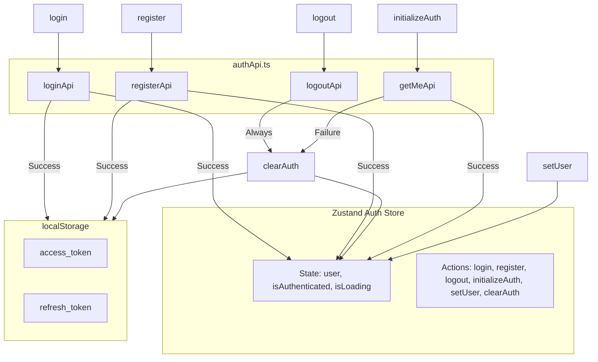

# Task E08-T3: Zustand Auth Store — Implementation Prompt

## Overview

Create a centralized Zustand auth store for managing authentication state in the DocuChat frontend. This store will be the single source of truth for auth state (`user`, `isAuthenticated`, `isLoading`) and will provide actions for login, register, logout, initialize auth, set user, and clear auth.

**Important:** Do NOT follow the TDD approach from `.clinerules`. First implement the store file, get user approval on the implementation, then write the tests.

---

## Files to Create

### 1. `src/frontend/src/stores/authStore.ts`

**Directory:** `src/frontend/src/stores/` (create if not exists)

**Imports:**
```typescript
import { create } from 'zustand';
import { loginApi, registerApi, logoutApi, getMeApi } from '@/api/authApi';
import type { User, LoginPayload, RegisterPayload } from '@/types/auth';
```

**State Interface:**
```typescript
interface AuthState {
  user: User | null;
  isAuthenticated: boolean;
  isLoading: boolean;
}
```

**Actions Interface:**
```typescript
interface AuthActions {
  login: (payload: LoginPayload) => Promise<void>;
  register: (payload: RegisterPayload) => Promise<void>;
  logout: () => Promise<void>;
  initializeAuth: () => Promise<void>;
  setUser: (user: User) => void;
  clearAuth: () => void;
}
```

**Store Type:**
```typescript
type AuthStore = AuthState & AuthActions;
```

### Implementation Details

#### Initial State
```typescript
const initialState: AuthState = {
  user: null,
  isAuthenticated: false,
  isLoading: false,
};
```

#### `login(payload: LoginPayload): Promise<void>`
1. Call `loginApi(payload)` which returns `AuthResponse` (contains `user`, `accessToken`, `refreshToken`)
2. Save tokens to localStorage:
   - `localStorage.setItem('access_token', accessToken)`
   - `localStorage.setItem('refresh_token', refreshToken)`
3. Update store state:
   - `set({ user, isAuthenticated: true })`
4. Let errors propagate to the caller (LoginPage will handle them)

#### `register(payload: RegisterPayload): Promise<void>`
1. Call `registerApi(payload)` which returns `AuthResponse`
2. Save tokens to localStorage (same as login)
3. Update store state: `set({ user, isAuthenticated: true })`
4. Let errors propagate

#### `logout(): Promise<void>`
1. Get `refreshToken` from `localStorage.getItem('refresh_token')`
2. Call `logoutApi(refreshToken)` — **wrap in try/catch** so failure doesn't block logout
3. Regardless of success/failure, call `clearAuth()` (defined below)

#### `clearAuth(): void`
1. Remove tokens from localStorage:
   - `localStorage.removeItem('access_token')`
   - `localStorage.removeItem('refresh_token')`
2. Reset state to initial: `set({ ...initialState })`

#### `initializeAuth(): Promise<void>`
1. Set loading: `set({ isLoading: true })`
2. Try to call `getMeApi()` which returns `User`
3. On success: `set({ user, isAuthenticated: true, isLoading: false })`
4. On failure: call `clearAuth()` then `set({ isLoading: false })`
   - Note: `clearAuth()` already resets user/isAuthenticated, so just set `isLoading: false` after

#### `setUser(user: User): void`
1. Simply `set({ user })` — used for optimistic updates or profile refresh


### Important Rules
- **No `zustand/middleware/persist`** — manual localStorage only for tokens
- User object is in-memory only (not persisted)
- All API errors should propagate to the caller (except logout which swallows errors)
- Use `try/catch` blocks where specified
- Use `@/` path alias for imports (already configured in tsconfig.json)

---

### 2. `src/frontend/tests/auth/authStore.test.ts`

**Directory:** `src/frontend/tests/auth/` (already exists)

**Test Structure:**

```typescript
import { describe, it, expect, vi, beforeEach, afterEach } from 'vitest';
```

#### Mock Setup

Mock the auth API module:
```typescript
vi.mock('@/api/authApi', () => ({
  loginApi: vi.fn(),
  registerApi: vi.fn(),
  logoutApi: vi.fn(),
  getMeApi: vi.fn(),
}));
```

Mock localStorage (use `vi.stubGlobal` similar to `axiosInterceptor.test.ts`):
```typescript
const mockLocalStorage = (() => {
  let store: Record<string, string> = {};
  return {
    getItem: vi.fn((key: string) => store[key] ?? null),
    setItem: vi.fn((key: string, value: string) => { store[key] = value; }),
    removeItem: vi.fn((key: string) => { delete store[key]; }),
    clear: vi.fn(() => { store = {}; }),
    get length() { return Object.keys(store).length; },
    key: vi.fn((index: number) => Object.keys(store)[index] ?? null),
  };
})();
```

#### Test Cases

**1. `login` action**
- Mock `loginApi` to resolve with `{ user, accessToken, refreshToken }`
- Call `authStore.getState().login(payload)`
- Assert `loginApi` was called with the payload
- Assert `localStorage.setItem` was called for both tokens
- Assert store state: `user` matches, `isAuthenticated` is `true`

**2. `login` action — propagates API error**
- Mock `loginApi` to reject with an error
- Call `authStore.getState().login(payload)` — expect it to throw
- Assert store state: `user` is `null`, `isAuthenticated` is `false`

**3. `register` action**
- Same pattern as login test
- Mock `registerApi` to resolve
- Assert tokens saved, user set, isAuthenticated true

**4. `logout` action — calls logoutApi then clearAuth**
- Set initial state with a user and isAuthenticated=true
- Mock `logoutApi` to resolve successfully
- Call `authStore.getState().logout()`
- Assert `logoutApi` was called with the refresh token
- Assert localStorage tokens are removed
- Assert store state: `user` is `null`, `isAuthenticated` is `false`

**5. `logout` action — clears auth even if logoutApi fails**
- Set initial state with a user
- Mock `logoutApi` to reject
- Call `authStore.getState().logout()` — should NOT throw
- Assert localStorage tokens are removed
- Assert store state is reset

**6. `clearAuth` action**
- Set initial state with a user and isAuthenticated=true
- Call `authStore.getState().clearAuth()`
- Assert localStorage tokens are removed
- Assert store state: `user` is `null`, `isAuthenticated` is `false`

**7. `initializeAuth` — success path**
- Set `access_token` in localStorage
- Mock `getMeApi` to resolve with a user
- Call `authStore.getState().initializeAuth()`
- Assert `getMeApi` was called
- Assert store state: `user` matches, `isAuthenticated` is `true`, `isLoading` is `false`

**8. `initializeAuth` — failure path (no token / API error)**
- Mock `getMeApi` to reject
- Call `authStore.getState().initializeAuth()`
- Assert store state: `user` is `null`, `isAuthenticated` is `false`, `isLoading` is `false`

**9. `setUser` action**
- Call `authStore.getState().setUser(mockUser)`
- Assert store state: `user` matches the mock

---

## Execution Order

1. **Phase 1 — Store Implementation:** Create `src/frontend/src/stores/authStore.ts`
2. **User Review:** Present the implementation for approval
3. **Phase 2 — Tests:** Create `src/frontend/tests/auth/authStore.test.ts`
4. **Verification:** Run `npx vitest run tests/auth/authStore.test.ts` to confirm all tests pass

---

## Mermaid Diagram: Auth Store Data Flow



---

## Verification

After implementation, run:
```bash
cd src/frontend
npx vitest run tests/auth/authStore.test.ts
```

Expected: All 9+ test cases pass.
