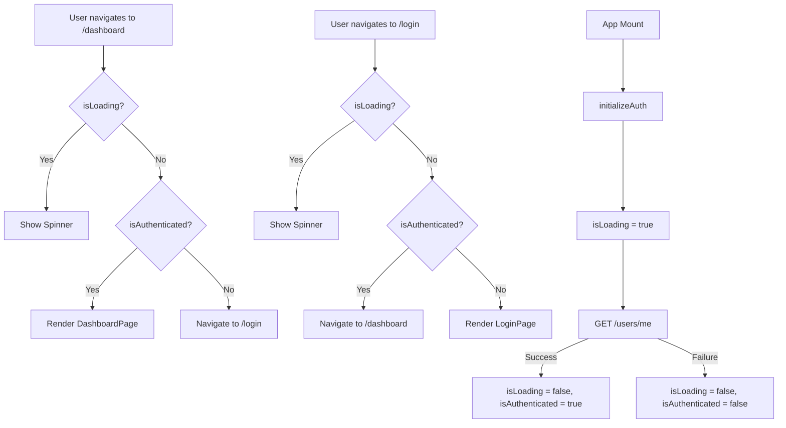

# Task E08-T4: Route Structure & Auth Guards — Implementation Prompt

## Overview

Set up React Router with `PrivateRoute` and `PublicRoute` guards. This task rewrites [`src/frontend/src/App.tsx`](src/frontend/src/App.tsx) and [`src/frontend/src/main.tsx`](src/frontend/src/main.tsx) to use `createBrowserRouter` + `RouterProvider`, creates auth guard components, and adds a placeholder `DashboardPage`.

**Important:** Do NOT write tests for this task. The user will test manually in the browser.

---

## Prerequisites (Already Done)

The following are already implemented and available:
- [`src/frontend/src/stores/authStore.ts`](src/frontend/src/stores/authStore.ts) — Zustand store with `isAuthenticated`, `isLoading`, `user`, and `initializeAuth()` action
- [`src/frontend/src/types/auth.ts`](src/frontend/src/types/auth.ts) — TypeScript interfaces (`User`, etc.)
- [`src/frontend/src/api/authApi.ts`](src/frontend/src/api/authApi.ts) — Typed API functions
- [`src/frontend/src/api/axios.ts`](src/frontend/src/api/axios.ts) — Axios instance with interceptors
- `react-router-dom` v7 is already in `package.json`
- `lucide-react` is already in `package.json` (provides `Loader2` icon)

---

## Files to Create

### 1. `src/frontend/src/components/auth/PrivateRoute.tsx`

**Directory:** `src/frontend/src/components/auth/` (create if not exists)

**Purpose:** Protects authenticated routes. Shows a loading spinner while auth is initializing, redirects to `/login` if not authenticated, otherwise renders child routes via `<Outlet />`.

**Implementation:**

```tsx
import { useAuthStore } from '@/stores/authStore';
import { Navigate, Outlet } from 'react-router-dom';
import { Loader2 } from 'lucide-react';

export default function PrivateRoute() {
  const isAuthenticated = useAuthStore((s) => s.isAuthenticated);
  const isLoading = useAuthStore((s) => s.isLoading);

  if (isLoading) {
    return (
      <div className="flex h-screen w-screen items-center justify-center">
        <Loader2 className="h-8 w-8 animate-spin text-primary" />
      </div>
    );
  }

  if (!isAuthenticated) {
    return <Navigate to="/login" replace />;
  }

  return <Outlet />;
}
```

**Key Details:**
- Use `useAuthStore` with selector functions for optimal re-render behavior (only re-render when `isAuthenticated` or `isLoading` changes)
- The spinner uses `lucide-react` `Loader2` icon with Tailwind `animate-spin` class
- Full-screen centered spinner (`h-screen w-screen`) prevents flash of wrong content
- `<Navigate to="/login" replace />` — `replace` prevents back-button from returning to the protected page

---

### 2. `src/frontend/src/components/auth/PublicRoute.tsx`

**Directory:** `src/frontend/src/components/auth/`

**Purpose:** Redirects already-authenticated users away from auth pages (login/register) to `/dashboard`. Shows spinner while loading.

**Implementation:**

```tsx
import { useAuthStore } from '@/stores/authStore';
import { Navigate, Outlet } from 'react-router-dom';
import { Loader2 } from 'lucide-react';

export default function PublicRoute() {
  const isAuthenticated = useAuthStore((s) => s.isAuthenticated);
  const isLoading = useAuthStore((s) => s.isLoading);

  if (isLoading) {
    return (
      <div className="flex h-screen w-screen items-center justify-center">
        <Loader2 className="h-8 w-8 animate-spin text-primary" />
      </div>
    );
  }

  if (isAuthenticated) {
    return <Navigate to="/dashboard" replace />;
  }

  return <Outlet />;
}
```

**Key Details:**
- Same spinner pattern as `PrivateRoute`
- Redirects to `/dashboard` if already authenticated (prevents logged-in users from seeing login page)

---

### 3. `src/frontend/src/pages/DashboardPage.tsx`

**Directory:** `src/frontend/src/pages/` (create if not exists)

**Purpose:** Placeholder page for the dashboard route.

**Implementation:**

```tsx
export default function DashboardPage() {
  return <h1>Dashboard</h1>;
}
```

---

## Files to Modify

### 4. `src/frontend/src/App.tsx` — Complete Rewrite

**Current state:** Contains a landing page with "DocuChat Frontend" header and test buttons. This needs to be completely replaced with the router setup.

**New implementation:**

```tsx
import { createBrowserRouter, Navigate, RouterProvider } from 'react-router-dom';
import PrivateRoute from '@/components/auth/PrivateRoute';
import PublicRoute from '@/components/auth/PublicRoute';
import DashboardPage from '@/pages/DashboardPage';

const router = createBrowserRouter([
  {
    path: '/',
    element: <Navigate to="/dashboard" replace />,
  },
  {
    element: <PublicRoute />,
    children: [
      { path: '/login', element: <div>Login Page</div> },    // Placeholder — will be replaced by T5
      { path: '/register', element: <div>Register Page</div> }, // Placeholder — will be replaced by T6
    ],
  },
  {
    element: <PrivateRoute />,
    children: [
      {
        // element: <AppShell />,  // Will be added in T7
        children: [
          { path: '/dashboard', element: <DashboardPage /> },
        ],
      },
    ],
  },
  {
    path: '*',
    element: <Navigate to="/dashboard" replace />,
  },
]);

export default function App() {
  return <RouterProvider router={router} />;
}
```

**Important Notes:**
- The route config uses `createBrowserRouter` (React Router v6 style, also compatible with v7)
- `PublicRoute` and `PrivateRoute` use `<Outlet />` internally to render their children
- The `/login` and `/register` routes currently use placeholder `<div>` elements — these will be replaced by actual page components in Tasks E08-T5 and E08-T6
- The `AppShell` wrapper is commented out with a note — it will be added in Task E08-T7
- The catch-all `*` route redirects to `/dashboard`
- The root `/` route also redirects to `/dashboard`

---

### 5. `src/frontend/src/main.tsx` — Update Entry Point

**Current state:** Renders `<App />` directly.

**New implementation:**

```tsx
import React from 'react';
import ReactDOM from 'react-dom/client';
import App from './App.tsx';
import './index.css';
import { useAuthStore } from '@/stores/authStore';

// Initialize auth before rendering — checks for existing token and fetches user
useAuthStore.getState().initializeAuth();

ReactDOM.createRoot(document.getElementById('root')!).render(
  <React.StrictMode>
    <App />
  </React.StrictMode>,
);
```

**Key Details:**
- `useAuthStore.getState().initializeAuth()` is called **before** `ReactDOM.createRoot` — this starts the auth initialization (checking localStorage for tokens, calling `/users/me`) immediately
- The store's `isLoading` state will be `true` during this process, which causes `PrivateRoute` and `PublicRoute` to show the spinner
- This prevents a flash of unauthenticated content on page refresh

---

## Route Structure (Final)

```
/                  → Navigate to /dashboard
/login             → PublicRoute → <div>Login Page</div> (placeholder)
/register          → PublicRoute → <div>Register Page</div> (placeholder)
/dashboard         → PrivateRoute → DashboardPage
* (404)            → Navigate to /dashboard
```

---

## Execution Order

1. **Create** `src/frontend/src/components/auth/PrivateRoute.tsx`
2. **Create** `src/frontend/src/components/auth/PublicRoute.tsx`
3. **Create** `src/frontend/src/pages/DashboardPage.tsx`
4. **Rewrite** `src/frontend/src/App.tsx`
5. **Update** `src/frontend/src/main.tsx`
6. **Verify** by running `cd src/frontend && npx tsc --noEmit` — zero TypeScript errors
7. **Verify** by running `cd src/frontend && npx vite build` — builds successfully

---

## Mermaid Diagram: Route Guard Flow



---

## Verification

After implementation, run these commands from `src/frontend/`:

```bash
# TypeScript check — should have zero errors
npx tsc --noEmit

# Build check — should succeed
npx vite build
```

Then manually test in the browser:
1. Visit `http://localhost:5173/` — should redirect to `/dashboard` then to `/login` (since not authenticated)
2. Visit `http://localhost:5173/login` — should show the placeholder login div
3. Visit `http://localhost:5173/register` — should show the placeholder register div
4. Visit `http://localhost:5173/dashboard` — should redirect to `/login` (since not authenticated)
5. Visit `http://localhost:5173/some-random-path` — should redirect to `/login` (404 catch-all)
