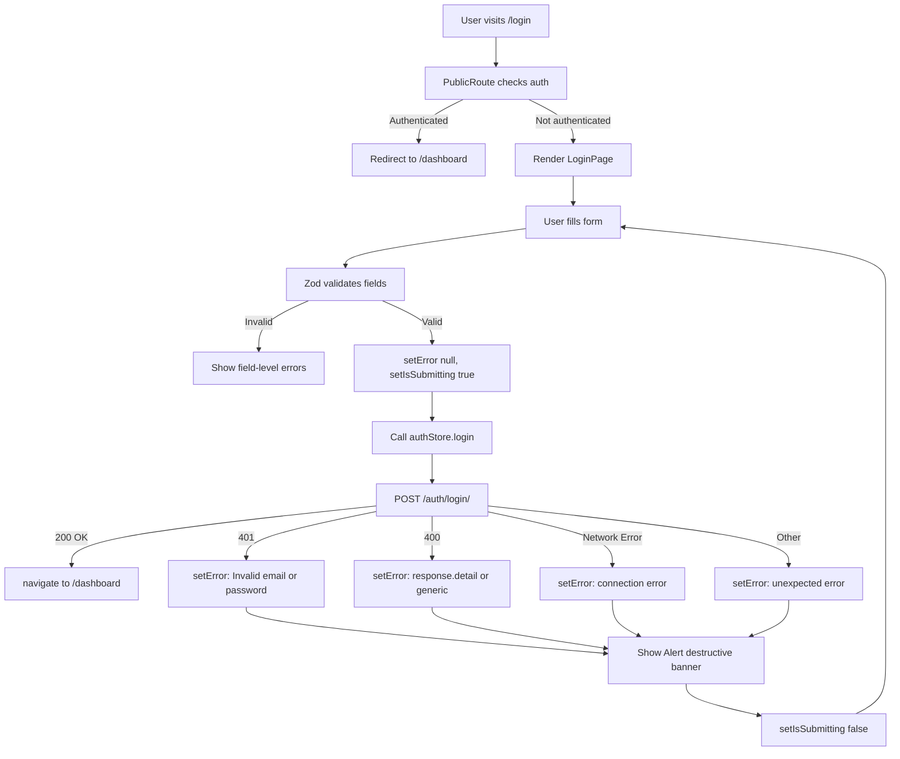

# Task E08-T5: Login Page — Implementation Prompt

## Overview

Create a full login form page at `/login` using React Hook Form + Zod validation, with proper error handling and a link to the registration page. The page uses a centered card layout **without** AppShell (standalone auth page).

**Important:** Do NOT write tests for this task. The user will test manually in the browser.

---

## Prerequisites (Already Done)

The following are already implemented and available:

| File | Purpose |
|------|---------|
| [`src/frontend/src/stores/authStore.ts`](src/frontend/src/stores/authStore.ts) | Zustand store with `login(payload)` action |
| [`src/frontend/src/types/auth.ts`](src/frontend/src/types/auth.ts) | `LoginPayload` interface (`email`, `password`) |
| [`src/frontend/src/api/authApi.ts`](src/frontend/src/api/authApi.ts) | `loginApi()` — POST `/auth/login/` |
| [`src/frontend/src/api/axios.ts`](src/frontend/src/api/axios.ts) | Axios instance with token refresh interceptor |
| [`src/frontend/src/App.tsx`](src/frontend/src/App.tsx) | Router already has `/login` route under `PublicRoute` (currently placeholder `<div>Login Page</div>`) |
| [`src/frontend/src/components/auth/PublicRoute.tsx`](src/frontend/src/components/auth/PublicRoute.tsx) | Redirects authenticated users away from `/login` |
| [`src/frontend/src/components/ui/form.tsx`](src/frontend/src/components/ui/form.tsx) | shadcn Form components (`Form`, `FormField`, `FormItem`, `FormLabel`, `FormControl`, `FormMessage`) |
| [`src/frontend/src/components/ui/input.tsx`](src/frontend/src/components/ui/input.tsx) | shadcn Input component |
| [`src/frontend/src/components/ui/button.tsx`](src/frontend/src/components/ui/button.tsx) | shadcn Button component with `loading` state support |
| [`src/frontend/src/components/ui/card.tsx`](src/frontend/src/components/ui/card.tsx) | shadcn Card components (`Card`, `CardHeader`, `CardTitle`, `CardDescription`, `CardContent`, `CardFooter`) |
| [`src/frontend/src/components/ui/alert.tsx`](src/frontend/src/components/ui/alert.tsx) | shadcn Alert component with `destructive` variant |
| [`src/frontend/src/components/ui/label.tsx`](src/frontend/src/components/ui/label.tsx) | shadcn Label component |
| `react-hook-form` + `@hookform/resolvers` + `zod` | Already in `package.json` |
| `lucide-react` | Already in `package.json` (provides `Loader2`, `AlertCircle`, `Eye`, `EyeOff` icons) |

---

## Files to Create

### 1. `src/frontend/src/pages/LoginPage.tsx`

**Directory:** `src/frontend/src/pages/` (already exists)

**Purpose:** Full login form with:
- Centered card layout (standalone, no AppShell)
- Email and password fields with Zod validation
- Submit handler that calls `authStore.login()`
- Error banner for API errors (401, 400, network)
- Loading spinner on submit button
- Link to `/register`

#### Imports

```typescript
import { useState } from 'react';
import { useForm } from 'react-hook-form';
import { zodResolver } from '@hookform/resolvers/zod';
import { z } from 'zod/v4';
import { Link, useNavigate } from 'react-router-dom';
import { useAuthStore } from '@/stores/authStore';
import { Loader2, AlertCircle } from 'lucide-react';

import { Button } from '@/components/ui/button';
import { Card, CardHeader, CardTitle, CardDescription, CardContent, CardFooter } from '@/components/ui/card';
import { Form, FormField, FormItem, FormLabel, FormControl, FormMessage } from '@/components/ui/form';
import { Input } from '@/components/ui/input';
import { Alert, AlertDescription } from '@/components/ui/alert';
```

**Important:** Use `zod/v4` (not `zod`) because `package.json` has `"zod": "^4.3.6"`. Zod v4 exports from `zod/v4`.

#### Zod Schema

```typescript
const loginSchema = z.object({
  email: z
    .string()
    .min(1, 'Email is required')
    .email('Please enter a valid email address'),
  password: z
    .string()
    .min(1, 'Password is required'),
});

type LoginFormValues = z.infer<typeof loginSchema>;
```

#### Component Structure

```tsx
export default function LoginPage() {
  const navigate = useNavigate();
  const login = useAuthStore((s) => s.login);
  const [error, setError] = useState<string | null>(null);
  const [isSubmitting, setIsSubmitting] = useState(false);

  const form = useForm<LoginFormValues>({
    resolver: zodResolver(loginSchema),
    defaultValues: {
      email: '',
      password: '',
    },
  });

  const onSubmit = async (values: LoginFormValues) => {
    setError(null);
    setIsSubmitting(true);
    try {
      await login(values);
      navigate('/dashboard', { replace: true });
    } catch (err: unknown) {
      if (err && typeof err === 'object' && 'response' in err) {
        const axiosErr = err as { response?: { status?: number; data?: { detail?: string } } };
        if (axiosErr.response?.status === 401) {
          setError('Invalid email or password');
        } else if (axiosErr.response?.status === 400) {
          setError(axiosErr.response?.data?.detail ?? 'Invalid input. Please check your credentials.');
        } else {
          setError('An unexpected error occurred. Please try again.');
        }
      } else {
        setError('Unable to connect to the server. Please check your connection.');
      }
    } finally {
      setIsSubmitting(false);
    }
  };

  return (
    <div className="flex min-h-screen items-center justify-center px-4">
      <Card className="w-full max-w-md">
        <CardHeader className="space-y-1 text-center">
          <CardTitle className="text-2xl font-bold">Welcome back</CardTitle>
          <CardDescription>Enter your credentials to sign in to your account</CardDescription>
        </CardHeader>
        <CardContent>
          {error && (
            <Alert variant="destructive" className="mb-6">
              <AlertCircle className="h-4 w-4" />
              <AlertDescription>{error}</AlertDescription>
            </Alert>
          )}

          <Form {...form}>
            <form onSubmit={form.handleSubmit(onSubmit)} className="space-y-4">
              <FormField
                control={form.control}
                name="email"
                render={({ field }) => (
                  <FormItem>
                    <FormLabel>Email</FormLabel>
                    <FormControl>
                      <Input
                        type="email"
                        placeholder="name@example.com"
                        autoComplete="email"
                        disabled={isSubmitting}
                        {...field}
                      />
                    </FormControl>
                    <FormMessage />
                  </FormItem>
                )}
              />

              <FormField
                control={form.control}
                name="password"
                render={({ field }) => (
                  <FormItem>
                    <FormLabel>Password</FormLabel>
                    <FormControl>
                      <Input
                        type="password"
                        placeholder="Enter your password"
                        autoComplete="current-password"
                        disabled={isSubmitting}
                        {...field}
                      />
                    </FormControl>
                    <FormMessage />
                  </FormItem>
                )}
              />

              <Button type="submit" className="w-full" disabled={isSubmitting}>
                {isSubmitting && <Loader2 className="mr-2 h-4 w-4 animate-spin" />}
                Sign In
              </Button>
            </form>
          </Form>
        </CardContent>
        <CardFooter className="justify-center">
          <p className="text-sm text-muted-foreground">
            Don't have an account?{' '}
            <Link to="/register" className="font-medium text-primary hover:underline">
              Create one
            </Link>
          </p>
        </CardFooter>
      </Card>
    </div>
  );
}
```

#### Key Implementation Details

1. **Centered Layout:** The outer `<div>` uses `flex min-h-screen items-center justify-center px-4` to center the card vertically and horizontally. This is a standalone page — **not** wrapped in AppShell.

2. **Form State Management:**
   - `useForm` with `zodResolver` for validation
   - `defaultValues` for both fields (empty strings)
   - `form.handleSubmit(onSubmit)` handles validation before calling `onSubmit`

3. **Submit Behavior:**
   - `setIsSubmitting(true)` disables all inputs and the button
   - `Loader2` spinner appears inside the button
   - Calls `authStore.login(values)` which internally calls `loginApi` and updates store state
   - On success: `navigate('/dashboard', { replace: true })` — `replace` prevents back-button from returning to login
   - On error: parse the Axios error and set appropriate message
   - `finally`: `setIsSubmitting(false)` re-enables the form

4. **Error Handling (3 cases):**
   - **401** → `"Invalid email or password"` (wrong credentials)
   - **400** → Show `response.data.detail` if available, otherwise generic `"Invalid input. Please check your credentials."`
   - **Network error** (no response) → `"Unable to connect to the server. Please check your connection."`
   - **Other status codes** → `"An unexpected error occurred. Please try again."`

5. **Error Banner:**
   - Uses shadcn `Alert` with `variant="destructive"`
   - `AlertCircle` icon from `lucide-react`
   - Only rendered when `error` state is non-null
   - Cleared on each new submit attempt (`setError(null)`)

6. **Link to Register:**
   - Uses React Router `<Link to="/register">` (not `<a>` tag)
   - Styled as `text-primary hover:underline` inside `text-muted-foreground` text

7. **Accessibility:**
   - `autoComplete="email"` and `autoComplete="current-password"` for browser autofill
   - `disabled={isSubmitting}` on inputs and button prevents double-submit
   - `type="email"` on email input triggers appropriate mobile keyboard

---

## Files to Modify

### 2. `src/frontend/src/App.tsx` — Replace Login Placeholder

**Current state (line 14):**
```tsx
{ path: '/login', element: <div>Login Page</div> },    // Placeholder — will be replaced by T5
```

**Change to:**
```tsx
{ path: '/login', element: <LoginPage /> },
```

**Also add the import at the top:**
```tsx
import LoginPage from '@/pages/LoginPage';
```

---

## Execution Order

1. **Create** `src/frontend/src/pages/LoginPage.tsx` with the full implementation above
2. **Modify** `src/frontend/src/App.tsx`:
   - Add `import LoginPage from '@/pages/LoginPage';`
   - Replace `<div>Login Page</div>` with `<LoginPage />`
3. **Verify TypeScript:** `cd src/frontend && npx tsc --noEmit` — zero errors
4. **Verify Build:** `cd src/frontend && npx vite build` — builds successfully

---

## Mermaid Diagram: Login Flow



---

## Verification

After implementation, run these commands from `src/frontend/`:

```bash
# TypeScript check — should have zero errors
npx tsc --noEmit

# Build check — should succeed
npx vite build
```

Then manually test in the browser:

1. Visit `http://localhost:5173/login` — should see the centered login card
2. Submit empty form — should see Zod validation errors ("Email is required", "Password is required")
3. Enter invalid email — should see "Please enter a valid email address"
4. Enter valid credentials — should redirect to `/dashboard`
5. Enter wrong credentials — should see "Invalid email or password" error banner
6. Click "Create one" link — should navigate to `/register`
7. If already authenticated and visit `/login` — should redirect to `/dashboard` (handled by PublicRoute)
