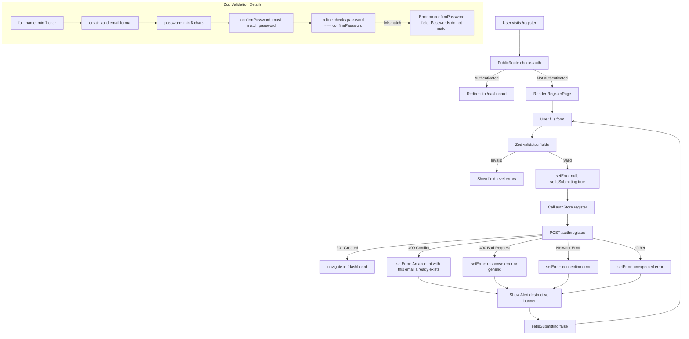

# Task E08-T6: Register Page — Implementation Prompt

## Overview

Create a full registration form page at `/register` using React Hook Form + Zod validation, with password confirmation, password strength hint, and proper error handling. The page uses the **same centered card layout** as [`LoginPage`](src/frontend/src/pages/LoginPage.tsx) (standalone auth page, no AppShell).

**Important:** Do NOT write tests. The user will test manually in the browser.

---

## Prerequisites (Already Done)

The following are already implemented and available:

| File | Purpose |
|------|---------|
| [`src/frontend/src/stores/authStore.ts`](src/frontend/src/stores/authStore.ts) | Zustand store with `register(payload)` action |
| [`src/frontend/src/types/auth.ts`](src/frontend/src/types/auth.ts) | `RegisterPayload` interface (`email`, `password`, `full_name`) |
| [`src/frontend/src/api/authApi.ts`](src/frontend/src/api/authApi.ts) | `registerApi()` — POST `/auth/register/` |
| [`src/frontend/src/api/axios.ts`](src/frontend/src/api/axios.ts) | Axios instance with token refresh interceptor |
| [`src/frontend/src/App.tsx`](src/frontend/src/App.tsx) | Router already has `/register` route under `PublicRoute` (currently placeholder `<div>Register Page</div>`) |
| [`src/frontend/src/components/auth/PublicRoute.tsx`](src/frontend/src/components/auth/PublicRoute.tsx) | Redirects authenticated users away from `/register` |
| [`src/frontend/src/components/ui/form.tsx`](src/frontend/src/components/ui/form.tsx) | shadcn Form components (`Form`, `FormField`, `FormItem`, `FormLabel`, `FormControl`, `FormMessage`) |
| [`src/frontend/src/components/ui/input.tsx`](src/frontend/src/components/ui/input.tsx) | shadcn Input component |
| [`src/frontend/src/components/ui/button.tsx`](src/frontend/src/components/ui/button.tsx) | shadcn Button component |
| [`src/frontend/src/components/ui/card.tsx`](src/frontend/src/components/ui/card.tsx) | shadcn Card components (`Card`, `CardHeader`, `CardTitle`, `CardDescription`, `CardContent`, `CardFooter`) |
| [`src/frontend/src/components/ui/alert.tsx`](src/frontend/src/components/ui/alert.tsx) | shadcn Alert component with `destructive` variant |
| [`src/frontend/src/components/ui/label.tsx`](src/frontend/src/components/ui/label.tsx) | shadcn Label component |
| `react-hook-form` + `@hookform/resolvers` + `zod` | Already in `package.json` |
| `lucide-react` | Already in `package.json` (provides `Loader2`, `AlertCircle`, `Eye`, `EyeOff` icons) |

### Backend API Contract (for reference)

**Endpoint:** `POST /auth/register/`

**Request body (sent to API):**
```json
{
  "email": "user@example.com",
  "password": "securepassword123",
  "full_name": "John Doe"
}
```

**Note:** `confirmPassword` is a **frontend-only** field for validation. It must NOT be included in the API payload.

**Success Response (201 Created):**
```json
{
  "user": { "id": "uuid", "email": "...", "full_name": "...", "is_active": true, "created_at": "...", "updated_at": "..." },
  "accessToken": "jwt...",
  "refreshToken": "jwt..."
}
```

**Error Responses:**
- **400 Bad Request:** `{"error": "This password is too short. It must contain at least 8 characters."}` (validation errors)
- **409 Conflict:** `{"error": "Email already exists"}` (duplicate email)
- **500 Internal Server Error:** `{"error": "Internal server error"}`

---

## Files to Create

### 1. `src/frontend/src/pages/RegisterPage.tsx`

**Directory:** `src/frontend/src/pages/` (already exists)

**Purpose:** Full registration form with:
- Centered card layout (same as LoginPage)
- Fields: `full_name`, `email`, `password`, `confirmPassword`
- Zod schema with `.refine()` for password match validation
- `confirmPassword` is validated client-side but NOT sent to API
- Password strength hint text below the password field
- Error banner for API errors (409 → "An account with this email already exists", 400, network)
- Loading spinner on submit button
- Link to `/login`

#### Imports

```typescript
import { useState } from 'react';
import { useForm } from 'react-hook-form';
import { zodResolver } from '@hookform/resolvers/zod';
import { z } from 'zod/v4';
import { Link, useNavigate } from 'react-router-dom';
import { useAuthStore } from '@/stores/authStore';
import { Loader2, AlertCircle } from 'lucide-react';

import { Button } from '@/components/ui/button';
import {
  Card,
  CardHeader,
  CardTitle,
  CardDescription,
  CardContent,
  CardFooter,
} from '@/components/ui/card';
import {
  Form,
  FormField,
  FormItem,
  FormLabel,
  FormControl,
  FormMessage,
  FormDescription,
} from '@/components/ui/form';
import { Input } from '@/components/ui/input';
import { Alert, AlertDescription } from '@/components/ui/alert';
```

**Important:** Use `zod/v4` (not `zod`) because `package.json` has `"zod": "^4.3.6"`. Zod v4 exports from `zod/v4`.

#### Zod Schema

```typescript
const registerSchema = z
  .object({
    full_name: z
      .string()
      .min(1, 'Full name is required'),
    email: z
      .string()
      .min(1, 'Email is required')
      .email('Please enter a valid email address'),
    password: z
      .string()
      .min(8, 'Password must be at least 8 characters'),
    confirmPassword: z
      .string()
      .min(1, 'Please confirm your password'),
  })
  .refine((data) => data.password === data.confirmPassword, {
    message: 'Passwords do not match',
    path: ['confirmPassword'],
  });

type RegisterFormValues = z.infer<typeof registerSchema>;
```

#### Component Structure

```tsx
export default function RegisterPage() {
  const navigate = useNavigate();
  const register = useAuthStore((s) => s.register);
  const [error, setError] = useState<string | null>(null);
  const [isSubmitting, setIsSubmitting] = useState(false);

  const form = useForm<RegisterFormValues>({
    resolver: zodResolver(registerSchema),
    defaultValues: {
      full_name: '',
      email: '',
      password: '',
      confirmPassword: '',
    },
  });

  const onSubmit = async (values: RegisterFormValues) => {
    setError(null);
    setIsSubmitting(true);
    try {
      // Only send full_name, email, password to the API — NOT confirmPassword
      await register({
        full_name: values.full_name,
        email: values.email,
        password: values.password,
      });
      navigate('/dashboard', { replace: true });
    } catch (err: unknown) {
      if (err && typeof err === 'object' && 'response' in err) {
        const axiosErr = err as {
          response?: { status?: number; data?: { error?: string } };
        };
        if (axiosErr.response?.status === 409) {
          setError('An account with this email already exists');
        } else if (axiosErr.response?.status === 400) {
          setError(
            axiosErr.response?.data?.error ??
              'Invalid input. Please check your information.',
          );
        } else {
          setError('An unexpected error occurred. Please try again.');
        }
      } else {
        setError(
          'Unable to connect to the server. Please check your connection.',
        );
      }
    } finally {
      setIsSubmitting(false);
    }
  };

  return (
    <div className="flex min-h-screen items-center justify-center px-4">
      <Card className="w-full max-w-md">
        <CardHeader className="space-y-1 text-center">
          <CardTitle className="text-2xl font-bold">Create an account</CardTitle>
          <CardDescription>
            Enter your details to create your account
          </CardDescription>
        </CardHeader>
        <CardContent>
          {error && (
            <Alert variant="destructive" className="mb-6">
              <AlertCircle className="h-4 w-4" />
              <AlertDescription>{error}</AlertDescription>
            </Alert>
          )}

          <Form {...form}>
            <form onSubmit={form.handleSubmit(onSubmit)} className="space-y-4">
              <FormField
                control={form.control}
                name="full_name"
                render={({ field }) => (
                  <FormItem>
                    <FormLabel>Full Name</FormLabel>
                    <FormControl>
                      <Input
                        placeholder="John Doe"
                        autoComplete="name"
                        disabled={isSubmitting}
                        {...field}
                      />
                    </FormControl>
                    <FormMessage />
                  </FormItem>
                )}
              />

              <FormField
                control={form.control}
                name="email"
                render={({ field }) => (
                  <FormItem>
                    <FormLabel>Email</FormLabel>
                    <FormControl>
                      <Input
                        type="email"
                        placeholder="name@example.com"
                        autoComplete="email"
                        disabled={isSubmitting}
                        {...field}
                      />
                    </FormControl>
                    <FormMessage />
                  </FormItem>
                )}
              />

              <FormField
                control={form.control}
                name="password"
                render={({ field }) => (
                  <FormItem>
                    <FormLabel>Password</FormLabel>
                    <FormControl>
                      <Input
                        type="password"
                        placeholder="At least 8 characters"
                        autoComplete="new-password"
                        disabled={isSubmitting}
                        {...field}
                      />
                    </FormControl>
                    <FormDescription>
                      Must be at least 8 characters
                    </FormDescription>
                    <FormMessage />
                  </FormItem>
                )}
              />

              <FormField
                control={form.control}
                name="confirmPassword"
                render={({ field }) => (
                  <FormItem>
                    <FormLabel>Confirm Password</FormLabel>
                    <FormControl>
                      <Input
                        type="password"
                        placeholder="Re-enter your password"
                        autoComplete="new-password"
                        disabled={isSubmitting}
                        {...field}
                      />
                    </FormControl>
                    <FormMessage />
                  </FormItem>
                )}
              />

              <Button
                type="submit"
                className="w-full"
                disabled={isSubmitting}
              >
                {isSubmitting && (
                  <Loader2 className="mr-2 h-4 w-4 animate-spin" />
                )}
                Create Account
              </Button>
            </form>
          </Form>
        </CardContent>
        <CardFooter className="justify-center">
          <p className="text-sm text-muted-foreground">
            Already have an account?{' '}
            <Link
              to="/login"
              className="font-medium text-primary hover:underline"
            >
              Sign in
            </Link>
          </p>
        </CardFooter>
      </Card>
    </div>
  );
}
```

#### Key Implementation Details

1. **Centered Layout:** Same as LoginPage — `<div className="flex min-h-screen items-center justify-center px-4">` — standalone auth page, **not** wrapped in AppShell.

2. **Zod Schema with `.refine()`:**
   - `full_name`: `z.string().min(1, 'Full name is required')`
   - `email`: `z.string().min(1, ...).email(...)`
   - `password`: `z.string().min(8, 'Password must be at least 8 characters')`
   - `confirmPassword`: `z.string().min(1, 'Please confirm your password')`
   - `.refine()` at the schema level checks `data.password === data.confirmPassword`
   - The `path: ['confirmPassword']` option ensures the error message appears on the `confirmPassword` field (not at the form level)

3. **`confirmPassword` NOT sent to API:**
   - The `register()` call from `authStore` only receives `{ full_name, email, password }`
   - The `RegisterPayload` type in [`src/frontend/src/types/auth.ts`](src/frontend/src/types/auth.ts) only has `email`, `password`, `full_name` — no `confirmPassword`
   - This is enforced by TypeScript — you cannot pass `confirmPassword` to `register()`

4. **Password Strength Hint:**
   - Uses `FormDescription` component from shadcn (`import { FormDescription } from '@/components/ui/form'`)
   - Rendered below the password input: `Must be at least 8 characters`
   - `FormDescription` renders as `<p className="text-sm text-muted-foreground">`

5. **Submit Behavior:**
   - `setIsSubmitting(true)` disables all inputs and the button
   - `Loader2` spinner appears inside the button
   - Calls `authStore.register(payload)` which internally calls `registerApi` and updates store state
   - On success: `navigate('/dashboard', { replace: true })`
   - On error: parse the Axios error and set appropriate message
   - `finally`: `setIsSubmitting(false)` re-enables the form

6. **Error Handling (3 cases):**
   - **409 Conflict** → `"An account with this email already exists"` (duplicate email)
   - **400 Bad Request** → Show `response.data.error` if available, otherwise generic `"Invalid input. Please check your information."`
   - **Network error** (no response) → `"Unable to connect to the server. Please check your connection."`
   - **Other status codes** → `"An unexpected error occurred. Please try again."`

7. **Error Banner:**
   - Uses shadcn `Alert` with `variant="destructive"`
   - `AlertCircle` icon from `lucide-react`
   - Only rendered when `error` state is non-null
   - Cleared on each new submit attempt (`setError(null)`)

8. **Link to Login:**
   - Uses React Router `<Link to="/login">` (not `<a>` tag)
   - Text: `"Already have an account? Sign in"` — styled as `text-primary hover:underline`

9. **Accessibility:**
   - `autoComplete="name"` on full_name for browser autofill
   - `autoComplete="email"` on email input
   - `autoComplete="new-password"` on both password and confirmPassword (tells browser this is a new password, not current)
   - `disabled={isSubmitting}` on all inputs and button prevents double-submit
   - `type="email"` on email input triggers appropriate mobile keyboard

---

## Files to Modify

### 2. `src/frontend/src/App.tsx` — Replace Register Placeholder

**Current state (line 16):**
```tsx
{ path: '/register', element: <div>Register Page</div> }, // Placeholder — will be replaced by T6
```

**Change to:**
```tsx
{ path: '/register', element: <RegisterPage /> },
```

**Also add the import at the top (after the LoginPage import):**
```tsx
import RegisterPage from '@/pages/RegisterPage';
```

---

## Execution Order

1. **Create** [`src/frontend/src/pages/RegisterPage.tsx`](src/frontend/src/pages/RegisterPage.tsx) with the full implementation above
2. **Modify** [`src/frontend/src/App.tsx`](src/frontend/src/App.tsx):
   - Add `import RegisterPage from '@/pages/RegisterPage';`
   - Replace `<div>Register Page</div>` with `<RegisterPage />`
3. **Verify TypeScript:** `cd src/frontend && npx tsc --noEmit` — zero errors
4. **Verify Build:** `cd src/frontend && npx vite build` — builds successfully

---

## Mermaid Diagram: Registration Flow



---

## Verification

After implementation, run these commands from `src/frontend/`:

```bash
# TypeScript check — should have zero errors
npx tsc --noEmit

# Build check — should succeed
npx vite build
```

Then manually test in the browser:

1. Visit `http://localhost:5173/register` — should see the centered registration card
2. Submit empty form — should see Zod validation errors on all fields
3. Enter mismatched passwords — should see "Passwords do not match" on confirmPassword field
4. Enter password shorter than 8 chars — should see "Password must be at least 8 characters"
5. Enter invalid email — should see "Please enter a valid email address"
6. Enter valid data for a new account — should redirect to `/dashboard`
7. Try registering with an existing email — should see "An account with this email already exists" error banner
8. Click "Sign in" link — should navigate to `/login`
9. If already authenticated and visit `/register` — should redirect to `/dashboard` (handled by PublicRoute)
