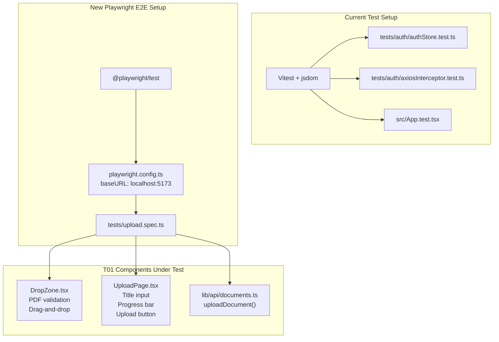
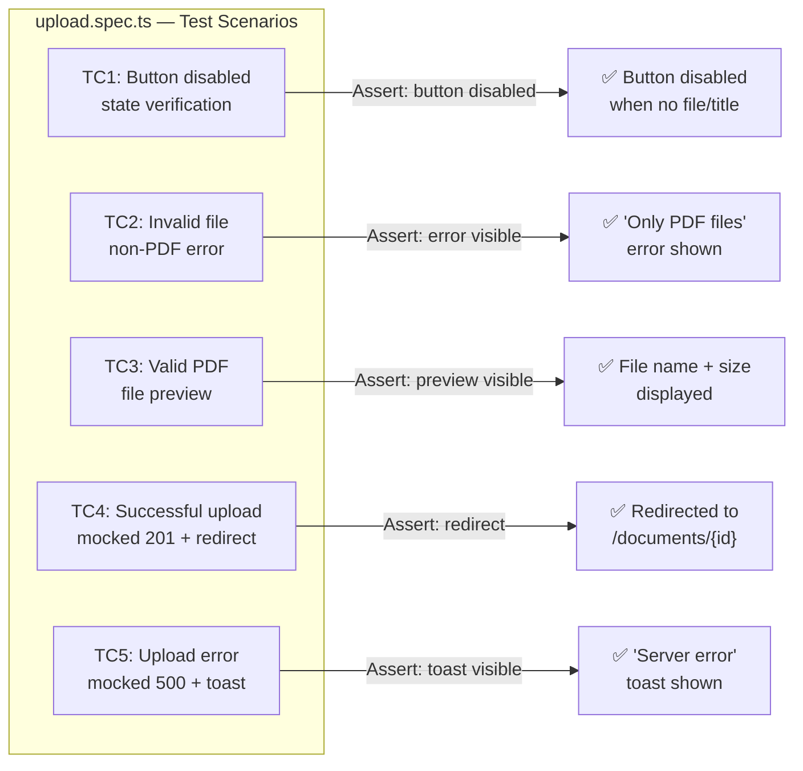

# T01 Test Migration Plan: Jest/RTL → Playwright E2E

**Epic:** E09 — Frontend Document Management  
**Task:** T01 — Document Upload Page & Flow  
**Strategy:** Visual First → Playwright E2E (per updated `.clinerules`)

---

## Context Summary

The `.clinerules` have been updated to replace Jest/React Testing Library with Playwright E2E for all frontend testing, following a **"Visual First"** approach:
1. Developer verifies the UI manually in the browser first.
2. Only after visual approval, write Playwright E2E tests to lock in the behavior.

The existing codebase already has:
- [`src/frontend/src/components/documents/DropZone.tsx`](src/frontend/src/components/documents/DropZone.tsx) — Drag-and-drop component with PDF validation (type + size)
- [`src/frontend/src/pages/documents/UploadPage.tsx`](src/frontend/src/pages/documents/UploadPage.tsx) — Upload form with title input, progress bar, error handling
- [`src/frontend/src/lib/api/documents.ts`](src/frontend/src/lib/api/documents.ts) — `uploadDocument()` using `XMLHttpRequest` with callbacks
- [`src/frontend/src/types/document.ts`](src/frontend/src/types/document.ts) — TypeScript interfaces
- [`src/frontend/vitest.config.ts`](src/frontend/vitest.config.ts) — Existing Vitest config (will remain for backend/store tests)
- [`src/frontend/src/App.test.tsx`](src/frontend/src/App.test.tsx) — Placeholder Vitest test (keep as-is)
- [`src/frontend/tests/auth/authStore.test.ts`](src/frontend/tests/auth/authStore.test.ts) — Existing Vitest store tests (keep)
- [`src/frontend/tests/auth/axiosInterceptor.test.ts`](src/frontend/tests/auth/axiosInterceptor.test.ts) — Existing Vitest interceptor tests (keep)

**No Jest/RTL test files for DropZone or UploadPage currently exist** — they were listed in the PRD as `DropZone.test.tsx` and `UploadPage.test.tsx` but were never created. So there's nothing to delete. However, the plan still includes a verification step to ensure no stale test files exist.

---

## Execution Steps

### Step 1: Verify & Clean Up Stale Jest/RTL Test Files

**Action:** Search for any existing `.test.tsx` files related to T01 components that should be removed.

**Files to check for deletion (if they exist):**
- `src/frontend/src/components/documents/DropZone.test.tsx`
- `src/frontend/src/pages/documents/UploadPage.test.tsx`
- `src/frontend/src/pages/documents/UploadPage.test.ts`
- Any other `.test.ts`/`.test.tsx` files in `src/frontend/src/components/documents/` or `src/frontend/src/pages/documents/`

**Expected outcome:** No stale Jest/RTL test files exist. If any are found, delete them.

**Note:** The existing Vitest config (`vitest.config.ts`) and its test files (`App.test.tsx`, `authStore.test.ts`, `axiosInterceptor.test.ts`) are **not** being removed — they test non-UI logic (store, interceptors) where Vitest is still appropriate. Only component-level UI tests are migrating to Playwright.

---

### Step 2: Install `@playwright/test` in `src/frontend`

**Action:** Install Playwright as a dev dependency inside the frontend directory.

```bash
cd src/frontend && npm install -D @playwright/test
```

Then install the browsers:

```bash
cd src/frontend && npx playwright install chromium
```

**Expected outcome:**
- `@playwright/test` added to `devDependencies` in [`src/frontend/package.json`](src/frontend/package.json)
- `node_modules/@playwright/` installed
- Chromium browser binary downloaded

---

### Step 3: Create `playwright.config.ts` in `src/frontend`

**Action:** Create a new file at [`src/frontend/playwright.config.ts`](src/frontend/playwright.config.ts) with the following configuration:

```typescript
import { defineConfig, devices } from '@playwright/test';

export default defineConfig({
  testDir: './tests',
  fullyParallel: true,
  forbidOnly: !!process.env.CI,
  retries: process.env.CI ? 2 : 0,
  workers: process.env.CI ? 1 : undefined,
  reporter: 'html',
  use: {
    baseURL: 'http://localhost:5173',
    trace: 'on-first-retry',
  },
  projects: [
    {
      name: 'chromium',
      use: { ...devices['Desktop Chrome'] },
    },
  ],
});
```

**Key configuration details:**
- `baseURL: 'http://localhost:5173'` — matches the Vite dev server port from [`src/frontend/vite.config.ts`](src/frontend/vite.config.ts:14)
- `testDir: './tests'` — points to the existing `src/frontend/tests/` directory
- Chromium only (fastest for CI/local)

---

### Step 4: Create E2E Test File at `src/frontend/tests/upload.spec.ts`

**Action:** Create a new Playwright E2E test file at [`src/frontend/tests/upload.spec.ts`](src/frontend/tests/upload.spec.ts).

The test file should cover the following scenarios for the T01 upload flow:

#### Test Case 1: Upload button is disabled when no file or title is provided
- Navigate to `/documents/upload`
- Verify the "Upload" button is disabled when both title and file are empty
- Type a title, verify button is still disabled (no file selected)
- Verify the button becomes enabled only after both title and file are provided

#### Test Case 2: Invalid file selection shows error (non-PDF)
- Navigate to `/documents/upload`
- Use `setInputFiles()` to select a non-PDF file (e.g., a `.txt` file)
- Verify an error message "Only PDF files are allowed." is displayed
- Verify the file is NOT accepted (no file preview shown)

#### Test Case 3: Valid PDF file selection shows file preview
- Navigate to `/documents/upload`
- Use `setInputFiles()` to select a valid PDF file
- Verify the file name and size are displayed in the DropZone preview
- Verify the error message area is empty

#### Test Case 4: Successful upload flow (mocked API)
- Navigate to `/documents/upload`
- Fill in the title and select a PDF file
- Mock the upload API endpoint (`POST /api/documents/upload/`) to return a `201` response with a document ID
- Click the "Upload" button
- Verify the progress bar appears during upload
- Verify the user is redirected to `/documents/{id}` on success

#### Test Case 5: Upload error handling (API error)
- Navigate to `/documents/upload`
- Fill in the title and select a PDF file
- Mock the upload API endpoint to return a `500` error
- Click the "Upload" button
- Verify an error toast "Server error" is shown
- Verify the user stays on the upload page

---

### Step 5: Add Playwright Scripts to `package.json`

**Action:** Add the following scripts to [`src/frontend/package.json`](src/frontend/package.json):

```json
"scripts": {
  // ... existing scripts
  "test:e2e": "playwright test",
  "test:e2e:ui": "playwright test --ui",
  "test:e2e:headed": "playwright test --headed"
}
```

---

### Step 6: Update `vitest.config.ts` to Exclude E2E Tests

**Action:** Update the `include` pattern in [`src/frontend/vitest.config.ts`](src/frontend/vitest.config.ts) to exclude `.spec.ts` files (since Playwright uses `.spec.ts` convention):

```typescript
include: ['src/**/*.test.{ts,tsx}', 'tests/**/*.test.{ts,tsx}'],
```

No change needed — the existing pattern already excludes `.spec.ts` files because it only matches `*.test.*`. But we should verify this is correct.

---

## File Changes Summary

| Action | File | Description |
|--------|------|-------------|
| ✅ Verify/Delete | `src/frontend/src/components/documents/DropZone.test.tsx` | Delete if exists (Jest/RTL) |
| ✅ Verify/Delete | `src/frontend/src/pages/documents/UploadPage.test.tsx` | Delete if exists (Jest/RTL) |
| ✅ Install | `src/frontend/package.json` | Add `@playwright/test` to devDependencies |
| ✅ Create | `src/frontend/playwright.config.ts` | Playwright config with `baseURL: http://localhost:5173` |
| ✅ Create | `src/frontend/tests/upload.spec.ts` | E2E tests for T01 upload flow |
| ✅ Modify | `src/frontend/package.json` | Add `test:e2e`, `test:e2e:ui`, `test:e2e:headed` scripts |

---

## Files That Remain Unchanged

| File | Reason |
|------|--------|
| `src/frontend/vitest.config.ts` | Still needed for non-UI tests (store, interceptors) |
| `src/frontend/src/test/setup.ts` | Still needed for Vitest tests |
| `src/frontend/src/App.test.tsx` | Placeholder Vitest test — keep |
| `src/frontend/tests/auth/authStore.test.ts` | Valid Vitest store tests — keep |
| `src/frontend/tests/auth/axiosInterceptor.test.ts` | Valid Vitest interceptor tests — keep |

---

## Architecture Diagram



---

## Test Scenarios Detail



---

## Execution Order

1. **Step 1** — Verify no stale Jest/RTL test files exist (delete if found)
2. **Step 2** — Install `@playwright/test` and Chromium browser
3. **Step 3** — Create `playwright.config.ts`
4. **Step 4** — Create `tests/upload.spec.ts` with all 5 test cases
5. **Step 5** — Add Playwright scripts to `package.json`
6. **Step 6** — Verify vitest config excludes `.spec.ts` files (no change needed)

---

## Risks & Mitigations

| Risk | Mitigation |
|------|-----------|
| Playwright requires a running dev server | Use `webServer` config in `playwright.config.ts` to auto-start Vite, or document that `docker-compose up` must be running first |
| `XMLHttpRequest` upload is hard to mock in E2E | Use Playwright's `page.route()` to intercept the `POST /api/documents/upload/` request and return a mock response |
| File input is hidden (opacity: 0) | Use `page.setInputFiles()` with a CSS selector that targets the hidden `<input type="file">` directly |
| Toast notifications use shadcn's Sonner/Toaster | Wait for the toast element to appear in the DOM using `page.waitForSelector()` |
