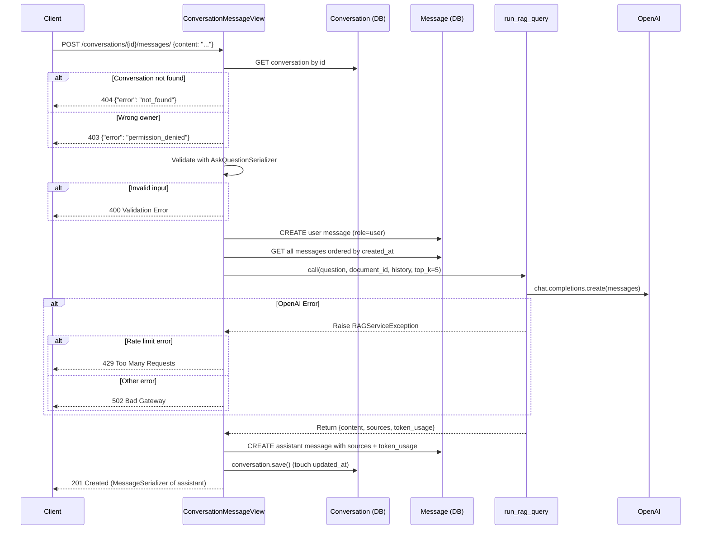

# Task 5 — ConversationMessageView Implementation Prompt

## Overview

Implement the **Ask Question View** (core RAG endpoint) — `ConversationMessageView` — for `POST /conversations/{conversation_id}/messages/`. This is the stateful Q&A endpoint that wires together the existing conversation CRUD, serializers, and RAG service layer.

---

## Files to Modify

### 1. [`src/backend/conversations/views.py`](src/backend/conversations/views.py)
Add the `ConversationMessageView` class.

### 2. [`src/backend/conversations/urls.py`](src/backend/conversations/urls.py)
Register the new URL pattern.

### 3. [`src/backend/conversations/tests/test_views.py`](src/backend/conversations/tests/test_views.py)
Add `ConversationMessageViewTests` class with unit + integration tests.

---

## Implementation Details

### A. [`ConversationMessageView`](src/backend/conversations/views.py)

**Class definition:**

```python
class ConversationMessageView(APIView):
    """Handle asking a question in a conversation (POST /conversations/{conversation_id}/messages/)."""
    permission_classes = [IsAuthenticated]
```

**Imports needed** (add to existing imports at top of file):

```python
from conversations.models import Message
from conversations.rag_service import RAGServiceException, run_rag_query
from conversations.serializers import (
    AskQuestionSerializer,
    MessageSerializer,
    # existing imports kept
)
```

**Method: `post(self, request: Request, conversation_id: str) -> Response`**

Logic flow:

1. **Fetch conversation + ownership check** — Reuse the same pattern from [`ConversationDetailView._get_conversation_or_error()`](src/backend/conversations/views.py:164). Since this is a new view, implement the check inline rather than extracting a shared helper (to keep changes minimal):

   ```python
   try:
       conversation = Conversation.objects.get(id=conversation_id)
   except Conversation.DoesNotExist:
       return Response(
           {"error": "not_found", "message": "Conversation not found"},
           status=status.HTTP_404_NOT_FOUND,
       )

   if conversation.user != request.user:
       return Response(
           {
               "error": "permission_denied",
               "message": "You do not have permission to access this conversation.",
           },
           status=status.HTTP_403_FORBIDDEN,
       )
   ```

2. **Validate input** with [`AskQuestionSerializer`](src/backend/conversations/serializers.py:192):

   ```python
   serializer = AskQuestionSerializer(data=request.data)
   serializer.is_valid(raise_exception=True)
   validated_data = serializer.validated_data
   question = validated_data["content"]
   ```

3. **Persist the user message** first:

   ```python
   Message.objects.create(
       conversation=conversation,
       role="user",
       content=question,
   )
   ```

4. **Build conversation history** from `conversation.messages.all()` ordered by `created_at`:

   ```python
   all_messages = conversation.messages.all().order_by("created_at")
   conversation_history = [
       {"role": msg.role, "content": msg.content}
       for msg in all_messages
   ]
   ```

   > **Note:** The user message just created is included in this history, so the RAG service receives the full context including the latest question.

5. **Call `run_rag_query`** with the conversation's `document_id`:

   ```python
   try:
       result = run_rag_query(
           question=question,
           document_id=str(conversation.document_id),
           conversation_history=conversation_history,
           top_k=5,
       )
   except RAGServiceException as e:
       logger.error("RAG query failed for conversation %s: %s", conversation_id, e)
       return Response(
           {"error": "rag_error", "message": str(e)},
           status=status.HTTP_502_BAD_GATEWAY,
       )
   ```

6. **Persist the assistant message** with `sources` and `token_usage`:

   ```python
   assistant_message = Message.objects.create(
       conversation=conversation,
       role="assistant",
       content=result["content"],
       sources=result["sources"],
       token_usage=result["token_usage"],
   )
   ```

7. **Touch `conversation.updated_at`** by calling `conversation.save()` (triggers `auto_now=True`):

   ```python
   conversation.save()  # updates updated_at via auto_now
   ```

8. **Return `201 Created`** with [`MessageSerializer`](src/backend/conversations/serializers.py:19) of the assistant message:

   ```python
   response_serializer = MessageSerializer(assistant_message)
   return Response(
       response_serializer.data,
       status=status.HTTP_201_CREATED,
   )
   ```

**Error handling for OpenAI rate limits:**

The `run_rag_query` function wraps OpenAI errors in `RAGServiceException`. To handle rate limits specifically, catch the OpenAI rate limit error before it becomes a generic `RAGServiceException`. However, since `run_rag_query` already wraps all OpenAI errors, the simplest approach is:

- Check if the error message contains rate-limit keywords in the `RAGServiceException` handler, OR
- Add a specific exception class for rate limits in [`rag_service.py`](src/backend/conversations/rag_service.py)

**Recommended approach:** Modify [`run_rag_query`](src/backend/conversations/rag_service.py:143) to raise a more specific exception for rate limits. But to keep changes minimal for this task, handle it in the view by checking the error message:

```python
except RAGServiceException as e:
    error_msg = str(e).lower()
    if "rate limit" in error_msg or "429" in error_msg:
        return Response(
            {
                "error": "rate_limit_exceeded",
                "message": "OpenAI API rate limit exceeded. Please try again later.",
                "retry_after": 60,
            },
            status=status.HTTP_429_TOO_MANY_REQUESTS,
        )
    # ... existing 502 handler
```

### B. URL Registration in [`src/backend/conversations/urls.py`](src/backend/conversations/urls.py)

Add import and path:

```python
from conversations.views import (
    ConversationDetailView,
    ConversationListCreateView,
    ConversationMessageView,  # NEW
)

urlpatterns = [
    # ... existing paths ...
    path(
        "<uuid:conversation_id>/messages/",
        ConversationMessageView.as_view(),
        name="conversation-messages",
    ),
]
```

> **Important:** This new path must be placed **after** the `"<uuid:conversation_id>/"` path to avoid Django's URL resolver matching `/messages/` as a `conversation_id`. Actually, since `conversation_id` is a UUID pattern and `messages/` is a string, there's no conflict — but place it before the detail path for clarity and safety.

### C. Tests in [`src/backend/conversations/tests/test_views.py`](src/backend/conversations/tests/test_views.py)

Add a new test class `ConversationMessageViewTests` following the existing patterns.

**Test class structure:**

```python
class ConversationMessageViewTests(TestCase):
    """Tests for the :class:`ConversationMessageView` endpoint."""
```

**`setUp` method:**

```python
def setUp(self) -> None:
    self.client = APIClient()
    self.user = User.objects.create_user(
        email="msg-test@example.com",
        password="testpass123",
    )
    self.other_user = User.objects.create_user(
        email="other-msg@example.com",
        password="testpass123",
    )
    self.document = _create_document(self.user)
    self.conversation = Conversation.objects.create(
        user=self.user,
        document=self.document,
        title="Test Conversation",
    )
    self.url = reverse(
        "conversations:conversation-messages",
        kwargs={"conversation_id": self.conversation.id},
    )
```

#### Test Cases (Unit Tests with Mocked `run_rag_query`)

Use `@patch("conversations.views.run_rag_query")` to mock the RAG service.

| # | Test Method | Description | Assertions |
|---|-------------|-------------|------------|
| 1 | `test_post_creates_user_and_assistant_messages` | Happy path: valid question → 2 messages created | `201`, assistant msg has `content`, `sources`, `token_usage`; DB has 2 messages |
| 2 | `test_post_returns_201_with_message_serializer` | Verify response shape matches `MessageSerializer` | `id`, `role="assistant"`, `content`, `sources`, `token_usage`, `created_at` |
| 3 | `test_post_touches_conversation_updated_at` | `conversation.updated_at` changes after POST | Compare timestamps before/after |
| 4 | `test_post_invalid_conversation_id` | Random UUID → 404 | `{"error": "not_found", ...}` |
| 5 | `test_post_other_users_conversation` | Different user → 403 | `{"error": "permission_denied", ...}` |
| 6 | `test_post_unauthenticated` | No auth header → 401 | DRF's `{"detail": ...}` |
| 7 | `test_post_empty_content` | Empty `content` → 400 | DRF validation error on `content` |
| 8 | `test_post_rag_service_failure` | `run_rag_query` raises `RAGServiceException` → 502 | `{"error": "rag_error", ...}` |
| 9 | `test_post_rate_limit_error` | `run_rag_query` raises with "rate limit" → 429 | `{"error": "rate_limit_exceeded", "retry_after": 60}` |
| 10 | `test_post_conversation_history_includes_prior_messages` | Existing messages in conversation are passed to `run_rag_query` | Mock call args include history |

#### Integration Test

| # | Test Method | Description | Assertions |
|---|-------------|-------------|------------|
| 11 | `test_full_conversation_flow` | Create conv → ask → check messages persisted → ask again → verify history | 2 messages after first ask, 4 after second; history contains prior turns |

**Mock setup for `run_rag_query`:**

```python
mock_run_rag_query.return_value = {
    "content": "Based on the document, the answer is...",
    "sources": [
        {
            "chunk_id": "chunk-1",
            "page_start": 1,
            "page_end": 3,
            "content_preview": "Sample content...",
            "relevance_score": 0.95,
        }
    ],
    "token_usage": {
        "prompt_tokens": 350,
        "completion_tokens": 50,
        "total_tokens": 400,
    },
    "raw_chunks": [],
}
```

---

## Sequence Diagram



---

## Acceptance Criteria Checklist

- [ ] `ConversationMessageView` handles `POST /conversations/{conversation_id}/messages/`
- [ ] Ownership check returns `403` for other user's conversation
- [ ] Non-existent conversation returns `404`
- [ ] Unauthenticated requests return `401`
- [ ] Empty content returns `400` (DRF validation)
- [ ] User message is persisted **before** calling RAG
- [ ] Assistant message is persisted **after** RAG response with `sources` and `token_usage`
- [ ] `conversation.updated_at` is updated after the request
- [ ] `RAGServiceException` → `502 Bad Gateway`
- [ ] OpenAI rate limit error → `429 Too Many Requests` with `retry_after` hint
- [ ] URL registered at `<uuid:conversation_id>/messages/` with name `conversation-messages`
- [ ] All 11+ tests pass (10 unit + 1 integration minimum)
- [ ] No regressions in existing tests (`pytest` passes full suite)

---

## Edge Cases to Consider

1. **Empty conversation (no prior messages):** `conversation_history` will be `[{"role": "user", "content": question}]` — just the message just created. The RAG service handles this fine.

2. **Very long conversation history:** The RAG service already caps at `RAG_MAX_HISTORY_TURNS` (10 turns = 20 messages). The view passes all messages; truncation happens inside `run_rag_query`.

3. **RAG returns empty content:** If OpenAI returns an empty string, the assistant message will have empty `content`. This is valid — the system prompt instructs the model to say "I don't have enough information" rather than returning empty, but we shouldn't block empty responses.

4. **Multiple rapid requests:** Each request creates a user message + assistant message pair. No locking is needed since PostgreSQL handles concurrent writes safely.

5. **Conversation deleted between user message and RAG response:** Low probability, but the assistant message creation would fail with a foreign key violation. This is acceptable for now.

---

## Implementation Order

1. Add `ConversationMessageView` to [`views.py`](src/backend/conversations/views.py)
2. Register URL in [`urls.py`](src/backend/conversations/urls.py)
3. Add tests to [`test_views.py`](src/backend/conversations/tests/test_views.py)
4. Run tests: `docker-compose exec backend pytest conversations/tests/test_views.py -v`
5. Run full suite: `docker-compose exec backend pytest`
6. Update [`docs/references/api-registry.md`](docs/references/api-registry.md) to mark the endpoint as implemented
7. Update [`docs/active-task/wip-context.md`](docs/active-task/wip-context.md) with completion status
