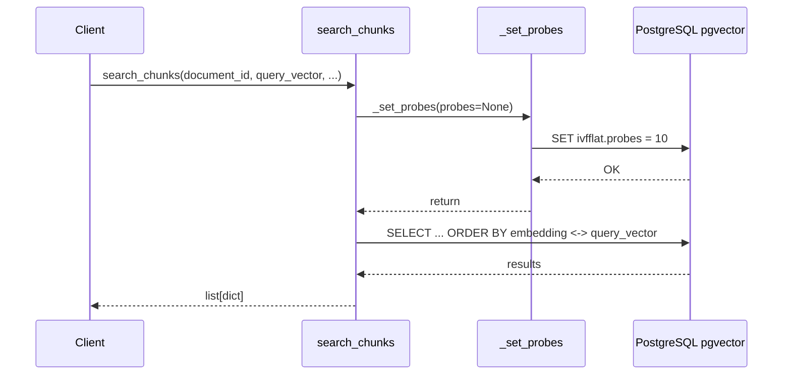

# Task 5 — ivfflat Index Probe Tuning

## Overview

Add pgvector `ivfflat.probes` session-level configuration to improve recall/performance trade-off for similarity searches. The probes setting controls how many lists are searched during an ivfflat index scan — higher values improve recall but slow down queries.

## Files to Modify

| File | Change |
|---|---|
| [`src/backend/config/settings.py`](../src/backend/config/settings.py) | Add `VECTOR_SEARCH_PROBES` setting |
| [`.env.example`](../.env.example) | Add `VECTOR_SEARCH_PROBES=10` with comment |
| [`src/backend/documents/services/search_service.py`](../src/backend/documents/services/search_service.py) | Add `_set_probes()` helper and call it before query execution |
| [`src/backend/documents/tests/test_search_service.py`](../src/backend/documents/tests/test_search_service.py) | Add `test_search_service_sets_probes` test |

## Implementation Steps

### Step 1: Add `VECTOR_SEARCH_PROBES` to `settings.py`

Add to the `env` constructor's default casting block (around line 32, after `EMBEDDING_PROVIDER`):

```python
VECTOR_SEARCH_PROBES=(int, 10),
```

Then add a dedicated setting line after the Embedding Provider section (around line 244):

```python
# pgvector ivfflat index probe count
VECTOR_SEARCH_PROBES = env("VECTOR_SEARCH_PROBES")
```

### Step 2: Add `VECTOR_SEARCH_PROBES` to `.env.example`

Insert a new section or add under the Application-Specific Configuration section (around line 178):

```
# pgvector ivfflat index probe count (1-100, higher = better recall but slower)
VECTOR_SEARCH_PROBES=10
```

### Step 3: Add `_set_probes()` helper to `search_service.py`

Add imports at the top:

```python
from django.conf import settings
from django.db import connection
```

Add the helper function before `search_chunks`:

```python
def _set_probes(probes: int | None = None) -> None:
    """Set ivfflat.probes for the current database session.

    This controls how many inverted lists are searched during an ivfflat
    index scan.  Higher values improve recall at the cost of speed.

    Args:
        probes: Number of probes (1-100).  Falls back to
            ``settings.VECTOR_SEARCH_PROBES`` if ``None``.
    """
    probes = probes if probes is not None else settings.VECTOR_SEARCH_PROBES
    with connection.cursor() as cursor:
        cursor.execute("SET ivfflat.probes = %s", [probes])
```

Call `_set_probes()` at the beginning of `search_chunks()`, before the queryset is built.

### Step 4: Add test `test_search_service_sets_probes`

Add import at the top of the test file:

```python
from unittest.mock import patch
from django.db import connection
```

Add a new test method in `SearchChunksTest`:

```python
def test_search_service_sets_probes(self) -> None:
    """Verify that _set_probes executes SET ivfflat.probes with the correct value."""
    from documents.services.search_service import _set_probes

    with patch.object(connection, "cursor") as mock_cursor:
        mock_cursor.return_value.__enter__.return_value = mock_cursor.return_value
        _set_probes(probes=10)

    mock_cursor.assert_called_once()
    mock_cursor.return_value.execute.assert_called_once_with(
        "SET ivfflat.probes = %s", [10]
    )
```

## Architecture



## Verification

After implementation, run:

```bash
docker-compose exec backend pytest src/backend/documents/tests/test_search_service.py -v
```

Expected: all 6 tests pass (5 existing + 1 new).
