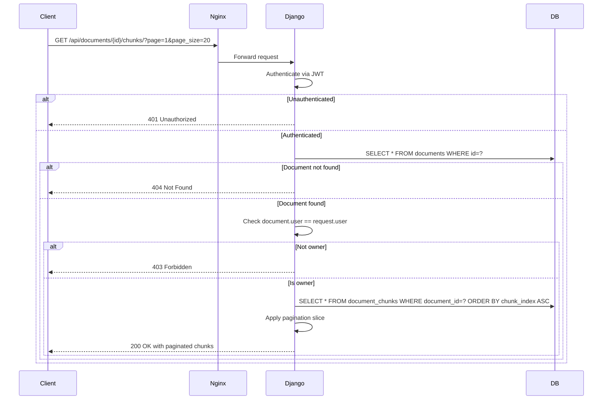

# Task 6: Implement Chunks Retrieval API

## Overview

Implement `GET /documents/{document_id}/chunks/` endpoint that returns paginated document chunks for a given document. The endpoint must verify document ownership, return chunks ordered by `chunk_index`, and support pagination via `page` and `page_size` query parameters.

---

## Files to Modify

| File | Change |
|------|--------|
| [`src/backend/documents/serializers.py`](../src/backend/documents/serializers.py) | Add `DocumentChunkSerializer` |
| [`src/backend/documents/views.py`](../src/backend/documents/views.py) | Add `DocumentChunksListView` |
| [`src/backend/documents/urls.py`](../src/backend/documents/urls.py) | Register the new route |
| [`src/backend/documents/tests/test_views.py`](../src/backend/documents/tests/test_views.py) | Add test class for the new endpoint |
| [`docs/references/api-registry.md`](../docs/references/api-registry.md) | Document the new endpoint |

---

## Step-by-Step Implementation

### Step 1: Add `DocumentChunkSerializer` to `serializers.py`

Add a new serializer class **after** the existing `ProcessingStatusSerializer` (line 97).

```python
class DocumentChunkSerializer(serializers.Serializer):
    """Serialize a single DocumentChunk for the chunks list response."""

    id = serializers.UUIDField(
        help_text="Unique identifier of the chunk.",
    )
    chunk_index = serializers.IntegerField(
        help_text="Sequential index of the chunk within the document.",
    )
    page_start = serializers.IntegerField(
        help_text="Starting page number for this chunk.",
    )
    page_end = serializers.IntegerField(
        help_text="Ending page number for this chunk.",
    )
    content = serializers.CharField(
        help_text="Text content of the chunk.",
    )
    token_count = serializers.IntegerField(
        allow_null=True,
        help_text="Number of tokens in the chunk, or null if not computed.",
    )
    metadata = serializers.JSONField(
        help_text="Additional metadata associated with the chunk.",
    )
```

**Fields rationale:**
- `id` — UUID primary key, needed for frontend references
- `chunk_index` — Sequential ordering within the document
- `page_start` / `page_end` — Page range for source tracking
- `content` — The actual chunk text
- `token_count` — Nullable, for LLM context window management
- `metadata` — JSON field for extensible metadata

### Step 2: Add `DocumentChunksListView` to `views.py`

Add the new view class **after** `DocumentProcessingStatusView` (line 236).

```python
class DocumentChunksListView(APIView):
    """Retrieve paginated chunks for a given document.

    **Endpoint:** ``GET /documents/<uuid:document_id>/chunks/``

    **Authentication:** Required.

    **Query Parameters:**
        - ``page`` (int, default=1)
        - ``page_size`` (int, default=20)

    **Responses:**
        - ``200 OK`` — Chunks returned successfully (may be empty list).
        - ``403 Forbidden`` — Document belongs to another user.
        - ``404 Not Found`` — Document does not exist.
    """

    permission_classes = [IsAuthenticated]

    def get(self, request: Request, document_id: str) -> Response:
        """Handle the chunks list GET request."""
        try:
            document = Document.objects.get(id=document_id)
        except Document.DoesNotExist:
            return Response(
                {"error": "not_found", "message": "Document not found"},
                status=status.HTTP_404_NOT_FOUND,
            )

        # Verify ownership.
        if document.user != request.user:
            return Response(
                {"error": "permission_denied", "message": "You do not have permission to view this document."},
                status=status.HTTP_403_FORBIDDEN,
            )

        # Parse pagination params.
        try:
            page = int(request.query_params.get("page", 1))
            page_size = int(request.query_params.get("page_size", 20))
        except (ValueError, TypeError):
            page, page_size = 1, 20

        if page < 1:
            page = 1
        if page_size < 1:
            page_size = 20

        # Query chunks ordered by chunk_index.
        chunks = DocumentChunk.objects.filter(
            document=document,
        ).order_by("chunk_index")

        # Apply pagination.
        total = chunks.count()
        start = (page - 1) * page_size
        end = start + page_size
        page_chunks = chunks[start:end]

        # Serialize.
        serializer = DocumentChunkSerializer(page_chunks, many=True)

        # Build paginated response.
        total_pages = (total + page_size - 1) // page_size if total > 0 else 0

        return Response(
            {
                "count": total,
                "page": page,
                "page_size": page_size,
                "total_pages": total_pages,
                "next": page + 1 if page < total_pages else None,
                "previous": page - 1 if page > 1 else None,
                "results": serializer.data,
            },
            status=status.HTTP_200_OK,
        )
```

**Design decisions:**
- Follows the same ownership-verification pattern as `DocumentProcessView` and `DocumentProcessingStatusView`
- Uses manual pagination (slice-based) instead of DRF's `PageNumberPagination` to keep it simple and consistent with the existing pattern of manual response construction
- Returns `next`/`previous` as page numbers (not full URLs) for simplicity
- Returns `count`, `page`, `page_size`, `total_pages` for full pagination metadata
- Handles invalid/negative page/page_size gracefully by falling back to defaults

### Step 3: Register the route in `urls.py`

Add the import and path entry.

**Import changes** — add `DocumentChunksListView` to the existing import block:
```python
from documents.views import (
    DocumentChunksListView,
    DocumentProcessView,
    DocumentProcessingStatusView,
    DocumentUploadView,
)
```

**URL pattern** — add after the processing-status path (line 28):
```python
    path(
        "<uuid:document_id>/chunks/",
        DocumentChunksListView.as_view(),
        name="document-chunks",
    ),
```

### Step 4: Add tests to `test_views.py`

Add a new test class `DocumentChunksListViewTests` **after** `DocumentUploadViewSmokeTests` (line 428).

```python
class DocumentChunksListViewTests(TestCase):
    """Tests for the :class:`DocumentChunksListView` endpoint."""

    def setUp(self) -> None:
        self.client = APIClient()
        self.user = User.objects.create_user(
            email="chunks-test@example.com",
            password="testpass123",
        )
        self.other_user = User.objects.create_user(
            email="other-chunks@example.com",
            password="testpass123",
        )
        self.document = _create_document(self.user)
        self.url = reverse(
            "documents:document-chunks",
            kwargs={"document_id": self.document.id},
        )

    # -- 404 Not Found -----------------------------------------------------

    def test_nonexistent_document_returns_404(self) -> None:
        """GET for a non-existent document should return 404."""
        url = reverse(
            "documents:document-chunks",
            kwargs={"document_id": uuid.uuid4()},
        )
        response = self.client.get(url, **_auth_header(self.user))
        self.assertEqual(response.status_code, status.HTTP_404_NOT_FOUND)
        self.assertEqual(response.data["error"], "not_found")

    # -- 403 Forbidden -----------------------------------------------------

    def test_other_users_document_returns_403(self) -> None:
        """GET for another user's document should return 403."""
        response = self.client.get(self.url, **_auth_header(self.other_user))
        self.assertEqual(response.status_code, status.HTTP_403_FORBIDDEN)
        self.assertEqual(response.data["error"], "permission_denied")

    # -- 401 Unauthenticated -----------------------------------------------

    def test_unauthenticated_request_returns_401(self) -> None:
        """GET without auth should return 401."""
        response = self.client.get(self.url)
        self.assertEqual(response.status_code, status.HTTP_401_UNAUTHORIZED)

    # -- 200 OK — empty chunks ---------------------------------------------

    def test_empty_chunks_returns_200_with_empty_list(self) -> None:
        """A document with no chunks should return 200 with empty results."""
        response = self.client.get(self.url, **_auth_header(self.user))
        self.assertEqual(response.status_code, status.HTTP_200_OK)

        data = response.json()
        self.assertEqual(data["count"], 0)
        self.assertEqual(data["page"], 1)
        self.assertEqual(data["page_size"], 20)
        self.assertEqual(data["total_pages"], 0)
        self.assertIsNone(data["next"])
        self.assertIsNone(data["previous"])
        self.assertEqual(data["results"], [])

    # -- 200 OK — with chunks ----------------------------------------------

    def test_returns_chunks_in_order(self) -> None:
        """Chunks should be returned ordered by chunk_index ASC."""
        for i in range(3):
            DocumentChunk.objects.create(
                document=self.document,
                chunk_index=i,
                page_start=i * 10 + 1,
                page_end=(i + 1) * 10,
                content=f"Chunk {i} content",
                token_count=50,
                metadata={"section": f"Section {i}"},
            )

        response = self.client.get(self.url, **_auth_header(self.user))
        self.assertEqual(response.status_code, status.HTTP_200_OK)

        data = response.json()
        self.assertEqual(data["count"], 3)
        self.assertEqual(len(data["results"]), 3)
        for i, chunk in enumerate(data["results"]):
            self.assertEqual(chunk["chunk_index"], i)
            self.assertEqual(chunk["content"], f"Chunk {i} content")

    # -- Pagination --------------------------------------------------------

    def test_pagination_page_size(self) -> None:
        """``page_size`` should limit the number of returned chunks."""
        for i in range(5):
            DocumentChunk.objects.create(
                document=self.document,
                chunk_index=i,
                page_start=1,
                page_end=10,
                content=f"Chunk {i}",
            )

        response = self.client.get(
            self.url,
            {"page": 1, "page_size": 2},
            **_auth_header(self.user),
        )
        self.assertEqual(response.status_code, status.HTTP_200_OK)

        data = response.json()
        self.assertEqual(data["count"], 5)
        self.assertEqual(data["page_size"], 2)
        self.assertEqual(data["total_pages"], 3)
        self.assertEqual(len(data["results"]), 2)
        self.assertEqual(data["next"], 2)
        self.assertIsNone(data["previous"])

    def test_pagination_second_page(self) -> None:
        """Page 2 should return the next set of chunks."""
        for i in range(5):
            DocumentChunk.objects.create(
                document=self.document,
                chunk_index=i,
                page_start=1,
                page_end=10,
                content=f"Chunk {i}",
            )

        response = self.client.get(
            self.url,
            {"page": 2, "page_size": 2},
            **_auth_header(self.user),
        )
        self.assertEqual(response.status_code, status.HTTP_200_OK)

        data = response.json()
        self.assertEqual(data["count"], 5)
        self.assertEqual(data["page"], 2)
        self.assertEqual(len(data["results"]), 2)
        self.assertEqual(data["results"][0]["chunk_index"], 2)
        self.assertEqual(data["results"][1]["chunk_index"], 3)
        self.assertEqual(data["next"], 3)
        self.assertEqual(data["previous"], 1)

    def test_pagination_last_page(self) -> None:
        """The last page should have remaining items and next=None."""
        for i in range(5):
            DocumentChunk.objects.create(
                document=self.document,
                chunk_index=i,
                page_start=1,
                page_end=10,
                content=f"Chunk {i}",
            )

        response = self.client.get(
            self.url,
            {"page": 3, "page_size": 2},
            **_auth_header(self.user),
        )
        self.assertEqual(response.status_code, status.HTTP_200_OK)

        data = response.json()
        self.assertEqual(data["count"], 5)
        self.assertEqual(data["page"], 3)
        self.assertEqual(len(data["results"]), 1)
        self.assertEqual(data["results"][0]["chunk_index"], 4)
        self.assertIsNone(data["next"])
        self.assertEqual(data["previous"], 2)

    # -- Response format ---------------------------------------------------

    def test_response_format_contains_expected_fields(self) -> None:
        """The response should contain all expected pagination fields."""
        DocumentChunk.objects.create(
            document=self.document,
            chunk_index=0,
            page_start=1,
            page_end=5,
            content="Test content",
            token_count=10,
            metadata={"key": "value"},
        )

        response = self.client.get(self.url, **_auth_header(self.user))
        self.assertEqual(response.status_code, status.HTTP_200_OK)

        data = response.json()
        self.assertIn("count", data)
        self.assertIn("page", data)
        self.assertIn("page_size", data)
        self.assertIn("total_pages", data)
        self.assertIn("next", data)
        self.assertIn("previous", data)
        self.assertIn("results", data)

        chunk = data["results"][0]
        self.assertIn("id", chunk)
        self.assertIn("chunk_index", chunk)
        self.assertIn("page_start", chunk)
        self.assertIn("page_end", chunk)
        self.assertIn("content", chunk)
        self.assertIn("token_count", chunk)
        self.assertIn("metadata", chunk)
```

**Test coverage:**
| Test | What it verifies |
|------|-----------------|
| `test_nonexistent_document_returns_404` | 404 for non-existent document |
| `test_other_users_document_returns_403` | 403 for other user's document |
| `test_unauthenticated_request_returns_401` | 401 without auth |
| `test_empty_chunks_returns_200_with_empty_list` | 200 with empty results |
| `test_returns_chunks_in_order` | Chunks ordered by `chunk_index` ASC |
| `test_pagination_page_size` | `page_size` limits results |
| `test_pagination_second_page` | Page 2 returns correct slice |
| `test_pagination_last_page` | Last page has `next=None` |
| `test_response_format_contains_expected_fields` | All expected fields present |

### Step 5: Update `docs/references/api-registry.md`

Add the new endpoint documentation under the Documents section, after the processing-status entry (after line 436).

---

## Execution Order

1. **RED** — Write the test class first (Step 4)
2. **GREEN** — Implement the serializer (Step 1), view (Step 2), and URL (Step 3)
3. **REFACTOR** — Run tests, verify all pass, update API registry (Step 5)

## Verification

```bash
# Run the document tests
docker-compose exec backend python -m pytest documents/tests/ --ds=config.settings -v
```

Expected: All existing tests + 9 new tests pass (0 failures, 0 errors).

## Mermaid Diagram


