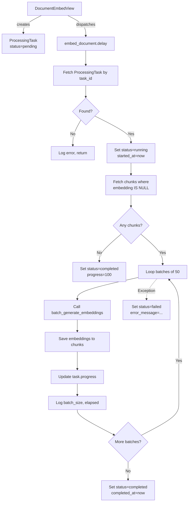

# Task 6: Implement Embedding Celery Task

## Objective

Create a dedicated, self-contained Celery task at [`src/backend/documents/tasks/embedding_tasks.py`](src/backend/documents/tasks/embedding_tasks.py) that generates embeddings for all un-embedded chunks of a document. This task **replaces** the existing [`embed_document`](src/backend/documents/tasks/document_processing.py:384) task (which currently delegates to [`generate_embeddings_for_document()`](src/backend/documents/services/embedding_service.py:218) — a service function that has its own `ProcessingTask` management, causing a dual-management conflict).

---

## Context & Problem Statement

### Current Architecture (Problematic)

```
DocumentEmbedView (views.py)
  └─ creates ProcessingTask (status="pending")
  └─ embed_document.delay(document_id, processing_task_id)
       └─ embed_document (document_processing.py:384)
            ├─ sets ProcessingTask → "running"
            └─ calls generate_embeddings_for_document(document_id)
                 └─ does its OWN get_or_create for ProcessingTask
                 └─ manages progress/status independently
```

**Problems:**
1. **Dual ProcessingTask management** — The view creates a `ProcessingTask`, then `embed_document` sets it to `running`, but then `generate_embeddings_for_document()` does its own `get_or_create` which may find the existing task or create a duplicate.
2. **No batch timing logs** — The current implementation doesn't log generation time per batch.
3. **No `task_id` parameter in the service** — The service function doesn't accept a `task_id`, so it can't update the specific task created by the view.

### Target Architecture

```
DocumentEmbedView (views.py)
  └─ creates ProcessingTask (status="pending")
  └─ embed_document.delay(document_id, processing_task_id)
       └─ embed_document (embedding_tasks.py)  ★ NEW FILE
            ├─ fetches ProcessingTask by task_id
            ├─ sets status → "running", started_at = now
            ├─ fetches chunks where embedding IS NULL
            ├─ processes in batches of 50:
            │    ├─ batch_generate_embeddings(texts)
            │    ├─ saves embeddings to each chunk
            │    ├─ updates task.progress
            │    └─ logs batch timing
            ├─ on success: status → "completed", completed_at = now
            └─ on failure: status → "failed", error_message = str(e)
```

---

## Implementation Plan

### Step 1: Create [`src/backend/documents/tasks/embedding_tasks.py`](src/backend/documents/tasks/embedding_tasks.py)

Create a new file with the following structure:

```python
"""
Celery task for generating document chunk embeddings.

Provides a single Celery task:
- ``embed_document`` — Generates embeddings for all un-embedded chunks of a
  document, managing the ``ProcessingTask`` lifecycle directly.
"""

from __future__ import annotations

import logging
import time
from typing import Any

from celery import shared_task
from django.db import IntegrityError, OperationalError
from django.utils import timezone

from documents.models import Document, DocumentChunk
from documents.services.embedding_service import (
    SUB_BATCH_SIZE,
    batch_generate_embeddings,
)
from documents.services.error_handler import log_milestone
from tasks.models import ProcessingTask

logger = logging.getLogger(__name__)


@shared_task(
    bind=True,
    autoretry_for=(IntegrityError, OperationalError, ConnectionError, TimeoutError),
    max_retries=3,
    retry_backoff=True,
    retry_backoff_max=60,
    retry_jitter=True,
)
def embed_document(self, document_id: str, task_id: str) -> None:
    """Generate embeddings for all un-embedded chunks of a document.

    This task is dispatched by :class:`~documents.views.DocumentEmbedView`
    and manages the ``ProcessingTask`` lifecycle directly (no delegation to
    :func:`~documents.services.embedding_service.generate_embeddings_for_document`).

    Transient database/network errors are automatically retried up to 3 times
    with exponential backoff.

    Args:
        document_id: The UUID (as a string) of the :class:`Document` to process.
        task_id: The UUID (as a string) of the :class:`~tasks.models.ProcessingTask`
            tracking this embed operation.
    """
    log_milestone(logger, document_id, "Starting embedding")

    # ── Step 1: Fetch ProcessingTask ──────────────────────────────────
    try:
        processing_task = ProcessingTask.objects.get(id=task_id)
    except ProcessingTask.DoesNotExist:
        logger.error(
            "embed_document: ProcessingTask %s not found for document %s",
            task_id,
            document_id,
        )
        return

    # ── Step 2: Mark as running ───────────────────────────────────────
    processing_task.celery_task_id = self.request.id
    processing_task.status = "running"
    processing_task.started_at = timezone.now()
    processing_task.save(update_fields=["celery_task_id", "status", "started_at"])

    # ── Step 3: Fetch un-embedded chunks ──────────────────────────────
    # Evaluate into a list upfront so slicing works correctly after saves.
    try:
        document = Document.objects.get(id=document_id)
    except Document.DoesNotExist:
        logger.error("embed_document: Document %s not found", document_id)
        processing_task.status = "failed"
        processing_task.error_message = f"Document {document_id} not found"
        processing_task.completed_at = timezone.now()
        processing_task.save(update_fields=["status", "error_message", "completed_at"])
        return

    chunks = list(
        DocumentChunk.objects.filter(
            document=document,
            embedding__isnull=True,
        ).order_by("chunk_index")
    )

    total_count = len(chunks)

    if total_count == 0:
        logger.info(
            "embed_document: No un-embedded chunks for document %s",
            document_id,
        )
        processing_task.status = "completed"
        processing_task.progress = 100
        processing_task.completed_at = timezone.now()
        processing_task.save(update_fields=["status", "progress", "completed_at"])
        return

    # ── Step 4: Process in batches of 50 ──────────────────────────────
    total_batches = (total_count + SUB_BATCH_SIZE - 1) // SUB_BATCH_SIZE
    processed_count = 0

    try:
        for batch_index in range(total_batches):
            batch_start = batch_index * SUB_BATCH_SIZE
            batch_end = min(batch_start + SUB_BATCH_SIZE, total_count)
            batch = chunks[batch_start:batch_end]

            texts = [chunk.content for chunk in batch]

            # Time the API call
            batch_start_time = time.monotonic()
            embeddings = batch_generate_embeddings(texts)
            batch_elapsed = time.monotonic() - batch_start_time

            # Save embeddings
            batch_processed = 0
            for chunk, embedding in zip(batch, embeddings):
                if embedding is not None:
                    chunk.embedding = embedding
                    chunk.save(update_fields=["embedding"])
                    processed_count += 1
                    batch_processed += 1

            # Update progress
            progress = int((batch_index + 1) / total_batches * 100)
            processing_task.progress = progress
            processing_task.save(update_fields=["progress"])

            logger.info(
                "embed_document: Batch %d/%d complete for document %s "
                "(batch_size=%d, processed=%d, elapsed=%.2fs, progress=%d%%)",
                batch_index + 1,
                total_batches,
                document_id,
                len(batch),
                batch_processed,
                batch_elapsed,
                progress,
            )

        # ── Step 5: Mark as completed ─────────────────────────────────
        processing_task.status = "completed"
        processing_task.progress = 100
        processing_task.completed_at = timezone.now()
        processing_task.save(update_fields=["status", "progress", "completed_at"])

        log_milestone(
            logger,
            document_id,
            "Embedding complete",
            task_id=task_id,
            total_chunks=total_count,
            embedded=processed_count,
        )

    except Exception as e:
        error_message = f"Embedding failed: {e}"
        logger.exception(
            "embed_document: %s (document=%s, task=%s)",
            error_message,
            document_id,
            task_id,
        )
        processing_task.status = "failed"
        processing_task.error_message = error_message
        processing_task.completed_at = timezone.now()
        processing_task.save(update_fields=["status", "error_message", "completed_at"])
```

### Step 2: Update [`src/backend/documents/tasks/__init__.py`](src/backend/documents/tasks/__init__.py)

Change the import to point to the **new** `embed_document` from `embedding_tasks.py` instead of the old one from `document_processing.py`:

```python
from .document_processing import chunk_document, extract_text_from_pdf
from .embedding_tasks import embed_document  # ← NEW: from new module

# process_document is a regular Python function (not a Celery task) that has
# been moved to documents.services.processing_service. It is re-exported here
# for backward compatibility so that existing imports (e.g. from views) continue
# to work without modification.
from documents.services.processing_service import process_document  # noqa: PLC0415

__all__ = ["extract_text_from_pdf", "chunk_document", "embed_document", "process_document"]
```

### Step 3: Remove (or Comment Out) the Old `embed_document` from [`document_processing.py`](src/backend/documents/tasks/document_processing.py)

The old task at lines 376-421 should be **removed or commented out** to avoid a name collision (since both modules would define `embed_document`). Since the `__init__.py` now imports from `embedding_tasks.py`, the old one in `document_processing.py` is dead code.

**Option A (Recommended):** Remove the old task entirely (lines 371-421).
**Option B:** Comment it out with a deprecation notice pointing to the new location.

### Step 4: Update Tests in [`src/backend/documents/tests/test_tasks.py`](src/backend/documents/tests/test_tasks.py)

Add a new test class `EmbedDocumentTaskTests` that covers:

| Test Case | Description |
|-----------|-------------|
| `test_successful_embedding` | 3 un-embedded chunks → all get embeddings, task → completed |
| `test_no_unembedded_chunks` | All chunks already embedded → task completes immediately |
| `test_empty_document_no_chunks` | Document with 0 chunks → task completes immediately |
| `test_processing_task_not_found` | Invalid task_id → logs error, returns gracefully |
| `test_document_not_found` | Invalid document_id → task marked as failed |
| `test_partial_batch_failures` | Some embeddings fail → remaining chunks still get embeddings |
| `test_progress_updates` | Verify progress goes from 0 → 50 → 100 for 2 batches |
| `test_batch_timing_logged` | Verify elapsed time is logged per batch |
| `test_task_marked_failed_on_error` | API error → task marked as failed with error_message |

### Step 5: Verify No Import Breakage

- [`src/backend/documents/views.py`](src/backend/documents/views.py:49) imports `embed_document` from `documents.tasks` — this still works because `__init__.py` re-exports it.
- [`src/backend/documents/views.py`](src/backend/documents/views.py:470) calls `embed_document.delay(...)` — no change needed.
- [`src/backend/documents/tests/test_views.py`](src/backend/documents/tests/test_views.py:958) mocks `documents.views.embed_document` — no change needed.

---

## Key Design Decisions

| Decision | Rationale |
|----------|-----------|
| **New file** (`embedding_tasks.py`) | Keeps the embedding task isolated from extraction/chunking tasks. Follows single-responsibility principle. |
| **Self-contained lifecycle** | The task manages `ProcessingTask` directly rather than delegating to `generate_embeddings_for_document()`, avoiding the dual-management bug. |
| **`time.monotonic()` for batch timing** | More reliable than `time.time()` for measuring elapsed wall-clock time (not affected by system clock changes). |
| **`int((batch_index + 1) / total_batches * 100)` for progress** | Uses batch index (not cumulative chunk count) so progress is 100% when the last batch completes, even if some chunks failed. |
| **`autoretry_for` same as other tasks** | Consistent with `extract_text_from_pdf` and `chunk_document` — retries on transient DB/network errors. |

---

## Mermaid: Task Flow



---

## Files to Modify

| File | Action |
|------|--------|
| [`src/backend/documents/tasks/embedding_tasks.py`](src/backend/documents/tasks/embedding_tasks.py) | **CREATE** — New Celery task |
| [`src/backend/documents/tasks/__init__.py`](src/backend/documents/tasks/__init__.py) | **MODIFY** — Update import to new module |
| [`src/backend/documents/tasks/document_processing.py`](src/backend/documents/tasks/document_processing.py) | **MODIFY** — Remove/comment out old `embed_document` (lines ~371-421) |
| [`src/backend/documents/tests/test_tasks.py`](src/backend/documents/tests/test_tasks.py) | **MODIFY** — Add `EmbedDocumentTaskTests` test class |
| [`docs/active-task/wip-context.md`](docs/active-task/wip-context.md) | **MODIFY** — Update WIP state after completion |
