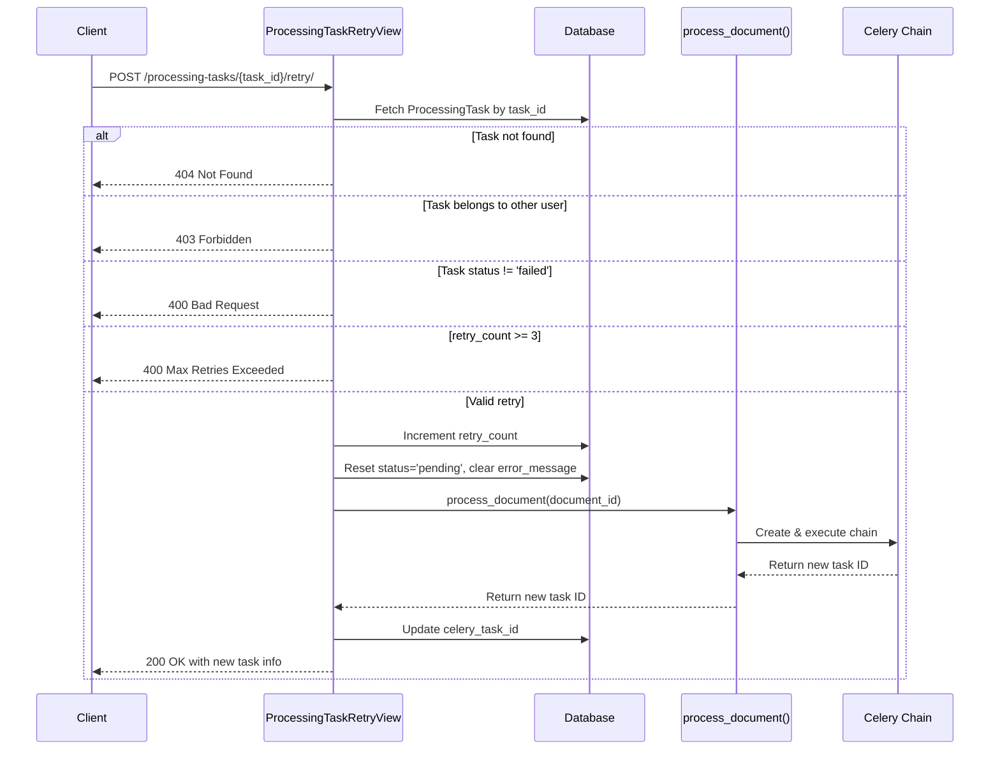

# Task 7: Implement Retry API — Implementation Plan

## Overview

Implement a `POST /documents/processing-tasks/{task_id}/retry/` endpoint that allows retrying a failed `ProcessingTask`. The endpoint enforces a maximum of 3 retries, resets the task state to `pending`, clears the error message, and re-triggers the Celery processing pipeline.

## Files to Modify

| File | Action |
|------|--------|
| [`src/backend/tasks/models.py`](src/backend/tasks/models.py) | Add `retry_count` field to `ProcessingTask` |
| [`src/backend/documents/views.py`](src/backend/documents/views.py) | Add `ProcessingTaskRetryView` class |
| [`src/backend/documents/urls.py`](src/backend/documents/urls.py) | Register the new retry route |
| [`src/backend/documents/tests/test_views.py`](src/backend/documents/tests/test_views.py) | Add `ProcessingTaskRetryViewTests` |
| [`docs/references/api-registry.md`](docs/references/api-registry.md) | Document the new endpoint |
| [`docs/references/database-schema.md`](docs/references/database-schema.md) | Document the new `retry_count` field |

## Step-by-Step Implementation

### Step 1: Add `retry_count` field to `ProcessingTask` model

**File:** [`src/backend/tasks/models.py`](src/backend/tasks/models.py)

Add a new field to the `ProcessingTask` model:

```python
retry_count = models.IntegerField(default=0)
```

Then create a new migration:

```bash
docker-compose exec backend python manage.py makemigrations tasks
docker-compose exec backend python manage.py migrate tasks
```

### Step 2: Create `ProcessingTaskRetryView`

**File:** [`src/backend/documents/views.py`](src/backend/documents/views.py)

Add a new view class `ProcessingTaskRetryView` with the following logic:

1. **Permission:** `IsAuthenticated`
2. **URL pattern:** `POST /documents/processing-tasks/<uuid:task_id>/retry/`
3. **Logic flow:**
   - Fetch `ProcessingTask` by `task_id` (UUID from URL kwarg)
   - If not found → return `404 Not Found` with `{"error": "not_found", "message": "Processing task not found"}`
   - Verify task belongs to authenticated user via `task.document.user != request.user` → return `403 Forbidden`
   - Check task status is `'failed'` → if not, return `400 Bad Request` with `{"error": "bad_request", "message": "Task is not in a failed state"}`
   - Check `retry_count < 3` → if not, return `400 Bad Request` with `{"error": "max_retries_exceeded", "message": "Maximum retry limit (3) exceeded"}`
   - Increment `retry_count`
   - Reset `status` to `'pending'`, clear `error_message`, clear `completed_at`
   - Call `process_document(str(task.document.id))` to re-trigger the Celery chain
   - If `process_document` returns `None` (document already processing/completed), return `400 Bad Request`
   - Update `celery_task_id` with the new task ID from `process_document`
   - Save the task
   - Return `200 OK` with:
     ```json
     {
       "task_id": "<new_celery_task_id>",
       "status": "pending",
       "retry_count": <incremented_count>,
       "document_id": "<document_uuid>"
     }
     ```

**Important considerations:**
- The `process_document` function (from [`src/backend/documents/services/processing_service.py`](src/backend/documents/services/processing_service.py)) checks `document.processing_status in ("processing", "completed")` and returns `None` if so. Since the task failed, the document's `processing_status` should be `"failed"`, so this should pass. But we need to handle the edge case.
- After retry, the document's `processing_status` will be set to `"processing"` by the Celery task's first step (`extract_text_from_pdf`).

### Step 3: Register the URL route

**File:** [`src/backend/documents/urls.py`](src/backend/documents/urls.py)

Add a new import and path:

```python
from documents.views import (
    ...,
    ProcessingTaskRetryView,
)

urlpatterns = [
    ...,
    path(
        "processing-tasks/<uuid:task_id>/retry/",
        ProcessingTaskRetryView.as_view(),
        name="processing-task-retry",
    ),
]
```

### Step 4: Write tests

**File:** [`src/backend/documents/tests/test_views.py`](src/backend/documents/tests/test_views.py)

Add a new test class `ProcessingTaskRetryViewTests` with these test cases:

| Test | Expected |
|------|----------|
| `test_nonexistent_task_returns_404` | POST to non-existent task_id → 404 |
| `test_other_users_task_returns_403` | Task belongs to another user's document → 403 |
| `test_unauthenticated_request_returns_401` | No auth header → 401 |
| `test_non_failed_task_returns_400` | Task status is not 'failed' (e.g., 'pending') → 400 |
| `test_max_retries_exceeded_returns_400` | `retry_count >= 3` → 400 |
| `test_successful_retry_returns_200` | Happy path: failed task, retry_count < 3 → 200 with new task info |
| `test_successful_retry_increments_retry_count` | Verify DB field is incremented |
| `test_successful_retry_clears_error_message` | Verify error_message is set to None |
| `test_successful_retry_resets_status_to_pending` | Verify status changes from 'failed' to 'pending' |

Use `@patch("documents.views.process_document")` to mock the Celery chain call (same pattern as [`DocumentProcessViewTests`](src/backend/documents/tests/test_views.py:115)).

### Step 5: Update reference documentation

**File:** [`docs/references/api-registry.md`](docs/references/api-registry.md)

Add the new endpoint documentation under the Documents section:

```markdown
#### POST /documents/processing-tasks/{task_id}/retry/
**Description:** Retry a failed processing task
**Auth Required:** Yes
**View:** `ProcessingTaskRetryView`
**Response:** `200 OK`
```json
{
  "task_id": "new_celery_task_id",
  "status": "pending",
  "retry_count": 1,
  "document_id": "uuid"
}
```
**Error Responses:**
- `400 Bad Request`: Task is not in a failed state
- `400 Bad Request`: Maximum retry limit (3) exceeded
- `403 Forbidden`: Task belongs to another user
- `404 Not Found`: Processing task does not exist
```

**File:** [`docs/references/database-schema.md`](docs/references/database-schema.md)

Add the `retry_count` field to the `ProcessingTask` table definition.

## Architecture Diagram



## Dependencies

- The `process_document` function already exists in [`src/backend/documents/services/processing_service.py`](src/backend/documents/services/processing_service.py) and is re-exported from [`src/backend/documents/tasks/__init__.py`](src/backend/documents/tasks/__init__.py).
- The `ProcessingTask` model already exists in [`src/backend/tasks/models.py`](src/backend/tasks/models.py).
- The existing test patterns in [`src/backend/documents/tests/test_views.py`](src/backend/documents/tests/test_views.py) use `@patch` for mocking `process_document`.

## Edge Cases & Notes

1. **Document processing_status:** When a task fails, the document's `processing_status` is set to `"failed"` by the Celery task's error handler. When retrying, `process_document` checks `document.processing_status in ("processing", "completed")` — since it's `"failed"`, it will proceed. The Celery task will then set it to `"processing"`.
2. **Multiple failed tasks per document:** A document can have multiple `ProcessingTask` records (e.g., extract + chunk). The retry endpoint targets a specific task by its UUID, not the document. This is correct behavior.
3. **Race conditions:** The retry check-and-update is not wrapped in a transaction. For this task's scope, this is acceptable. If needed later, `select_for_update()` can be added.
4. **process_document creates a NEW ProcessingTask:** Note that `process_document` creates a new `ProcessingTask` record with `task_type='extract'`. The retry endpoint updates the *existing* failed task's metadata (retry_count, status, celery_task_id) rather than creating a new one. This is the correct design — the existing failed task record is reused.
