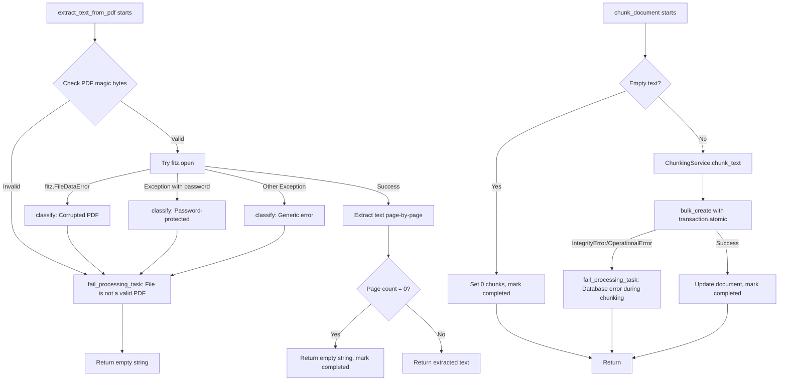

# Task 8: Error Handling & Edge Cases — Implementation Plan

## Overview

Implement comprehensive error handling for the document processing pipeline, covering all edge cases from the PRD table. This includes creating a centralized error handler service, updating Celery configuration, enhancing logging, and writing tests for every scenario.

---

## Files to Modify / Create

| Action | File |
|--------|------|
| **CREATE** | [`src/backend/documents/services/error_handler.py`](src/backend/documents/services/error_handler.py) |
| **MODIFY** | [`src/backend/documents/tasks/document_processing.py`](src/backend/documents/tasks/document_processing.py) |
| **MODIFY** | [`src/backend/config/settings.py`](src/backend/config/settings.py) |
| **MODIFY** | [`src/backend/documents/tests/test_tasks.py`](src/backend/documents/tests/test_tasks.py) |

---

## Step 1: Create `error_handler.py` — Centralized Error Handler Service

**File:** [`src/backend/documents/services/error_handler.py`](src/backend/documents/services/error_handler.py) (NEW)

This module provides reusable error-handling utilities that encapsulate the logic for:
- Classifying PDF-related errors (password-protected, corrupted, empty, non-PDF)
- Updating `ProcessingTask` and `Document` statuses to `"failed"` with appropriate error messages
- Logging errors with full stack traces via `logger.exception()`

### Components

#### 1.1 Error Classification Function

```python
def classify_pdf_error(exception: Exception, pdf_path: str) -> str:
```

Returns a user-friendly error string based on the exception type:

| Exception / Condition | Returned Error String |
|---|---|
| `fitz.FileDataError` | `"PDF file is corrupted or unreadable"` |
| `fitz.EmptyFileError` | `"PDF file is corrupted or unreadable"` |
| Exception message contains `"password"` (case-insensitive) | `"PDF is password-protected"` |
| File is not a valid PDF (magic bytes check) | `"File is not a valid PDF"` |
| Any other exception | `str(exception)` (fallback) |

**Magic bytes check for non-PDF detection:** The first 4 bytes of a PDF must be `%PDF`. Add a helper:

```python
def _has_pdf_magic_bytes(file_path: str) -> bool:
    with open(file_path, "rb") as f:
        header = f.read(4)
    return header == b"%PDF"
```

#### 1.2 Fail-State Updater

```python
def fail_processing_task(
    processing_task: ProcessingTask,
    document: Document,
    error_message: str,
    logger: logging.Logger,
) -> None:
```

Sets both `ProcessingTask` and `Document` to `"failed"` status with the given error message. Logs the error via `logger.exception()`.

**Behavior:**
1. Set `processing_task.status = "failed"`, `processing_task.error_message = error_message`, `processing_task.completed_at = timezone.now()`
2. Set `document.processing_status = "failed"`, `document.processing_error = error_message`
3. Call `logger.exception("...")` with contextual info (document_id, error_message)
4. Save both records

#### 1.3 Processing Milestone Logger

```python
def log_milestone(logger: logging.Logger, document_id: str, milestone: str, **extra: Any) -> None:
```

Logs processing milestones at `INFO` level with consistent formatting:

```
[document_id] milestone — extra_key=extra_value ...
```

Milestones to log:
- `"Starting extraction"`
- `"Extraction complete"`
- `"Starting chunking"`
- `"Chunking complete"`
- `"Pipeline complete"`

---

## Step 2: Update Celery Configuration in `settings.py`

**File:** [`src/backend/config/settings.py`](src/backend/config/settings.py)

Add the following settings to the Celery configuration block (around line 213–222):

```python
# Celery Configuration
CELERY_BROKER_URL = ...
CELERY_RESULT_BACKEND = ...
CELERY_ACCEPT_CONTENT = ...
CELERY_TASK_SERIALIZER = ...
CELERY_RESULT_SERIALIZER = ...
CELERY_TIMEZONE = ...
CELERY_TASK_TRACK_STARTED = True
CELERY_TASK_TIME_LIMIT = 30 * 60  # 30 minutes
CELERY_TASK_SOFT_TIME_LIMIT = 25 * 60  # 25 minutes

# --- NEW: Task 8 settings ---
CELERY_TASK_ACKS_LATE = True          # Tasks re-queued if worker crashes
CELERY_TASK_REJECT_ON_WORKER_LOST = True
CELERY_TASK_RETRY_BACKOFF = True       # Exponential backoff
CELERY_TASK_RETRY_BACKOFF_MAX = 600    # Max 10 minutes between retries
CELERY_TASK_RETRY_JITTER = True        # Add randomness to backoff
```

**Note:** The `CELERY_TASK_RETRY_*` settings are **defaults** for all tasks. The individual task decorators in `document_processing.py` already have their own `retry_backoff`, `retry_backoff_max`, and `retry_jitter` — these settings will serve as fallback defaults.

---

## Step 3: Enhance `document_processing.py` — Robust Error Handling & Logging

**File:** [`src/backend/documents/tasks/document_processing.py`](src/backend/documents/tasks/document_processing.py)

### 3.1 Import the new error handler

```python
from documents.services.error_handler import (
    classify_pdf_error,
    fail_processing_task,
    log_milestone,
)
```

### 3.2 Update `extract_text_from_pdf()`

#### Changes:

1. **Add milestone logging at start and end:**
   - `log_milestone(logger, document_id, "Starting extraction")` at the top
   - `log_milestone(logger, document_id, "Extraction complete", pages=num_pages, chars=len(extracted_text))` after successful extraction

2. **Replace inline error handling with `classify_pdf_error()` + `fail_processing_task()`:**

   Current code (lines 119–130):
   ```python
   except fitz.FileDataError:
       logger.exception(...)
       _fail_extract(processing_task, document, "PDF file is corrupted or unreadable")
       return ""
   except Exception:
       logger.exception(...)
       error_msg = str(traceback.format_exc())
       if "password" in error_msg.lower():
           _fail_extract(processing_task, document, "PDF is password-protected")
       else:
           _fail_extract(processing_task, document, error_msg)
       return ""
   ```

   New code:
   ```python
   except fitz.FileDataError:
       error_msg = classify_pdf_error(e, pdf_path)
       fail_processing_task(processing_task, document, error_msg, logger)
       return ""
   except Exception as e:
       error_msg = classify_pdf_error(e, pdf_path)
       fail_processing_task(processing_task, document, error_msg, logger)
       return ""
   ```

3. **Add non-PDF magic bytes check** — Before calling `fitz.open()`, check if the file starts with `%PDF`. If not, fail immediately with `"File is not a valid PDF"`.

   ```python
   if not _has_pdf_magic_bytes(pdf_path):
       fail_processing_task(processing_task, document, "File is not a valid PDF", logger)
       return ""
   ```

4. **Remove the old `_fail_extract()` helper function** (lines 182–191) — it's replaced by `fail_processing_task()` from the error handler.

### 3.3 Update `chunk_document()`

#### Changes:

1. **Add milestone logging:**
   - `log_milestone(logger, document_id, "Starting chunking")` at the top
   - `log_milestone(logger, document_id, "Chunking complete", chunks=len(chunks_to_create))` after success
   - `log_milestone(logger, document_id, "Pipeline complete")` at the very end (after setting status to completed)

2. **Replace inline error handling in the `except Exception` block (lines 303–315):**

   Current code:
   ```python
   except Exception:
       logger.exception("chunk_document: Failed to chunk document %s", document_id)
       error_message = traceback.format_exc()
       chunk_task.status = "failed"
       chunk_task.error_message = error_message
       chunk_task.completed_at = timezone.now()
       chunk_task.save(...)
       document.processing_status = "failed"
       document.processing_error = error_message
       document.save(...)
   ```

   New code:
   ```python
   except Exception:
       error_message = traceback.format_exc()
       fail_processing_task(chunk_task, document, error_message, logger)
   ```

3. **Add database error handling for chunk insert** — Wrap the `transaction.atomic()` / `bulk_create()` block in a specific try/except for `IntegrityError` and `OperationalError`:

   ```python
   try:
       with transaction.atomic():
           DocumentChunk.objects.bulk_create(chunks_to_create)
   except (IntegrityError, OperationalError) as e:
       fail_processing_task(
           chunk_task, document,
           "Database error during chunking",
           logger,
       )
       return
   ```

### 3.4 Update `_handle_chain_error()`

#### Changes:

1. **Add milestone logging:** Log the chain failure with the document_id
2. **Use `fail_processing_task()`** for the document-level failure (the ProcessingTask update logic is slightly different here since we're looking up a pending/running task, but the document update can use the shared function)

---

## Step 4: Update Tests in `test_tasks.py`

**File:** [`src/backend/documents/tests/test_tasks.py`](src/backend/documents/tests/test_tasks.py)

### 4.1 Add Tests for New Edge Cases

| # | Test Method | Scenario | Expected Behavior |
|---|---|---|---|
| 1 | `test_password_protected_pdf_sets_failed_status` | Password-protected PDF | Status `"failed"`, error contains `"password-protected"` |
| 2 | `test_non_pdf_file_sets_failed_status` | Non-PDF file (e.g., `.txt` renamed to `.pdf`) | Status `"failed"`, error contains `"not a valid PDF"` |
| 3 | `test_empty_pdf_returns_empty_string` | Already exists — verify it still works | Status `"completed"`, 0 chunks, no error |
| 4 | `test_database_error_during_chunk_insert` | `IntegrityError` during `bulk_create` | Status `"failed"`, error contains `"Database error during chunking"` |
| 5 | `test_celery_task_timeout_behavior` | Simulate soft/hard time limit via `SoftTimeLimitExceeded` | Status `"failed"`, error contains `"Task timed out"` |

### 4.2 Test Helper Updates

- Add `_create_password_protected_pdf()` helper — PyMuPDF can't easily create password-protected PDFs, so mock `fitz.open()` to raise an exception with "password" in the message.
- Add `_create_non_pdf_file()` helper — Write a file with a `.pdf` extension but non-PDF content (e.g., `b"not a pdf"`).

### 4.3 Verify Existing Tests Still Pass

- All existing tests in `ExtractTextFromPdfTests`, `ChunkDocumentTests`, `ProcessDocumentTests`, and `HandleChainErrorTests` must continue to pass after refactoring.

---

## Step 5: Update Reference Documentation

### 5.1 Update `docs/references/api-registry.md`

No API endpoint changes in this task, so no update needed unless error response formats changed (they haven't — the error messages are the same, just centralized).

### 5.2 Update `docs/references/database-schema.md`

No database schema changes in this task.

---

## Step 6: Update `wip-context.md`

After completing the implementation, update [`docs/active-task/wip-context.md`](docs/active-task/wip-context.md) with:
1. What was completed (all 5 steps above)
2. Current state of the code
3. Next steps (if any)

---

## Implementation Order (Recommended)

1. **Create** [`error_handler.py`](src/backend/documents/services/error_handler.py) — the centralized error handler service
2. **Update** [`settings.py`](src/backend/config/settings.py) — add new Celery config
3. **Refactor** [`document_processing.py`](src/backend/documents/tasks/document_processing.py) — use the error handler, add milestone logging, add magic bytes check, add DB error handling
4. **Update** [`test_tasks.py`](src/backend/documents/tests/test_tasks.py) — add new edge case tests, verify existing tests pass
5. **Run** tests via `docker-compose exec backend pytest documents/tests/test_tasks.py -v`
6. **Update** [`wip-context.md`](docs/active-task/wip-context.md)

---

## Edge Cases Summary (from PRD)

| Scenario | Error Message | Status | Chunks |
|---|---|---|---|
| Password-protected PDF | `"PDF is password-protected"` | `failed` | N/A |
| Corrupted PDF | `"PDF file is corrupted or unreadable"` | `failed` | N/A |
| Empty PDF (0 pages) | No error | `completed` | 0 |
| Non-PDF file uploaded | `"File is not a valid PDF"` | `failed` | N/A |
| Celery task timeout | `"Task timed out"` | `failed` | N/A |
| Database error during chunk insert | `"Database error during chunking"` | `failed` | N/A |

---

## Mermaid: Error Handling Flow



---

## Prompt for Code Mode Session

Below is the exact prompt to give to Roo Code in **Code mode**:

---

```
# Task 8: Error Handling & Edge Cases

Implement comprehensive error handling for the document processing pipeline as specified below.

## Files

### CREATE: src/backend/documents/services/error_handler.py

Create a centralized error handler service with these components:

1. `classify_pdf_error(exception: Exception, pdf_path: str) -> str` — Classifies PDF errors:
   - `fitz.FileDataError` → `"PDF file is corrupted or unreadable"`
   - `fitz.EmptyFileError` → `"PDF file is corrupted or unreadable"`
   - Exception message contains "password" (case-insensitive) → `"PDF is password-protected"`
   - File doesn't start with `%PDF` magic bytes → `"File is not a valid PDF"`
   - Any other → `str(exception)`

2. `_has_pdf_magic_bytes(file_path: str) -> bool` — Check first 4 bytes are `%PDF`

3. `fail_processing_task(processing_task, document, error_message, logger)` — Sets both ProcessingTask and Document to "failed" status with the error message. Logs via `logger.exception()`.

4. `log_milestone(logger, document_id, milestone, **extra)` — Logs processing milestones at INFO level with consistent format.

### MODIFY: src/backend/config/settings.py

Add these Celery settings after `CELERY_TASK_SOFT_TIME_LIMIT`:
- `CELERY_TASK_ACKS_LATE = True`
- `CELERY_TASK_REJECT_ON_WORKER_LOST = True`
- `CELERY_TASK_RETRY_BACKOFF = True`
- `CELERY_TASK_RETRY_BACKOFF_MAX = 600`
- `CELERY_TASK_RETRY_JITTER = True`

### MODIFY: src/backend/documents/tasks/document_processing.py

1. Import from error_handler: `classify_pdf_error`, `fail_processing_task`, `log_milestone`
2. In `extract_text_from_pdf()`:
   - Add milestone logging at start and end
   - Add magic bytes check before `fitz.open()` — fail with "File is not a valid PDF" if missing
   - Replace inline error handling with `classify_pdf_error()` + `fail_processing_task()`
   - Remove the old `_fail_extract()` helper function
3. In `chunk_document()`:
   - Add milestone logging at start and end
   - Wrap `bulk_create` in try/except for IntegrityError/OperationalError → fail with "Database error during chunking"
   - Replace inline error handling with `fail_processing_task()`
4. In `_handle_chain_error()`:
   - Add milestone logging
   - Use `fail_processing_task()` for document-level failure

### MODIFY: src/backend/documents/tests/test_tasks.py

Add these test methods:

1. `test_password_protected_pdf_sets_failed_status` — Mock fitz.open to raise an exception with "password" in the message. Verify status="failed" and error contains "password-protected".

2. `test_non_pdf_file_sets_failed_status` — Create a file with .pdf extension but non-PDF content. Verify status="failed" and error contains "not a valid PDF".

3. `test_database_error_during_chunk_insert` — Mock bulk_create to raise IntegrityError. Verify status="failed" and error contains "Database error during chunking".

4. `test_celery_task_timeout_behavior` — Simulate SoftTimeLimitExceeded during extraction. Verify status="failed" and error contains "Task timed out".

5. Verify ALL existing tests still pass after refactoring.

## Execution

Run tests with:
```
docker-compose exec backend pytest documents/tests/test_tasks.py -v
```

## TDD Flow

Follow RED → GREEN → REFACTOR:
1. Write failing tests first (RED)
2. Implement the code to make them pass (GREEN)
3. Clean up and verify all tests pass (REFACTOR)

## Post-Implementation

Update `docs/active-task/wip-context.md` with:
1. What was completed
2. Current state
3. Next steps
```
