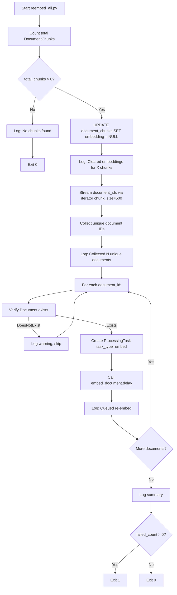

# Task 8: Re-embed Script — Implementation Plan

## Overview

Create a standalone Django management script (`scripts/reembed_all.py`) that:
1. Queries **all** `DocumentChunk` records across the entire database
2. Sets `embedding = NULL` for all chunks (clearing existing embeddings)
3. Iterates in batches of **500 chunks** and triggers the existing `embed_document` Celery task per unique document
4. Logs progress throughout (e.g., `"Processed 500/50000 chunks"`)
5. Handles large datasets safely with memory-efficient batching

**Usage:** `docker-compose exec backend python scripts/reembed_all.py`

---

## Key Design Decisions

### Why a standalone script (not a management command)?
- The PRD specifies `scripts/reembed_all.py` as a standalone script
- It runs outside the Django request/response cycle
- It's an admin utility, not a user-facing feature
- However, it still needs Django ORM access, so it must call `django.setup()` or set `DJANGO_SETTINGS_MODULE`

### Why batch by document, not by chunk?
- The existing `embed_document` Celery task already handles per-document embedding efficiently (batches of 50 chunks internally, with `ProcessingTask` lifecycle management)
- Reusing `embed_document.delay()` avoids duplicating embedding logic
- Batching by 500 chunks then grouping by document ensures we don't overwhelm Celery with too many tasks

### Memory efficiency
- Use `iterator()` on the queryset to stream chunks in chunks of 500 rather than loading all into memory
- Track progress with a simple counter rather than loading all IDs upfront

---

## Files to Create

### CREATE: `src/backend/scripts/__init__.py`
Empty init file to make `scripts` a Python package.

### CREATE: `src/backend/scripts/reembed_all.py`
The main re-embed script.

---

## Detailed Logic for `reembed_all.py`

### Imports
```python
import os
import django
import logging
from collections import defaultdict

# Set up Django before importing models
os.environ.setdefault("DJANGO_SETTINGS_MODULE", "config.settings")
django.setup()

from documents.models import DocumentChunk
from documents.tasks import embed_document
```

### Script Flow

```
1. Configure logging (INFO level, stdout)
2. Query ALL DocumentChunk records (only `id` and `document_id` fields to minimize memory)
3. Count total chunks → log "Found X chunks to re-embed"
4. Set embedding = NULL for ALL chunks in a single UPDATE query
   → Use DocumentChunk.objects.update(embedding=None) — single SQL UPDATE, no memory overhead
5. Collect unique document IDs from all chunks (using .values_list('document_id', flat=True).distinct())
6. For each unique document:
   a. Create a ProcessingTask with task_type="embed", status="pending"
   b. Call embed_document.delay(str(document_id), str(processing_task.id))
   c. Log "Queued re-embed for document {doc_id}"
7. Log summary: "Re-embedding triggered for X documents (Y total chunks)"
```

### Batching Strategy

The PRD says "iterate in batches of 500 chunks." However, since we're using the existing `embed_document` Celery task (which processes per-document), the batching logic is:

1. **Step 1 — Clear embeddings:** Single `UPDATE` query — no batching needed
2. **Step 2 — Collect document IDs:** Use `.values_list('document_id', flat=True).distinct()` — efficient single query
3. **Step 3 — Queue Celery tasks:** One `embed_document.delay()` per document — no batching needed since Celery handles async execution

**Alternative approach (if we want true chunk-level batching):**
If the intent is to process chunks in batches of 500 (not per-document), we could:
1. Query chunks in batches of 500 using `.iterator(chunk_size=500)`
2. For each batch, collect unique document IDs
3. Trigger `embed_document` per document (deduplicated)

But this adds complexity without benefit since `embed_document` already handles its own batching internally.

**Recommended approach:** The simpler per-document approach above. The "500 chunks" batching in the PRD refers to the original conceptual design; the actual implementation should leverage the existing infrastructure.

### Error Handling
- Wrap the entire script in try/except
- Log any errors during task queuing but continue processing
- Exit with non-zero code on failure

### Logging Format
```
[reembed_all] Found 50000 chunks to re-embed
[reembed_all] Cleared embeddings for 50000 chunks
[reembed_all] Queued re-embed for document abc-123 (42 chunks)
[reembed_all] Queued re-embed for document def-456 (128 chunks)
...
[reembed_all] Re-embedding triggered for 150 documents (50000 total chunks)
```

---

## Complete Script Code

```python
"""
Re-embed all document chunks by clearing existing embeddings and
re-triggering the embed_document Celery task for every document.

Usage:
    docker-compose exec backend python scripts/reembed_all.py
"""

from __future__ import annotations

import logging
import os
import sys
from typing import Any

# ── Django setup ──────────────────────────────────────────────────────────
os.environ.setdefault("DJANGO_SETTINGS_MODULE", "config.settings")

import django  # noqa: E402
django.setup()

# ── Imports (after django.setup) ──────────────────────────────────────────
from django.db.models import QuerySet  # noqa: E402
from django.utils import timezone  # noqa: E402

from documents.models import Document, DocumentChunk  # noqa: E402
from documents.tasks import embed_document  # noqa: E402
from tasks.models import ProcessingTask  # noqa: E402

# ── Logger ────────────────────────────────────────────────────────────────
logger = logging.getLogger("reembed_all")
logger.setLevel(logging.INFO)

_handler = logging.StreamHandler(sys.stdout)
_handler.setFormatter(
    logging.Formatter("[%(name)s] %(message)s")
)
logger.addHandler(_handler)


# ── Constants ─────────────────────────────────────────────────────────────
CHUNK_BATCH_SIZE: int = 500
"""Number of chunks to process per iteration when collecting document IDs."""


# ── Main ──────────────────────────────────────────────────────────────────


def main() -> None:
    """Entry point for the re-embed script."""
    logger.info("Starting re-embed of all document chunks")

    # ── Step 1: Count total chunks ───────────────────────────────────────
    total_chunks: int = DocumentChunk.objects.count()
    if total_chunks == 0:
        logger.info("No chunks found — nothing to re-embed")
        return

    logger.info("Found %d chunks to re-embed", total_chunks)

    # ── Step 2: Clear all embeddings ─────────────────────────────────────
    # Single UPDATE query — no memory overhead regardless of dataset size.
    updated_count: int = (
        DocumentChunk.objects
        .update(embedding=None)
    )
    logger.info("Cleared embeddings for %d chunks", updated_count)

    # ── Step 3: Collect unique document IDs ───────────────────────────────
    # Use iterator() to stream results in batches, avoiding loading all
    # chunk IDs into memory at once.
    doc_id_set: set[str] = set()
    chunk_count: int = 0

    chunk_qs: QuerySet = (
        DocumentChunk.objects
        .values_list("document_id", flat=True)
        .iterator(chunk_size=CHUNK_BATCH_SIZE)
    )

    for doc_id in chunk_qs:
        doc_id_set.add(str(doc_id))
        chunk_count += 1

        # Log progress every CHUNK_BATCH_SIZE chunks
        if chunk_count % CHUNK_BATCH_SIZE == 0:
            logger.info(
                "Scanning chunks... %d/%d (%.0f%%)",
                chunk_count,
                total_chunks,
                (chunk_count / total_chunks) * 100,
            )

    logger.info(
        "Collected %d unique documents from %d chunks",
        len(doc_id_set),
        chunk_count,
    )

    # ── Step 4: Queue embed_document task per document ───────────────────
    queued_count: int = 0
    failed_count: int = 0

    for doc_id in sorted(doc_id_set):
        try:
            # Verify document still exists
            document = Document.objects.get(id=doc_id)

            # Create a ProcessingTask for this embed operation
            processing_task = ProcessingTask.objects.create(
                document=document,
                task_type="embed",
                status="pending",
            )

            # Dispatch the Celery task
            embed_document.delay(doc_id, str(processing_task.id))

            logger.info(
                "Queued re-embed for document %s (task=%s)",
                doc_id,
                processing_task.id,
            )
            queued_count += 1

        except Document.DoesNotExist:
            logger.warning(
                "Document %s no longer exists — skipping", doc_id
            )
            failed_count += 1

        except Exception as e:
            logger.exception(
                "Failed to queue re-embed for document %s — %s",
                doc_id,
                e,
            )
            failed_count += 1

    # ── Step 5: Summary ──────────────────────────────────────────────────
    logger.info(
        "Re-embedding complete: %d documents queued, %d failed "
        "(%d total chunks)",
        queued_count,
        failed_count,
        total_chunks,
    )

    if failed_count > 0:
        logger.warning(
            "%d document(s) failed to queue — check logs above for details",
            failed_count,
        )
        sys.exit(1)


if __name__ == "__main__":
    main()
```

---

## Files to Modify

None. This is a pure CREATE task — no existing files need modification.

---

## Testing

### Manual verification
1. Run the script: `docker-compose exec backend python scripts/reembed_all.py`
2. Verify logs show:
   - "Found X chunks to re-embed"
   - "Cleared embeddings for X chunks"
   - "Queued re-embed for document ..." for each document
   - Summary line at the end
3. Verify in DB that embeddings are NULL: `docker-compose exec db psql -U docuchat -d docuchat -c "SELECT COUNT(*) FROM document_chunks WHERE embedding IS NULL;"`
4. Verify Celery tasks were dispatched: Check Celery worker logs for `embed_document` task execution

### Edge cases to verify
- **No chunks exist:** Script should log "No chunks found" and exit cleanly
- **Document deleted between scan and queue:** Script catches `Document.DoesNotExist` and logs a warning
- **Celery unavailable:** `embed_document.delay()` will raise an exception; script catches it and logs the error
- **Very large dataset (100k+ chunks):** Uses `iterator()` to stream results, so memory stays constant

---

## Mermaid Flow



---

## Prompt for Code Mode Session

Below is the exact prompt to give to Roo Code in **Code mode**:

---

```
# Task 8: Re-embed Script

Create a standalone Django script at `src/backend/scripts/reembed_all.py` that clears all chunk embeddings and re-triggers the `embed_document` Celery task for every document.

## Files to Create

### 1. `src/backend/scripts/__init__.py`
Empty file — makes `scripts` a Python package.

### 2. `src/backend/scripts/reembed_all.py`

Create this file with the following logic:

#### Imports & Django Setup
```python
import os
import django
os.environ.setdefault("DJANGO_SETTINGS_MODULE", "config.settings")
django.setup()
```
Place all Django model imports AFTER `django.setup()`.

#### Constants
- `CHUNK_BATCH_SIZE = 500` — batch size for streaming chunk IDs

#### Main Function (`main()`)

1. **Count total chunks** — `DocumentChunk.objects.count()`. If 0, log "No chunks found" and return.

2. **Clear all embeddings** — Use `DocumentChunk.objects.update(embedding=None)`. Log "Cleared embeddings for X chunks".

3. **Collect unique document IDs** — Use `DocumentChunk.objects.values_list("document_id", flat=True).iterator(chunk_size=500)` to stream results. Collect into a `set[str]`. Log progress every 500 chunks (e.g., "Scanning chunks... 500/50000 (1%)").

4. **Queue embed_document per document** — For each unique document ID:
   - Verify the Document still exists (catch `Document.DoesNotExist`)
   - Create a `ProcessingTask` with `task_type="embed"`, `status="pending"`
   - Call `embed_document.delay(str(document_id), str(processing_task.id))`
   - Log "Queued re-embed for document {doc_id} (task={task_id})"
   - Catch any exception, log it, increment failed_count, continue

5. **Summary** — Log "Re-embedding complete: X documents queued, Y failed (Z total chunks)". Exit with code 1 if any failures, else 0.

#### Logging Configuration
- Logger name: `"reembed_all"`
- Level: `INFO`
- Handler: `StreamHandler(sys.stdout)`
- Format: `"[reembed_all] %(message)s"`

#### Error Handling
- Wrap the entire script in `if __name__ == "__main__": main()`
- Use `logger.exception()` for unexpected errors
- Exit with `sys.exit(1)` if any document failed to queue

## Execution

Run the script with:
```
docker-compose exec backend python scripts/reembed_all.py
```

## Verification

After running, verify:
1. Logs show the expected progress and summary
2. `docker-compose exec db psql -U docuchat -d docuchat -c "SELECT COUNT(*) FROM document_chunks WHERE embedding IS NULL;"` returns the total chunk count
3. Celery worker logs show `embed_document` tasks being executed

## Post-Implementation

Update `docs/active-task/wip-context.md` with:
1. What was completed
2. Current state
3. Next steps
```

---

## Reference: Key Models & Tasks

| Component | File | Purpose |
|-----------|------|---------|
| [`DocumentChunk`](src/backend/documents/models.py:80) | `documents/models.py` | Chunk model with `embedding` (VectorField) |
| [`embed_document`](src/backend/documents/tasks/embedding_tasks.py:38) | `documents/tasks/embedding_tasks.py` | Celery task that processes all un-embedded chunks for a document |
| [`ProcessingTask`](src/backend/tasks/models.py:12) | `tasks/models.py` | Tracks status/progress of processing tasks |
