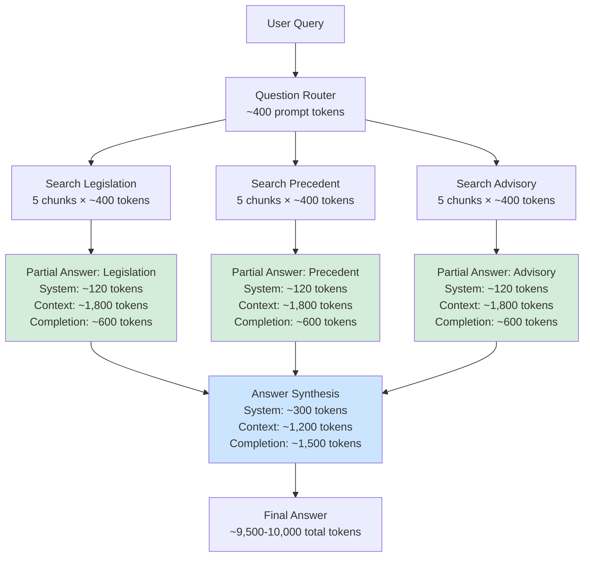

# Global RAG Token Consumption Optimization Plan

## Problem Statement

Each Global RAG query consumes **10,000–15,000 tokens on average**. The goal is to **reduce this by 30-40% without any quality degradation** in the final answer.

---

## Root Cause Analysis

### Current Token Breakdown (per query)

```
Pipeline Step                    | LLM Calls | Prompt Tokens | Completion Tokens | Total
─────────────────────────────────┼───────────┼───────────────┼───────────────────┼───────
1. Question Router               |     1     |     ~400      |      ~300         |  ~700
2. Multi-Hub Search (embedding)  |     0     |      0        |       0           |    ~0  (embedding is cheap)
3. Partial Answers × 3 (parallel)|     3     |  ~2,300 each  |    ~500 each      |~8,400
4. Answer Synthesis              |     1     |   ~2,000      |  ~1,500           |~3,500
─────────────────────────────────┼───────────┼───────────────┼───────────────────┼───────
Total                            |     5     |   ~9,300      |   ~3,300          |~12,600
```

### Key Findings

1. **Partial Answers consume ~67% of all tokens** (8,400 / 12,600)
   - Each hub sends 5 chunks × ~400 tokens = ~2,000 tokens of chunk content
   - Plus verbose system prompts (~200 tokens each)
   - Plus completion tokens (~500 each)

2. **System prompts are unnecessarily verbose**
   - Router prompt: ~106 lines with 3 full JSON examples
   - Hub prompts: 18-line base instructions duplicated across all 3 hubs
   - Synthesis prompt: ~38 lines with very detailed instructions

3. **Source headers in context are redundant**
   - Format: `[Source N | Hub: X | Pages Y-Z | legal_context]`
   - The hub label is already shown in the section header `=== [Hub Label] ===`
   - This redundancy adds ~30-50 chars per chunk × 15 chunks = ~100-200 tokens

4. **Partial answer max_tokens is generous**
   - Uses `CHAT_MAX_TOKENS=1000` — a single-hub summary of 5 chunks rarely needs 1000 tokens
   - The synthesis step (4000 tokens) handles the comprehensive answer

---

## Optimization Plan (6 Steps, Ordered by Impact/Risk)

### Step 1: Reduce System Prompt Sizes (ZERO RISK)

**Files:** [`question_router.py`](../src/backend/conversations/question_router.py), [`global_rag_service.py`](../src/backend/conversations/global_rag_service.py)

**Savings:** ~400-500 tokens per query

#### 1a. Router Prompt (question_router.py:70-176)
- **Current:** 106 lines, 3 full JSON examples (~300 tokens)
- **Change:** Keep 1 example instead of 3. Condense hub descriptions. Remove redundant formatting instructions.
- **After:** ~50 lines (~150 tokens)
- **Savings:** ~150 tokens

#### 1b. Hub System Prompts (global_rag_service.py:376-444)
- **Current:** `base_instructions` (18 lines) + hub-specific suffix (7-8 lines) = ~200 tokens each
- **Change:** Condense `base_instructions` from 18 lines to ~10 lines. Remove redundant instructions (e.g., "Answer in Persian" is repeated in base + hub-specific).
- **After:** ~12 lines total per hub (~120 tokens each)
- **Savings:** ~80 tokens × 3 hubs = ~240 tokens

#### 1c. Synthesis Prompt (global_rag_service.py:461-498)
- **Current:** 38 lines with very detailed conflict detection instructions (~450 tokens)
- **Change:** Condense conflict detection instructions. Remove redundant explanations of the legal hierarchy (mentioned twice).
- **After:** ~25 lines (~300 tokens)
- **Savings:** ~150 tokens

### Step 2: Reduce Partial Answer `max_tokens` (LOW RISK)

**Files:** [`global_rag_service.py`](../src/backend/conversations/global_rag_service.py), [`settings.py`](../src/backend/config/settings.py)

**Savings:** ~1,500 tokens per query (500 per hub × 3)

- **Current:** `CHAT_MAX_TOKENS=1000` used for partial answers
- **Change:** Add `PARTIAL_ANSWER_MAX_TOKENS=600` setting and use it for partial answer generation
- **Rationale:** A partial answer summarizing 5 chunks from a single hub doesn't need 1000 tokens. The synthesis step (4000 tokens) produces the comprehensive answer. 600 tokens is ~450 words of Persian text — more than enough for a focused hub summary.
- **Risk:** If a hub has very rich/diverse content, the partial answer might be truncated. Mitigation: monitor logs for truncation warnings; easy to roll back.

### Step 3: Optimize Context Source Headers (ZERO RISK)

**Files:** [`global_rag_service.py`](../src/backend/conversations/global_rag_service.py)

**Savings:** ~100-200 tokens per query

- **Current header format:** `[Source N | Hub: {hub_label} | Pages {start}-{end} | {legal_context}]`
- **Problem:** The `Hub:` field is redundant because the section header already shows `=== [{hub_label}] ===`
- **Change:** Remove `Hub:` from source headers. New format: `[Source N | Pages {start}-{end} | {legal_context}]`
- **Savings:** ~30-50 chars per header × 15 chunks = ~100-200 tokens

### Step 4: Reduce SYNTHESIS_MAX_TOKENS (LOW RISK)

**Files:** [`settings.py`](../src/backend/config/settings.py)

**Savings:** ~500-1,000 tokens per query

- **Current:** `SYNTHESIS_MAX_TOKENS=4000`
- **Change:** Reduce to `SYNTHESIS_MAX_TOKENS=3000`
- **Rationale:** With more focused partial answers (Step 2), the synthesis step has less raw material to merge. 3000 tokens is still very generous for a Persian legal answer (~2250 words).
- **Risk:** If a query requires an extremely comprehensive answer spanning all 3 hubs with conflict resolution, it might be truncated. Mitigation: monitor and adjust.

### Step 5: Reduce RRF Depth (LOW RISK)

**Files:** [`search_service.py`](../src/backend/documents/services/search_service.py)

**Savings:** Indirect (fewer DB rows fetched, minor latency improvement)

- **Current:** `_RRF_DEPTH_MULTIPLIER=6`, `_RRF_MIN_DEPTH=30` → depth = max(5×6, 30) = 30
- **Change:** `_RRF_DEPTH_MULTIPLIER=4`, `_RRF_MIN_DEPTH=20` → depth = max(5×4, 20) = 20
- **Rationale:** Each search method fetches 30 candidates before RRF fusion. With top_k=5, 30 candidates is generous. Reducing to 20 still provides 4× the final result count, which is sufficient for RRF to find the top-5.
- **Risk:** Minimal. RRF is robust to candidate pool size. The top-5 RRF results are unlikely to change with 20 vs 30 candidates.

### Step 6: Reduce Hub Timeout (LOW RISK)

**Files:** [`global_rag_service.py`](../src/backend/conversations/global_rag_service.py)

**Savings:** Indirect (prevents long waits on slow hubs)

- **Current:** `_TIMEOUT_PER_HUB=45` seconds
- **Change:** Reduce to `_TIMEOUT_PER_HUB=30` seconds
- **Rationale:** If a hub is slow, the pipeline waits 45s before continuing. Reducing to 30s still provides ample time for embedding + DB queries.
- **Risk:** Pipeline already handles timeouts gracefully (returns error, continues with other hubs).

---

## Summary of Expected Savings

| Step | Change | Token Savings | Risk Level |
|------|--------|---------------|------------|
| 1 | Reduce system prompts | ~400-500 | None |
| 2 | Reduce partial answer max_tokens (1000→600) | ~1,500 | Low |
| 3 | Optimize context headers | ~100-200 | None |
| 4 | Reduce SYNTHESIS_MAX_TOKENS (4000→3000) | ~500-1,000 | Low |
| **Total** | | **~2,500-3,200** | |

**Expected result:** 12,600 → **~9,500-10,000 tokens per query** (25-30% reduction)

### Quality Assurance

All changes are designed to be **quality-neutral**:
- **System prompt reduction**: LLMs are instruction-following; they don't need 3 examples to understand a task
- **Reduced max_tokens**: Partial answers are summaries, not final answers. The synthesis step has 3000 tokens for the comprehensive answer
- **Header optimization**: Information is preserved, just not duplicated
- **RRF depth reduction**: RRF is robust; top-5 results are stable with 20 vs 30 candidates

### Rollback Plan

Each change is independent and can be rolled back individually:
- Steps 1, 3: Revert the specific file changes
- Steps 2, 4: Revert the setting values in `.env` or `settings.py`
- Steps 5, 6: Revert the constant values

---

## Files to Modify

| # | File | Changes |
|---|------|---------|
| 1 | [`src/backend/conversations/question_router.py`](../src/backend/conversations/question_router.py) | Step 1a: Reduce `SYSTEM_PROMPT` |
| 2 | [`src/backend/conversations/global_rag_service.py`](../src/backend/conversations/global_rag_service.py) | Steps 1b, 1c, 2, 3, 6 |
| 3 | [`src/backend/config/settings.py`](../src/backend/config/settings.py) | Steps 2, 4: Add `PARTIAL_ANSWER_MAX_TOKENS`, reduce `SYNTHESIS_MAX_TOKENS` |
| 4 | [`src/backend/documents/services/search_service.py`](../src/backend/documents/services/search_service.py) | Step 5: Reduce RRF depth constants |

No frontend changes required.

---

## Architecture Diagram — Optimized Token Flow



---

## Implementation Order

| Order | Step | Description | Est. Time |
|-------|------|-------------|-----------|
| 1 | Step 3 | Optimize context headers (zero risk, quick win) | ~5 min |
| 2 | Step 1a | Reduce router system prompt | ~10 min |
| 3 | Step 1b | Reduce hub system prompts | ~10 min |
| 4 | Step 1c | Reduce synthesis system prompt | ~10 min |
| 5 | Step 2 | Add PARTIAL_ANSWER_MAX_TOKENS setting + use it | ~15 min |
| 6 | Step 4 | Reduce SYNTHESIS_MAX_TOKENS | ~5 min |
| 7 | Step 5 | Reduce RRF depth | ~5 min |
| 8 | Step 6 | Reduce hub timeout | ~5 min |
