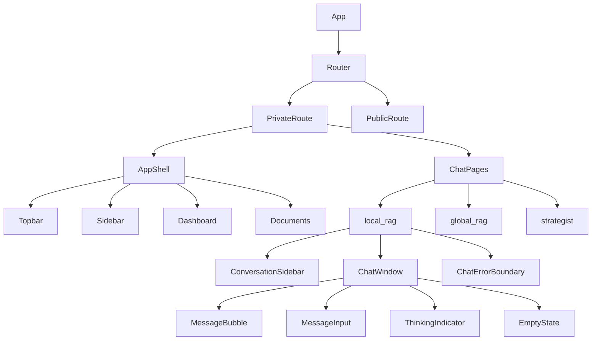

# UI Refactor Plan — DocuChat Persian Legal RAG System

## Issue Summary

| # | Issue | Phase | Priority | Type |
|---|-------|-------|----------|------|
| 1 | Chat conversations lost on browser refresh | Phase 3 (Global RAG / Strategist) | High | Bug |
| 2 | Token consumption not displayed | Phase 3 | Medium | Feature |
| 3 | Extraction progress percentage not shown | Phase 1 | Medium | Feature |
| 4 | UI not attractive (needs Claude/Gemini-like redesign) | All | High | Design |

---

## Issue 1: Chat Persistence on Browser Refresh

### Root Cause
The [`conversationStore`](src/frontend/src/stores/conversationStore.ts) uses Zustand **without** any persistence middleware. All state (`conversations`, `activeConversation`, `streamingContent`, etc.) is held in memory only. When the user refreshes the page or closes/reopens the browser:

1. The Zustand store resets to `initialState` — `conversations: []`, `activeConversation: null`
2. [`ConversationSidebar`](src/frontend/src/components/chat/ConversationSidebar.tsx:257) calls `fetchConversations()` on mount, which hits the API
3. [`ChatWindow`](src/frontend/src/components/chat/ChatWindow.tsx:167) calls `loadConversation(conversationId)` on mount, which fetches messages from the API

**However**, there's a race condition: [`initializeAuth()`](src/frontend/src/main.tsx:9) is called synchronously before React renders, but the API calls in steps 2-3 may fire before auth completes if the component tree renders before the async `initializeAuth()` finishes. The [`PrivateRoute`](src/frontend/src/components/auth/PrivateRoute.tsx) **does** show a loading spinner while `isLoading` is true, but the initial state has `isLoading: false`, so there's a brief window where the user sees an empty/redirected page.

### Fix: Add Zustand Persist Middleware

**File:** [`src/frontend/src/stores/conversationStore.ts`](src/frontend/src/stores/conversationStore.ts)

1. Install `zustand/middleware` persist (already available in zustand)
2. Wrap the store with `persist` middleware, caching `conversations` and `activeConversation` to `localStorage`
3. On page reload: instant restore from cache → background re-fetch to sync
4. This eliminates the flash-of-empty-state issue entirely

**Implementation:**
```typescript
import { create } from 'zustand';
import { persist } from 'zustand/middleware';

export const useConversationStore = create<ConversationStore>()(
  persist(
    (set) => ({
      ...initialState,
      // ... all existing actions
    }),
    {
      name: 'docuchat-conversations',
      partialize: (state) => ({
        conversations: state.conversations,
        activeConversation: state.activeConversation,
      }),
    },
  ),
);
```

---

## Issue 2: Token Consumption Display

### Root Cause
In [`MessageBubble.tsx`](src/frontend/src/components/chat/MessageBubble.tsx:239-243), token usage IS conditionally rendered:
```tsx
{message.token_usage && !isUser && (
  <span className="text-[10px] text-muted-foreground/60">
    {message.token_usage.total_tokens} tokens
  </span>
)}
```

Problems:
1. **Too small** — `text-[10px]` at `text-muted-foreground/60` opacity is nearly invisible
2. **Only shows total** — no breakdown of prompt vs completion tokens
3. **No visual indicator** — just plain text, easy to miss
4. **Not shown for Partial Answers tokens** inside collapsible sections

### Fix: Enhanced Token Display

**File:** [`src/frontend/src/components/chat/MessageBubble.tsx`](src/frontend/src/components/chat/MessageBubble.tsx)

1. Replace the small text with a proper token badge (like a pill/chip)
2. Show breakdown: "Tokens: ⬆X prompt + ⬇Y completion = Z total"
3. Use a subtle icon (e.g., `zap` or `database` from lucide-react) for visual cue
4. Apply the same enhanced display to Partial Answers token usage

**Design:**
```
┌──────────────────────────────────┐
│ ⚡ Tokens: 156 prompt + 342 comp = 498 total │
└──────────────────────────────────┘
```

---

## Issue 3: Extraction Progress Display

### Root Cause
In [`ProcessingStatusPanel.tsx`](src/frontend/src/components/documents/ProcessingStatusPanel.tsx:104-108), progress IS rendered:
```tsx
<Progress value={task.progress} className="h-2" />
<span>{task.progress}%</span>
```

The issue is likely on the **backend**: the `extract` task doesn't report granular progress. It stays at `0%` during extraction and jumps to `100%` when done. The polling interval (3 seconds in [`useProcessingStatus.ts`](src/frontend/src/hooks/useProcessingStatus.ts:77)) is fine.

### Fix: Better Progress Feedback

**Frontend:** [`ProcessingStatusPanel.tsx`](src/frontend/src/components/documents/ProcessingStatusPanel.tsx)
- Add animated progress bar (indeterminate animation when progress is 0 but status is 'processing')
- Show descriptive status text: "Extracting text from document..." instead of just "0%"
- Use the `task.status` to show state transitions: "pending" → "processing" → "completed"/"failed"

**Backend:** [`src/backend/documents/tasks/document_processing.py`](src/backend/documents/tasks/document_processing.py)
- Update the extraction task to report per-page progress: `progress = (page_number / total_pages) * 100`
- This gives the user real-time feedback on extraction progress

---

## Issue 4: UI Redesign (Claude/Gemini-inspired)

### Design Principles
- **Clean & Minimal**: Lots of whitespace, subtle separators, no visual clutter
- **Warm & Inviting**: Warmer gray tones instead of cool blue-gray
- **Legible Typography**: Good font sizing, line-height, and contrast
- **Refined Chat Bubbles**: User messages in colored rounded bubbles, AI messages in clean white cards
- **Subtle Animations**: Smooth transitions, micro-interactions

### Color Palette (New)

```css
:root {
  /* Background: warm off-white */
  --background: 40 20% 97%;        /* #F7F5F2 */
  --foreground: 220 15% 15%;       /* #22252A */
  
  /* Card: clean white */
  --card: 0 0% 100%;
  --card-foreground: 220 15% 15%;
  
  /* Primary: warm blue (instead of aggressive blue) */
  --primary: 220 70% 50%;          /* #4A7CF7 */
  --primary-foreground: 0 0% 100%;
  
  /* Secondary: soft warm gray */
  --secondary: 40 15% 94%;         /* #F0EEEB */
  --secondary-foreground: 220 15% 25%;
  
  /* Muted: subtle warm */
  --muted: 40 10% 92%;            /* #EAE8E5 */
  --muted-foreground: 220 8% 55%;  /* #81858C */
  
  /* Accent: soft lavender-blue */
  --accent: 220 40% 96%;          /* #F0F4FF */
  --accent-foreground: 220 70% 40%;
  
  /* Border: very soft */
  --border: 40 10% 88%;           /* #E0DEDB */
  --input: 40 10% 88%;
  --ring: 220 70% 50%;
  
  /* Destructive: soft red */
  --destructive: 0 75% 60%;
  --destructive-foreground: 0 0% 100%;
  
  --radius: 0.75rem;              /* Larger radius for modern feel */
}
```

### Files to Modify

| File | Changes |
|------|---------|
| [`src/frontend/src/index.css`](src/frontend/src/index.css) | **Complete CSS variable overhaul** with new palette, typography, scrollbar styling, selection colors |
| [`src/frontend/src/components/chat/MessageBubble.tsx`](src/frontend/src/components/chat/MessageBubble.tsx) | **Complete redesign** of chat bubbles: user messages = rounded colored bubbles with tail, AI messages = clean white cards with subtle shadow, improved timestamp and token display |
| [`src/frontend/src/components/chat/ChatWindow.tsx`](src/frontend/src/components/chat/ChatWindow.tsx) | Refine empty state layout, improve thinking indicator design, add gradient backgrounds |
| [`src/frontend/src/components/chat/MessageInput.tsx`](src/frontend/src/components/chat/MessageInput.tsx) | Redesign input area — cleaner, more like Claude's input with rounded border, subtle shadow, better send button |
| [`src/frontend/src/components/chat/ConversationSidebar.tsx`](src/frontend/src/components/chat/ConversationSidebar.tsx) | Better conversation item styling, refined hover states, cleaner typography |
| [`src/frontend/src/components/layout/Sidebar.tsx`](src/frontend/src/components/layout/Sidebar.tsx) | Refined nav items, better spacing, cleaner brand area |
| [`src/frontend/src/components/layout/Topbar.tsx`](src/frontend/src/components/layout/Topbar.tsx) | Cleaner top bar, better user menu |
| [`src/frontend/src/components/layout/AppShell.tsx`](src/frontend/src/components/layout/AppShell.tsx) | Adjust main content area |
| [`src/frontend/src/pages/DashboardPage.tsx`](src/frontend/src/pages/DashboardPage.tsx) | Refined dashboard cards, better visual hierarchy |
| [`src/frontend/src/pages/LoginPage.tsx`](src/frontend/src/pages/LoginPage.tsx) | Cleaner auth page, centered card design |
| [`src/frontend/src/components/documents/DocumentCard.tsx`](src/frontend/src/components/documents/DocumentCard.tsx) | Better document card styling |
| [`src/frontend/src/components/documents/DocumentDetailPage.tsx`](src/frontend/src/components/documents/DocumentDetailPage.tsx) | Refined detail page layout |
| [`src/frontend/src/components/documents/ProcessingStatusPanel.tsx`](src/frontend/src/components/documents/ProcessingStatusPanel.tsx) | Better progress panel |
| [`src/frontend/src/components/rag/GlobalRagEmptyState.tsx`](src/frontend/src/components/rag/GlobalRagEmptyState.tsx) | Redesigned empty state |
| [`src/frontend/src/components/rag/StrategistEmptyState.tsx`](src/frontend/src/components/rag/StrategistEmptyState.tsx) | Redesigned empty state |

### Chat Bubble Design (Claude-inspired)

**User message:**
```
┌──────────────────────────────────────┐
│                                      │
│  Your question text here...          │
│                                      │
│                         12:30 PM     │
└──────────────────────────────────────┘
```
- Background: `var(--primary)` (warm blue)
- Text: white
- Rounded: `rounded-2xl rounded-br-sm` (tail effect)
- Max-width: 75%
- Right-aligned

**AI message:**
```
┌──────────────────────────────────────────┐
│                                          │
│  Response text with markdown...          │
│                                          │
│  12:30 PM    ⚡ 498 tokens               │
│                                          │
│  ▼ 3 sources                             │
└──────────────────────────────────────────┘
```
- Background: white (`var(--card)`)
- Border: very subtle (`var(--border)`)
- Shadow: `shadow-sm`
- Rounded: `rounded-2xl`
- Left-aligned

### Mermaid: Component Hierarchy



---

## Execution Order

### Phase 1: CSS Foundation (index.css + tailwind.config.js)
1. Update CSS variables in [`index.css`](src/frontend/src/index.css) with new palette
2. Add dark mode colors
3. Add scrollbar styling, selection colors, focus ring styles
4. Add typography improvements (better line-height, font-features)

### Phase 2: Chat Redesign (core UI)
1. Redesign [`MessageBubble.tsx`](src/frontend/src/components/chat/MessageBubble.tsx) — Claude-like bubbles
2. Redesign [`MessageInput.tsx`](src/frontend/src/components/chat/MessageInput.tsx) — cleaner input
3. Redesign [`ConversationSidebar.tsx`](src/frontend/src/components/chat/ConversationSidebar.tsx) — better list items
4. Redesign [`ChatWindow.tsx`](src/frontend/src/components/chat/ChatWindow.tsx) — refined empty state + thinking indicator

### Phase 3: Layout Redesign
1. Redesign [`Sidebar.tsx`](src/frontend/src/components/layout/Sidebar.tsx)
2. Redesign [`Topbar.tsx`](src/frontend/src/components/layout/Topbar.tsx)
3. Redesign [`AppShell.tsx`](src/frontend/src/components/layout/AppShell.tsx)

### Phase 4: Page Redesigns
1. Redesign [`DashboardPage.tsx`](src/frontend/src/pages/DashboardPage.tsx)
2. Redesign [`LoginPage.tsx`](src/frontend/src/pages/LoginPage.tsx)
3. Redesign [`DocumentCard.tsx`](src/frontend/src/components/documents/DocumentCard.tsx)
4. Redesign [`DocumentDetailPage.tsx`](src/frontend/src/pages/documents/DocumentDetailPage.tsx)
5. Redesign [`GlobalRagEmptyState.tsx`](src/frontend/src/components/rag/GlobalRagEmptyState.tsx)
6. Redesign [`StrategistEmptyState.tsx`](src/frontend/src/components/rag/StrategistEmptyState.tsx)

### Phase 5: Chat Persistence Fix
1. Add `persist` middleware to [`conversationStore.ts`](src/frontend/src/stores/conversationStore.ts)
2. Verify conversation restoration on page refresh

### Phase 6: Token Display Enhancement
1. Enhance token display in [`MessageBubble.tsx`](src/frontend/src/components/chat/MessageBubble.tsx)
2. Add proper badge/chip styling

### Phase 7: Extraction Progress Enhancement
1. Update [`ProcessingStatusPanel.tsx`](src/frontend/src/components/documents/ProcessingStatusPanel.tsx)
2. Add animated progress and descriptive status text

---

## Verification

After implementation, use Puppeteer to verify:
1. Page loads without console errors
2. Chat bubbles render correctly
3. Token usage is visible
4. Processing status panel shows progress
5. Page refresh preserves active conversation

---

## Files Summary

### New Dependencies
- `zustand/middleware` (already available — no install needed)

### Modified Files (Frontend)
1. `src/frontend/src/index.css` — CSS variables overhaul
2. `src/frontend/tailwind.config.js` — Possibly color extensions
3. `src/frontend/src/stores/conversationStore.ts` — Add persist middleware
4. `src/frontend/src/components/chat/MessageBubble.tsx` — Redesigned bubbles + token display
5. `src/frontend/src/components/chat/MessageInput.tsx` — Redesigned input
6. `src/frontend/src/components/chat/ConversationSidebar.tsx` — Better styling
7. `src/frontend/src/components/chat/ChatWindow.tsx` — Refined layout
8. `src/frontend/src/components/layout/Sidebar.tsx` — Redesigned sidebar
9. `src/frontend/src/components/layout/Topbar.tsx` — Cleaner topbar
10. `src/frontend/src/components/layout/AppShell.tsx` — Layout adjustments
11. `src/frontend/src/pages/DashboardPage.tsx` — Refined dashboard
12. `src/frontend/src/pages/LoginPage.tsx` — Cleaner auth page
13. `src/frontend/src/components/documents/DocumentCard.tsx` — Better card
14. `src/frontend/src/pages/documents/DocumentDetailPage.tsx` — Refined detail page
15. `src/frontend/src/components/documents/ProcessingStatusPanel.tsx` — Better progress
16. `src/frontend/src/components/rag/GlobalRagEmptyState.tsx` — Redesigned empty state
17. `src/frontend/src/components/rag/StrategistEmptyState.tsx` — Redesigned empty state

### Modified Files (Backend)
18. `src/backend/documents/tasks/document_processing.py` — Granular progress reporting
